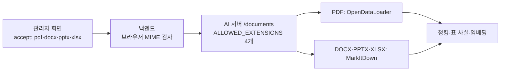
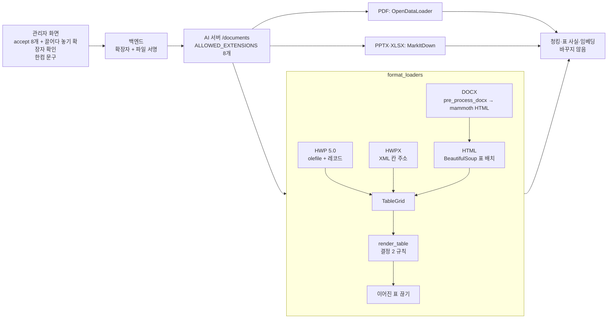

# HWP·HWPX·HTML 형식 지원 구현 (이슈 #125, M1 5번)

> 날짜: 2026-10-02 · PR [#135](https://github.com/QyongGin/DocuMind/pull/135) squash 머지(develop `b507adf`). 이슈 #125는 다음 릴리스 때 닫는다(develop 대상 PR의 `Closes`는 연결되지 않음)
> 앞 문서: `HWP-HTML-표변환-조사-20261002.md` (§1~6 조사, §7 재검토와 결정 1~3)

## 1. 결론

- **된 것**: 관리자 화면 → 백엔드 → AI 서버의 세 층이 HWP 5.0·HWPX·HTML을 받는다. AI 서버는 네 형식(HWP·HWPX·HTML·DOCX)의 표를 칸 주소·병합 수가 있는 격자로 만든 뒤, 결정 2의 규칙으로 마크다운 표를 낸다. 그 뒤 청킹·표 사실·임베딩은 그대로다.
- **실측**: 수집 파일 전체(HWP 467·HTML 2,215·HWPX 6·DOCX 5)가 오류 없이 변환된다. HWP 표 구조는 자바 hwplib과 2,276개 모두 같고, 본문 글자(머리말·꼬리말 제외)는 736,890자로 한 글자도 빠지지 않는다. HTML 표의 칸 밀림은 385개 → 0개, 열 이름을 모두 잃는 표는 272개 → 7개.
- **안 된 것**: 데스크탑에서 실제 업로드로 확인하지 않았다(M1 7번 표본 종단 테스트, 이슈 #127에서). 암호 HWP 등의 거절 이유는 AI 서버 응답(422)과 진행률 메시지까지만 담기고, 관리자 화면에는 아직 일반 실패 문구가 뜬다(아래 §8).

## 2. 용어

| 용어 | 뜻 | 위치 |
|---|---|---|
| TableGrid(표 격자) | 칸마다 (행, 열, 행 병합 수, 열 병합 수, 칸 안 블록)를 가진 표 | `ai-server/format_loaders/table_grid.py` |
| Block(블록) | 글 한 문단(str) 또는 표(TableGrid). 로더가 문서를 블록 목록으로 읽는다 | 같은 파일 |
| render_table(표 그리기) | 격자 → 마크다운 표. 병합 칸 규칙(결정 2)을 여기서 적용 | 같은 파일 |
| 레코드(record) | HWP 5.0 본문 스트림의 단위. (태그, 수준, 크기) 머리 + 내용 | `format_loaders/hwp5.py` |
| strict(엄격) | 칸 자리가 비면 해석 실패로 보는지. HWP·HWPX는 참, HTML은 거짓(줄마다 칸 수가 달라도 정상) | `TableGrid.strict` |
| 표 사실(table fact) | 마크다운 표의 한 행을 "열 이름=값" 문장으로 바꾼 검색용 색인 항목 | `ai-server/main.py` `_extract_table_facts` |
| 끊는 줄 | 빈 줄만 두고 이어진 두 표 사이에 넣는 `<!-- -->` | `table_grid.TABLE_SEPARATOR` |

## 3. 변경 전 파이프라인과 위험

| 위험 | 실제 모습 |
|---|---|
| HWP·HTML을 받지 못함 | 수집한 HWP 561행·HTML 2,279행을 올릴 길이 없다. 맥에서 `.hwp`의 브라우저 MIME은 보통 `application/octet-stream`이라 MIME 검사로는 형식을 알 수 없다 |
| MarkItDown 표 변환 | rowspan을 버려 세로 병합 아래 줄의 칸이 한 칸씩 밀리고, `th`가 없는 표에 빈 머리 줄을 만든다(합성 DOCX 실측: `|  |  |  |` 다음에 진짜 머리 `| 구분 | 학기 | 금액 |`, 그 아래 `| 2학기 | 200 |`) |
| 머리 보정의 빈틈 | 기존 `_is_probable_subheader_row`는 첫 줄에 숫자가 있으면 꺼진다 → 합성 학사안내 DOCX의 일정표(`기간 | 1학기 | 2학기`)는 열 이름을 모두 잃어 표 사실 0개 |

## 4. 변경 후 파이프라인

### 4.1 형식별 읽기

| 형식 | 코드 | 원리 |
|---|---|---|
| HWP 5.0 | `hwp5.py` `read_hwp5_blocks()` | OLE를 olefile로 열고 `FileHeader` 표시(압축·암호·배포용)를 본다 → `BodyText/SectionN`을 deflate로 풀고 레코드로 나눈다 → 문단(PARA_HEADER) 수준을 따라 글자(PARA_TEXT)·컨트롤(CTRL_HEADER)을 모은다. 표('tbl ')는 TABLE에서 행·열 수, 칸(LIST_HEADER)마다 8바이트 자리부터 열·행 주소와 병합 수를 읽는다. 머리말·꼬리말은 버리고 글상자·각주 글은 넣는다 |
| HWPX | `hwpx.py` `read_hwpx_blocks()` | ZIP 안 `Contents/sectionN.xml`의 `hp:p`→`hp:run`→`hp:t`·`hp:tbl`. 칸마다 `hp:cellAddr`·`hp:cellSpan`. 글상자는 `hp:drawText`. `<!DOCTYPE`이 있으면 거절(XML 개체 확장 공격 방지) |
| HTML | `html_tables.py` `html_to_markdown()` | 칸 하나뿐인 표를 먼저 벗긴다 → 표를 안쪽부터 처리해 표 안의 표는 바깥 칸 글로 펼치고, 바깥 표는 브라우저 표 배치 규칙(이미 찬 자리 건너뛰기)으로 격자를 만든다 → 그 자리에 자리표를 두고 나머지는 MarkItDown HTML 변환 → 자리표를 마크다운 표로 바꾼다. 그림은 대체 글만 남긴다. 인코딩은 UTF-8 → 문서 선언 → CP949 |
| DOCX | `html_tables.py` `load_docx_markdown()` | MarkItDown과 같은 순서(`pre_process_docx` → `mammoth.convert_to_html`)로 HTML을 만든 뒤 HTML 길로. Word 제목 스타일은 그대로 `#` 제목이 된다 |

### 4.2 표 규칙 (결정 2 + 구현 중 추가 1개)

| # | 규칙 |
|---|---|
| 1 | 칸 하나뿐인 1×1 표는 글로(HWP는 칸 안 블록을 그대로, HTML은 표를 벗김) |
| 2 | 맨 윗줄이 전체 폭 한 칸이면 표 위 제목 글줄로 |
| 3 | 머리: HTML은 `th`로만 된 앞 줄들, 그 밖은 첫 줄. 왼쪽 위 칸이 아래로 k줄 병합이면 머리 k줄을 한 줄로 합침 |
| 4 | 세로 병합 값은 줄마다 채움 |
| 5 | 본문 가로 병합은 열 이름이 서로 다르고 20자 이하일 때만 채움(`SPAN_FILL_MAX_CHARS`) |
| 6 | 본문 전체 폭 줄은 첫 칸에만 |
| 7 | 표 안의 표는 "칸 · 칸 / 다음 줄"로 바깥 칸 글에. 칸 글의 `\|`는 `/`로, 줄바꿈은 빈칸으로 |
| 8 | 칸 자리가 겹치거나 비는 표(엄격 모드)는 글로 내고 경고 기록 |
| 9 | **(구현 중 추가)** 빈 줄만 두고 이어진 두 표 사이에 `<!-- -->` 줄. 이유는 §6 |

### 4.3 거절과 안전장치 (결정 1)

| 상황 | 동작 |
|---|---|
| 암호·배포용 HWP | `UnsupportedDocumentError` → AI 서버 422, 진행률 메시지에 이유("암호가 걸렸거나 배포용으로 저장된 HWP 문서는 읽을 수 없습니다…") |
| HWP 3.0, OLE가 아닌 .hwp, 깨진 OLE·압축 | 같은 방식으로 각자 이유를 담아 거절 |
| HWPX가 ZIP이 아님·본문 없음·XML 깨짐·DOCTYPE | 같은 방식 |
| 섹션의 표 구조 해석 중 오류 | 그 섹션은 글만 꺼내고 경고(업로드는 계속) |
| 표 칸 자리 어긋남 | 그 표만 글로(규칙 8) |
| 맨 위 수준에 문단이 아닌 레코드 | 건너뛰고 다음 문단부터 계속(수집 HWP에는 없었음) |

### 4.4 백엔드·화면·고지

- 백엔드 `DocumentFileType`(enum): 확장자 8개 ↔ 서명(PDF `%PDF-` 앞 1024바이트 안, HWP OLE `D0CF11E0A1B11AE1`, DOCX·PPTX·XLSX·HWPX ZIP `PK0304`, HTML은 NUL 없음 + BOM·공백 뒤 `<`). `DocumentService.resolveFileType()`이 앞 1024바이트를 읽어 확인. 저장 MIME은 형식 표 값(HWP `application/x-hwp`, HWPX는 파일 안 `mimetype` 항목의 `application/hwp+zip`).
- 화면: `accept`에 8개, 끌어다 놓기도 확장자 확인, 업로드 칸 아래 한컴 문구.
- 한컴 문구(원문: 제품의 화면·설명서·도움말·소스): 관리자 업로드 칸, `NOTICE.md`, 수집기 README·`--help`·`hwp.py`, `format_loaders/__init__.py`·`hwp5.py`, `tools/hwp-fixture/README.md`.
- `requirements.txt`에 직접 쓰는 `beautifulsoup4`·`mammoth`·`olefile`을 고정(지금까지 markitdown을 통해 깔리던 것과 같은 판).

## 5. 실제 예시 (합성 HWP `ai-server/tests/fixtures/table_sample.hwp` → 골든 `tests/golden/formats/table_sample_hwp.md`)

| 한글 표 | 변환 결과 | 표 사실 |
|---|---|---|
| 맨 윗줄 "등록금 안내"(3칸 병합), "수업료" 세로 2칸, "동결" 가로 2칸 | `등록금 안내` 글줄 → `| 구분 | 학기 | 금액 |` / `| 수업료 | 1학기 | 100 |` / `| 수업료 | 2학기 | 200 |` / `| 비고 | 동결 | 동결 |` | `구분=수업료; 학기=2학기; 금액=200` |
| "구분" 세로 2칸 + "1학기"·"2학기" 가로 2칸 + 등록금·입학금 | `| 구분 | 1학기 등록금 | 1학기 입학금 | 2학기 등록금 | 2학기 입학금 |` / `| 신입생 | 100 | 20 | 100 | 0 |` | `1학기 등록금=100; 1학기 입학금=20` |
| 칸 하나뿐인 표 | `상자 안 안내 글` (글) | — |
| 칸 안에 2×2 표 | `| 학사 | 요일 · 시간 / 평일 · 9시 |` | — |

시험 파일은 자바 hwplib으로 썼다(만드는 법 `tools/hwp-fixture/README.md`). 우리 해석기와 다른 구현이 쓴 파일이라, 우리 가정에만 맞춘 시험이 되지 않는다.

## 6. 구현 중 발견: 이어진 두 표가 한 표로 합쳐짐

- 기존 `_split_markdown_table_blocks`(`main.py`)는 빈 줄을 지금 블록에 붙인다. 그래서 글 없이 빈 줄만 둔 두 표는 한 표 블록이 되고, `_parse_markdown_table`이 첫 표의 머리를 뒤 표에도 쓴다. 뒤 표의 머리 줄은 데이터 줄이 되고 구분선(`---`)은 빈 줄로 건너뛴다 → 뒤 표 값이 앞 표 열 이름으로 읽힌다.
- [실측] 새 로더 출력에서 수집 HWP 112개 파일 216곳, HTML 1곳.
- 기존 함수를 고치지 않은 이유: PDF(OpenDataLoader)에서 쪽 넘김으로 나뉜 표는 이 합치기 덕에 뒤 조각이 앞 머리를 이어받는 것으로 보인다. 확인하지 않은 채 바꾸면 PDF 표가 나빠질 수 있다. 그래서 새 형식 출력에서만 두 표 사이에 `<!-- -->` 줄을 넣어 끊었다. 이 줄은 '>'로 끝나 표 제목 후보(`_extract_table_caption`)와 표 주변 문구 후보(`_is_table_context_line`)에도 들지 않는다. 적용 후 216곳 → 0곳.
- PDF 쪽 동작은 그대로다. M2 표 개선(P3)에서 PDF 쪽 넘김 표를 실측한 뒤 기존 함수를 고칠지 정한다.

## 7. 안전 경계

| 바꾼 것 | 바꾸지 않은 것 |
|---|---|
| `_load_documents` 분기(hwp·hwpx·html·htm·docx → format_loaders) | PDF(OpenDataLoader)·PPTX·XLSX(MarkItDown) 경로 |
| `ALLOWED_EXTENSIONS` 8개, `/documents`의 422 처리 | 청킹(`_split_loaded_documents` 등)·표 사실 추출·임베딩·Chroma 저장 형식 |
| 백엔드 형식 검사·저장 MIME, `INVALID_FILE_TYPE` 문구 | DB 스키마(마이그레이션 없음), FastApiClient |
| 관리자 화면 업로드 형식·문구 | 질문·답변 경로(`/query`), 프롬프트 |
| DOCX 표 출력(옛 합성 평가 DOCX 14런의 표 글이 바뀜) | 이미 색인된 문서(재색인 전까지 그대로) |

## 8. 검증 결과

| 확인 | 결과 |
|---|---|
| AI 서버 pytest | 73 passed, 1 skipped (기존 34 + 새 39). 새 시험: 표 규칙 14, HWP 11(골든·표 사실·레코드·빈칸 제어 문자·암호/배포용/3.0/깨진 파일 거절·섹션 실패 시 글만), HWPX 2, HTML 7, DOCX 2, 서버 연결 3(허용 확장자·`_load_documents`·암호 HWP 업로드 422와 진행률) |
| 변이 확인 | 머리 합치기·가로 채움·이어진 표 끊기·빈칸 제어 문자·표 제목 줄을 하나씩 되돌리면 각각 4·4·2·1·5개 실패, 백엔드 서명 검사를 끄면 1개 실패 |
| 백엔드 gradle test | 88 tests, 실패 0 (새 7: 형식 판별 단위 5, octet-stream HWP 수락·확장자-내용 불일치 거절 2). 비동기 업로드 시험이 공유 빈 설정을 바꿔 다음 시험에 새던 것을 `setUp`에서 되돌림 |
| 화면 | `eslint` 통과, `npm run build` 통과. 실제 화면은 띄워 보지 않음 |
| 수집기 pytest | 67 passed, `--help`에 한컴 문구 |
| 수집 파일 전체 변환(맥북) | HWP 467 1.3초 · HTML 2,215 20.4초 · HWPX 6 · DOCX 5, 오류·경고 0 |
| HWP 표 구조 대조(hwplib 1.1.9) | 2,276/2,276 같음(표 안의 표 포함). 새 로더에만 있는 6개는 글상자 안의 표(대조 도구가 안 따라감) |
| HWP 글자 누락 | 머리말·꼬리말을 뺀 PARA_TEXT 글자 736,890 = 구조 해석 결과 736,890(파일마다 같음) |
| HTML 표(1,240개, 기존 표 사실 코드로 확인) | 칸 밀림 0(전 385), 열 이름 모두 잃음 7(전 272), 표 사실 0개 7(전 275) |
| HWP 표(1,728개) | 열 이름 모두 잃음 41, 표 사실 0개 68 — 대부분 머리 줄이 빈 서식 표 |
| `git diff --check`, AI 서명 | 문제 없음 |

측정 스크립트: `Assets/corpus/review/prototypes/recheck_20261002/` (`corpus_run.py`, `oracle_compare_new.py`, `text_coverage2.py`, `html_new_actual.py`, `hwp_new_actual.py`, `adjacent_tables.py`, `control_chars.py`).

## 9. 한계와 남은 것

| 항목 | 내용 | 어디서 |
|---|---|---|
| 데스크탑 확인 | Docker 이미지 빌드(요구 패키지 고정 3줄)와 실제 업로드·검색을 아직 안 함 | #127 (M1 7번 표본 종단 테스트) |
| 거절 이유의 화면 표시 | 비동기 업로드에서 백엔드가 실패를 기록하면 관리자 화면은 일반 실패 문구를 보인다. 이유를 DB에 남기고 보여 주려면 칸 추가·마이그레이션이 필요 | #126 (업로드 보강) |
| HWP 제목 구조 | HWP 개요 수준을 마크다운 제목(`#`)으로 옮기지 않았다. 제목 경로 메타데이터가 비고 청크 경계는 글자 수 기준 | M1 7번에서 청크를 보고 필요하면 M2 |
| 글상자 안의 표 6개 | hwplib 대조 밖 | 새 문서를 대량으로 받을 때 대조 도구를 넓힌다 |
| PDF 쪽 넘김 표 | 이어진 표 합치기 동작은 PDF에서 그대로 | M2 표 개선 |
| 20자 기준 | 설정값 `SPAN_FILL_MAX_CHARS`. 바꾸면 재색인 | M1 7번에서 다시 봄 |
| 서식 표 | 머리 줄이 빈 서식 표(HWP 47개)는 열 이름이 없어 표 사실이 안 나온다 | 서식 문서의 쓰임을 보고 M2 |

## 10. 학습 포인트 (면접에서 말할 수 있는 것)

- "HWP 5.0은 OLE 복합 문서 안의 레코드 스트림이라, 한컴 공개 명세를 보고 파이썬으로 직접 읽었습니다. 명세와 실제 파일이 다른 곳(칸 머리의 문단 수가 4바이트)은 수집한 실제 파일 467개를 자바 hwplib과 대조해 찾았고, 표 2,276개의 구조가 모두 같은 것을 확인했습니다."
- "마크다운 표는 병합 칸을 못 나타내서, 병합된 자리마다 무엇을 적을지 규칙을 정했습니다. 세로 병합은 줄마다 채워 행 하나만 읽어도 뜻이 통하게 하고, 가로 병합은 열 이름이 다를 때 짧은 값만 채워 글이 3%만 늘게 했습니다. 다 채우면 49%가 늘었습니다."
- "검증을 세 층으로 했습니다: 합성 시험 파일(다른 구현인 hwplib으로 작성)의 골든 테스트, 실제 문서 전체에 대한 대조(구조·글자 수), 그리고 규칙을 일부러 되돌려 테스트가 실패하는지 보는 변이 확인입니다."
- "구현 중 기존 표 사실 코드가 이어진 두 표를 한 표로 합치는 문제를 찾았습니다. PDF 쪽 넘김 표가 그 동작에 기대고 있을 수 있어 공용 함수를 바로 고치지 않고, 새 형식 출력에서만 끊었습니다. 바꾸는 범위를 측정할 수 있는 곳으로 좁힌 판단입니다."
- "브라우저가 보내는 MIME 형식은 운영체제마다 달라 믿지 않고, 확장자와 파일 앞부분 서명으로 형식을 판별했습니다."
