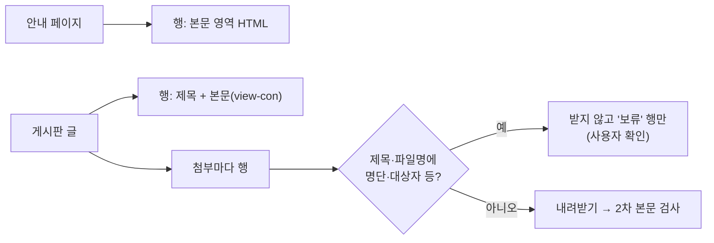

# M1-1 문서 대장 형식 (2026-10-01)

> 목적: M1에서 모으는 학교 문서를 한 장부(문서 대장)로 관리한다. 수집·중복 검사·개인정보 검수·학습/평가 분리·업로드가 모두 이 대장을 기준으로 돈다.
> 상태: **형식 확정 + 표본 20행 기록 완료** (총괄계획 §4.2 M1 진행 순서 1번 ✅). 수집기 구현(M1-2, 이슈 #123)에서 바뀐 점은 §7.
> 관련: 총괄계획 §4.2 M1·§4.6 안건 2·4, `docs/rag/research/학교-문서-원천-조사-20261001.md`, `docs/rag/research/수집-색인-파이프라인-점검-20261001.md`, 결정 근거 `docs/project/설계6단계-결정근거대장-20261001.md`

## 0. 결정 요약 (사용자 결정, 2026-10-01)

| 결정 | 내용 | 근거 |
|---|---|---|
| 한 행 | **파일 하나**(안내 페이지 HTML, 글 본문, 첨부 각각). 첨부는 상위 글 ID로 연결 | [판단] 업로드·중복 검사·개인정보 판단·형식 변환이 모두 파일 단위 · [실측] 예비군 공지 첨부 8개 중 대상자 명단 1개만 빼야 했다 |
| 필드 | 네 묶음: 출처·파일(자동), 내용 판단(자동 추정 → 사람 확인), 용도(규칙으로 고정) | [판단] 사람이 확인할 칸을 한 묶음으로 모아 검수 부담을 줄인다 |
| 저장 | SQLite 파일 하나(`Assets/corpus/ledger.sqlite`, git 제외)가 원본. 사람 확인 칸만 CSV로 왕복. 업로드 스크립트가 필요한 칸만 서비스로 | [원문] SQLite 공식 "Appropriate Uses": "SQLite does not compete with client/server databases. SQLite competes with fopen()" · [판단] 4천 행 안팎 이어 쓰기·해시 중복 검사, 설치 없음, 파일 하나라 백업·인계 쉬움 |
| ID | 원래 주소에서 나오는 `사이트/종류/번호` | [판단] 다시 수집해도 같은 ID → 이어 받기·중복 검사 |
| 묶음 | `종류:대표이름` (연도·재공지 표시를 뺀 제목으로 자동 제안 → 사람 확인) | 안건 4 학습·평가 분리 단위 |
| 값 목록·유효 기간 | §2 표 | 안건 2·4·5 |

## 1. 행 만들기 규칙

| 규칙 | 내용 |
|---|---|
| 안내 페이지 | 메뉴·바닥글을 빼고 본문 영역(`article#_contentBuilder`)만 저장 |
| 게시판 글 | **제목 + 본문(`view-con`)만** 저장(게시판 틀·첨부 목록·이전/다음 글 제외). 표본에서 틀까지 저장하면 글 하나가 151KB였던 것을 확인하고 바꿨다 |
| 본문이 빈 글 | 학사규정 게시판처럼 첨부만 있는 글은 본문 행을 만들지 않고, 첨부 행의 `parent_id`로만 남긴다 |
| 첨부의 게시일 | 상위 글의 게시일을 물려받는다 |
| 안내 페이지의 게시일 | 페이지의 "최종수정일". 없으면 비운다(학과 사이트는 표시가 없었다) |
| 개인정보 1차 | 제목·첨부 파일명에 `명단`·`선발자`·`합격자`·`대상자`·`인증자`·`당첨` → **내려받지 않고** 보류 행만 만든다 |
| 개인정보 2차 | 받은 파일의 글에서 학번형 숫자(19·20으로 시작하는 8~10자리), 휴대전화(010 등), 주민등록번호 형식, 가린 이름(홍*동) → 보류. 학교 업무 전화(032-870-…)는 잡지 않는다 |
| 서비스 색인 여부 | 개인정보 보류·제외 → `제외`, 유효 기간 지남 → `보관`, 그 밖 → `색인`. 주제 `기타`(채용 공고 등)는 사람이 확인해 `제외`할 수 있다 |
| 사람 확인 | `reviewed=1`이 되기 전까지 내용 판단 칸은 "자동 제안"이다 |

## 2. 필드 정의

| 묶음 | 컬럼 | 뜻 | 값 / 형식 | 채움 |
|---|---|---|---|---|
| 출처 | `doc_id` | 대장 ID | `www/page/236`, `www/bbs/11/110588`, `www/bbs/11/110588/a162900`, `ipsi/viewer/13` | 자동 |
| | `parent_id` | 상위 글 ID | 첨부일 때만 | 자동 |
| | `site` | 사이트 | `www`, `ipsi`, 학과 하위 도메인(`cs` 등) | 자동 |
| | `kind` | 종류 | `page`·`post`·`attach`·`viewer`·`file`·`faq` (`faq`는 M1-2에서 추가, §7) | 자동 |
| | `board`, `post_no` | 게시판(번호), 글 번호 | 예: `학사(11)`, `110588` | 자동 |
| | `url` | 원래 주소 | | 자동 |
| | `title` | 제목 또는 첨부 파일명 | | 자동 |
| | `posted_at` | 게시일(페이지는 최종수정일) | `YYYY-MM-DD` | 자동 |
| | `collected_at` | 수집일 | `YYYY-MM-DD` | 자동 |
| 파일 | `file_path` | corpus 안 경로 | `sample/raw/www/bbs/11/110588/a162900.hwp` (보류로 받지 않았으면 비움) | 자동 |
| | `format` | 형식 | `html`·`pdf`·`hwp`·`hwpx`·`docx`·`xlsx`·`pptx`·`image`·`etc` | 자동 |
| | `sha256`, `size_bytes` | 해시, 크기 | | 자동 |
| | `text_chars` | 추출 글자 수 | 표본: HTML MarkItDown·PDF pdftotext·HWP olefile. 수집기(M1-2): HTML BeautifulSoup·PDF pypdfium2·HWP olefile (§7) | 자동 |
| | `table_count` | 표 수 | HTML·HWP만(PDF는 OpenDataLoader 단계에서) | 자동 |
| | `image_heavy` | 그림 위주 | PDF 쪽당 200자 미만, HTML 300자 미만 + 그림 | 자동 |
| 내용 판단 | `topic` | 주제 | `입시`·`학사`·`장학·등록금`·`학과·캠퍼스 생활`·`기타` | 자동 제안 → 사람 |
| | `academic_year` | 학년도 | 예: 2027 | 자동 제안 → 사람 |
| | `revised_at` | 개정일(규정) | 파일명·본문에서 | 자동 제안 → 사람 |
| | `valid_until` | 유효 기간 끝 | 안내·규정 `until_replaced`(학년도 전환 때 확인) · 공지 마감일, 없으면 게시 학기 끝 · 모집요강 해당 학년도 입시 끝 | 자동 제안 → 사람 |
| | `aliases` | 별칭 | 예: `컴퓨터정보공학과`(현 AI소프트웨어학과) | 자동 제안 → 사람 |
| | `group_id` | 문서 묶음 | `규정:학생출결관리규정`, `공지:국가장학금신청`, `모집요강:신입생` | 자동 제안 → 사람 |
| | `pii_status`, `pii_reason` | 개인정보 상태·사유 | `통과`·`보류`·`가림`·`제외` | 자동 → 사람 확정 |
| | `third_party` | 제3자 저작물 | 기관명(예: `(재)춘천인재육성장학재단`) | 자동 제안 → 사람 |
| 용도 | `visibility` | 공개 범위 | `공개`·`내부`(M6) | 규칙 |
| | `index_status` | 서비스 색인 여부 | `색인`·`보관`·`제외` | 규칙(§1) |
| | `split` | 학습·평가 | `학습`·`평가`·`미정` → M1-4에서 고정 | 규칙(안건 4) |
| | `uploaded_document_id` | 업로드 뒤 서비스 DB document_id | | 업로드 스크립트 |
| | `reviewed` | 사람 확인 여부 | 0·1 | 사람 |
| | `notes` | 메모 | | |

DDL(표본에서 쓴 그대로): `Assets/corpus/sample/ledger_sample.sqlite`의 `ledger` 테이블. 값 목록은 `CHECK` 제약으로 걸었다(예: `format IN ('html','pdf','hwp',...)`, `pii_status IN ('통과','보류','가림','제외')`).

## 3. 표본 20행 (2026-10-01)

조사 때 받아 둔 페이지·파일로 채웠다(새로 받은 파일은 학력증명발급규정 PDF 1개). 위치: `Assets/corpus/sample/`(`ledger_sample.sqlite`, 확인용 `review_sample.csv`, `raw/`).

| doc_id | 형식 | 주제 | 글자 | 표 | 그림 위주 | 개인정보 | 색인 | 학습·평가 | 묶음 |
|---|---|---|---|---|---|---|---|---|---|
| `www/page/123` | html | 학사 | 3,688 | 13 | | 통과 | 색인 | 미정 | 안내:학사일정 |
| `www/page/232` | html | 학사 | 5,985 | 2 | | 통과 | 색인 | 미정 | 안내:휴학복학 |
| `www/page/236` | html | 학사 | 2,301 | 6 | | 통과 | 색인 | 미정 | 안내:졸업학점 |
| `www/page/237` | html | 장학·등록금 | 4,434 | 0 | | 통과 | 색인 | 미정 | 안내:등록금납부 |
| `www/page/239` | html | 장학·등록금 | 3,832 | 1 | | 통과 | 색인 | 미정 | 안내:장학금 |
| `www/page/214` | html | 장학·등록금 | 912 | 1 | | 통과 | 색인 | 미정 | 안내:장학금현황 |
| `www/bbs/32/2981/a159869` | pdf | 학사 | 2,603 | — | | 통과 | 색인 | 미정 | 규정:학력증명발급규정 |
| `www/bbs/11/110588` | html | 학사 | 888 | 0 | | 통과 | 색인 | 미정 | 공지:출석인정원입력절차 |
| `www/bbs/11/110588/a162900` | hwp | 학사 | 1,572 | 5 | | 통과 | 색인 | 미정 | 규정:학생출결관리규정 |
| `www/bbs/11/110588/a162901` | pdf | 학사 | 674 | — | **예** | 통과 | 색인 | 미정 | 공지:출석인정원입력절차 |
| `www/bbs/11/110425` | html | 장학·등록금 | 2,516 | 2 | | 통과 | 색인 | 미정 | 공지:등록금분할납부 |
| `www/bbs/17/110559` | html | 장학·등록금 | 567 | 0 | | 통과 | 색인 | 미정 | 공지:봄내장학생 |
| `www/bbs/17/110559/a162863` | hwp | 장학·등록금 | 10,145 | 26 | | 통과 | 색인 | 미정 | 공지:봄내장학생 |
| `www/bbs/17/110559/a162864` | hwp | 장학·등록금 | 2,682 | 3 | | 통과 | 색인 | 미정 | 공지:봄내장학생 |
| `www/bbs/17/110473/a162775` | hwp | 장학·등록금 | 8,992 | 25 | | 통과 | 색인 | 미정 | 공지:대전청년내일재단성취장학생 |
| `www/bbs/33/110661/a163062` | hwp | 기타 | — | — | | **보류** (1차: 대상자) | **제외** | 미정 | 공지:학생예비군훈련 |
| `www/bbs/33/110671` | html | 기타 | 1,763 | 1 | | 통과 | 색인 | 미정 | 공지:교명변경 |
| `ipsi/viewer/13` | pdf | 입시 | 27,086 | — | | 통과 | 색인 | **평가** | 모집요강:신입생 |
| `cs/page/1741` | html | 학과·캠퍼스 생활 | 838 | 0 | | 통과 | 색인 | 미정 | 학과:AI소프트웨어학과:소개 |
| `cs/page/1769` | html | 학과·캠퍼스 생활 | 5,886 | 0 | | 통과 | 색인 | 미정 | 학과:AI소프트웨어학과:교과목개요 |

- 분포: 형식 html 12·hwp 5·pdf 3, 주제 장학·등록금 8·학사 7·학과 2·기타 2·입시 1. 주제·학년도·묶음 칸은 자동 제안이고 아직 사람 확인 전(`reviewed=0`).
- 학습·평가는 연도 시험으로 미리 정한 2027 모집요강만 `평가`이고 나머지는 M1-4에서 고정한다.

## 4. 표본에서 알게 된 것

| 발견 | 뜻 | 반영 |
|---|---|---|
| 글 본문을 게시판 틀째 저장하면 151KB(편집기 인라인 서식 687개, 그림 0) | 저장 단위가 틀리면 크기·중복 해시가 흔들린다 | 글은 제목 + 본문만(§1) |
| 학과 사이트 페이지에는 최종수정일이 없다 | 유효 기간을 날짜로 판단할 수 없다 | `posted_at` 비움, 학년도 전환 때 확인 |
| 공지 제목은 "(재)춘천시민장학재단", 첨부는 "(재)춘천인재육성장학재단" | 같은 기관이 출처마다 다르게 적힌다 | `third_party`·`aliases`로 기록 |
| 출결 규정 HWP에 표 5개(본문에서 보인 경조사·입원 표 포함) | HWP 표 보존이 실제로 필요 | M1-5 형식 지원 |
| PPT로 만든 PDF는 쪽당 약 96자 → 그림 위주 | OCR 없이 내용을 잃는다 | `image_heavy=1` |
| 개인정보 2차 검사 오탐 0건, 1차 보류 1건 | 학교 업무 전화 제외 규칙이 작동 | 규칙 유지, 전체 수집 때 보류 건수 재확인 |

## 5. 확인하지 못한 것

- PDF의 표 수(지금은 OpenDataLoader 단계에서 센다), HWPX 파일(표본에 없음)
- 묶음 자동 제안의 정확도(표본은 사람이 정함) → M1-2 수집기에서 규칙을 만들고 M1-4에서 확인
- 학력증명발급규정 PDF와 다른 판(게시일 2014, 파일 개정일 2024-09-02)의 관계

## 6. 학습 포인트 (면접)

- "수집 대장을 서비스 DB와 분리했다. 서비스 DB에는 업로드한 문서만 들어가야 하고, 대장에는 제외·보관·보류한 파일까지 근거로 남아야 하기 때문이다. 대장은 SQLite 파일 하나라 맥북에서 데스크탑 없이 돌고 그대로 백업·인계된다."
- "개인정보 검사를 내려받기 전(제목·파일명)과 후(본문 패턴) 두 단계로 나눴다. 1차에 걸린 파일은 아예 받지 않아서 학교 밖 저장소에 개인정보가 남지 않는다."
- "ID를 원래 주소에서 만들어 다시 수집해도 같은 ID가 나오게 했다. 이어 받기와 중복 검사가 이 성질에 기댄다."

## 7. 수집기 구현에서 바뀐 점 (M1-2, 2026-10-02)

수집기(`tools/corpus/`, 이슈 #123)를 만들며 형식에 더하거나 바꾼 것. 근거는 조사 때 받아 둔 실제 화면으로 다시 확인했다.

| 바뀐 점 | 내용 | 근거 |
|---|---|---|
| `kind`에 `faq` 추가 | FAQ는 문답 하나가 한 행. 글 번호가 없어 ID는 `www/faq/579/q<질문 해시 10자>`, 주소는 FAQ 메뉴 주소 | [실측] FAQ 목록 `li`에 글 번호·주소가 없다(`a.question` + `div.answer`뿐) |
| 글자 수 기준 도구 | HTML은 BeautifulSoup 글, PDF는 pypdfium2(BSD-3·Apache-2.0)로 센다. 표본 값(MarkItDown·pdftotext)과 몇 % 다를 수 있다 | [판단] pdftotext(poppler)는 pip로 설치되지 않는 GPL 도구, MarkItDown은 수집기에 무겁다. 대장의 글자 수는 크기 가늠용 |
| `visits` 테이블 추가 | 끝까지 처리한 단위(페이지·글과 첨부·FAQ 게시판)를 적어 이어 받기. 실패가 있던 단위는 적지 않아 다음에 다시 시도 | [판단] "받은 글 번호 기록" 규칙의 구현. 본문 없는 글(첨부만)도 처리 여부를 남겨야 한다 |
| 내용 중복 표시 | SHA256이 같으면 원본을 새로 쓰지 않고 먼저 받은 파일을 가리키며 `notes`에 `내용 중복: <ID>`, `index_status=제외` | [판단] 같은 규정 HWP가 여러 공지에 붙는다(표본: 출결 규정). 출처(행)는 남기고 색인은 한 번만 |
| 사람 정보 페이지 보류 | 교수진·행정직원·교내전화번호·학생회·임원현황 페이지는 받되 `보류`(사유: 사용 여부 결정 대기) | [판단] 조사 보고서 §4 "교수진 연락처를 답에 쓸지는 정책으로 정할 일" — 아직 정하지 않았으므로 사용자 확인으로 넘긴다 |
| 읽지 못한 파일 보류 | 글을 꺼내지 못한 파일(그림·암호 HWP·docx 등)은 2차 검사를 못 했으므로 `보류` | [판단] "자동 검사만으로 통과시키지 않는다"의 연장 |
| 1차 보류를 사람이 푼 경우 | 다음 수집 때 받고, 받은 내용에서 2차 패턴이 나오면 `보류`·`reviewed=0`으로 되돌린다 | [판단] 사람은 제목만 보고 풀었으므로 새 내용은 다시 확인해야 한다 |
| `제외` 원본 삭제 | `import-review`가 `제외` 행의 원본 파일을 지우고 주소만 남긴다(같은 파일을 가리키는 행도 제외) | 수집 규칙 ⑨, 이슈 #124 "코드 변경 없음"이라 도구를 #123에 넣었다 |
| 이미 가진 파일 등록 | `add-file` 명령: 2026학년도 모집요강처럼 누리집에 없는 판을 대장에 넣는다 | 안건 4 "모집요강은 2026판 학습·2027판 평가" |
