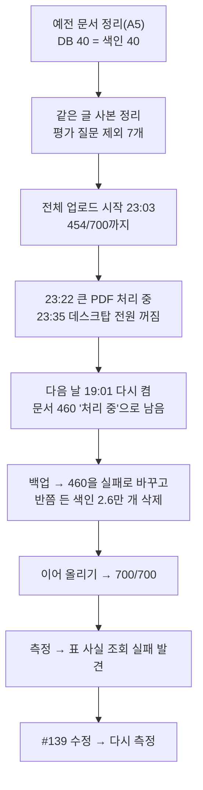

# 서비스 전체 색인과 측정, 표 사실 조회 고장 수정 (M1 8번, 이슈 #127·#139)

> 날짜: 2026-10-03~04 · 장소: 데스크탑(develop `84f4fa4` + 브랜치 `fix/#139-table-fact-cache`) · 업로드: 맥북 `corpus upload --set service`(사용자가 비밀번호 입력)
> 관련: 표본 종단 테스트 `표본-종단-테스트-20261003.md`, PR 2 보고서 `업로드-파이프라인-보강-PR2-설정정리-20261003.md`, 총괄계획 §4.2 M1 8번

## 0. 결론

| 항목 | 결과 |
|---|---|
| DB와 색인이 같은 문서를 가리키나 (완료 기준) | **예.** 처리 완료이고 청크가 있는 문서 698개 = 세 컬렉션의 document_id 698개 |
| 서비스 색인 | 대장 '색인' 700행 모두 업로드(실패 0). 그중 2개는 글이 없어 청크 0(빈 HTML, 그림 PDF) |
| 색인 크기 | 원문 청크 3,206 · 표 사실 45,878 · 검색 청크 3,206 · 출처 블록 3,654, Chroma 저장소 1.7GB |
| 처리 시간 | 합계 43.9분(HTML 618개 12.9분, PDF 60개 30.1분, HWP 22개 0.9분, DOCX 1개 0.1분). 가장 긴 문서 825초 |
| **고장 발견** | 표 질문마다 표 사실 전체를 Chroma에서 가져오는 조회가 45,878개에서 `too many SQL variables`로 실패 → 표 근거가 소리 없이 빠짐, Chroma 메모리 1.44GB → 9.25GB |
| **수정(#139)** | 표 사실을 나눠 가져와 메모리 캐시에 한 번 두고 질문마다 메모리에서 채점(채점 규칙 그대로) → 실패 0, 표 질문 0.65~1.25초, Chroma 1.35GB |
| 그 밖에 | 2,048토큰을 넘는 임베딩 글 2개(한 PDF), 표 우선 단계에서 HTML 근거가 빠지는 문제(M2) |

## 1. 진행 순서와 사고

- **꺼진 원인(Windows 기록으로 확인)**: 23:35:39에 사용자 계정의 시작 메뉴 전원 메뉴에서 "전원 끄기"(이벤트 1074, `RuntimeBroker.exe`, 이유 "기타(계획되지 않음)"), 23:36:02 운영 체제 종료(이벤트 13), 다음 날 19:01:44 새로 부팅(이벤트 12, 부팅 유형 0x0). 절전(이벤트 42)은 9월 5일 이후 없음. 절전 설정은 전원 연결 시 '안 함'. 처리 부담·고장 때문이 아니었다.
- **꺼질 때 처리 중이던 문서**: `2026학년도 인하공업전문대학 실습실 정밀안전진단 결과보고서.pdf`(8.5MB, 글자 175,947). 색인 항목 25,261개(64개씩 395묶음)를 23:35:17까지 임베딩하고 검색 청크 7묶음 중 4번째에서 끊겼다.
- **남은 흔적과 처리**: DB에 '처리 중'으로 남았다. 관리 화면은 '처리 중' 문서의 삭제 버튼을 막아 두어 지울 수 없었고, 그대로 이어 올리면 같은 파일 검사(살아 있고 실패하지 않은 문서)에 걸려 '이미 있음'으로 기록될 상황이었다. 백업(`20261004-193720`) 뒤 DB에서 '실패'로 바꾸고(사유 기록), AI 서버 삭제 경로로 반쯤 든 색인(25,261·739·192개)을 지웠다. 이어 올리기에서 다시 처리되어 461번으로 완료(825초).
- **빠진 기능**: 서버가 재시작되면 '처리 중' 문서를 되살리거나 실패로 바꾸는 경로가 없다 → M4 운영 준비 할 일로 기록.

## 2. 측정

### 2.1 처리 시간 (DB `processing_duration_ms`)

| 형식 | 문서 | 합계 | 평균 | 최대 |
|---|---|---|---|---|
| html | 618 | 12.9분 | 1.3초 | 17.4초 |
| pdf | 60(실패 1 포함) | 30.1분 | 30.6초 | 825.3초 |
| hwp | 22 | 0.9분 | 2.4초 | 10.6초 |
| docx | 1 | 0.1분 | 4.5초 | 4.5초 |

PDF 시간은 표 사실 수가 정한다. 안전진단 PDF 한 건이 25,261개 항목을 만들었고, 이는 나머지 699개 문서를 합친 것보다 많다. PDF의 OpenDataLoader 표 사실에는 개수 상한이 없다(마크다운 표 경로는 청크당 40개).

### 2.2 색인 크기

| 컬렉션 | 항목 | 비고 |
|---|---|---|
| documents | 49,084 | 원문 청크 3,206 + 표 사실 45,878(PDF 42,807 · HTML 2,676 · HWP 367 · DOCX 28) |
| retrieval_chunks | 3,206 | |
| source_blocks | 3,654 | 임베딩 없음 |
| Chroma 저장소 | 1.7GB | 백업 압축본 838MB(`20261004-201713`) |
| BM25 | 원문 3,206개, 단어 13,308개 | 상한 50,000에 한참 못 미침 |

### 2.3 GPU·메모리

| 시점 | GPU | AI 서버 | Chroma |
|---|---|---|---|
| 업로드 중 최대 | 6,702MiB(임베딩 모델만) | 약 400MiB | 약 1.4GB |
| 질문(BM25 만든 뒤, 수정 전) | — | 803MiB | **9.25GB**(실패한 전체 조회 뒤) |
| 질문(수정 뒤) | — | 1.03GB(+표 사실 캐시 약 230MB) | 1.35GB |

### 2.4 가장 긴 임베딩 글

2,048토큰을 넘는 글이 2개 있다(안전진단 PDF의 원문 청크 2,907자·2,098토큰, 검색 청크 2,941자·2,124토큰). 끝부분 수십 토큰이 잘린 채 임베딩된다. 나머지는 1,372토큰 이하. 청크 크기 설정(800자)보다 긴 청크가 나오는 원인은 M2 청크 길이 손질에서 본다. PR 2 때 쓴 코드 주석("약 1,400토큰이라 잘리지 않는다")을 이 실측으로 다시 고쳤다(#139 PR에 별도 커밋).

### 2.5 검색 확인 (표본 때 질문 7개, `/debug/rag-trace`, 두 번씩)

| | 표본 41개(10-03) | 전체 700개, 수정 전 | 전체 700개, 수정 뒤 |
|---|---|---|---|
| 벡터 검색 상위 10에 목표 | 7/7 | 7/7 | 7/7 |
| 최종 후보에 목표 | 5/7 | 4/7 | 4/7 |
| 표 사실 후보 | 0~5 | **0(조회 실패)** | 0~5 |
| 질문 시간(두 번째 회) | 0.9~7.2초 | 1.0~17.1초 | **0.65~1.25초** |

수정 뒤 첫 질문은 57초가 걸렸다: 임베딩 모델 불러오기 12.5초, Chroma 첫 조회 9.1초, BM25 만들기, 표 사실 캐시 만들기 15.6초. 서버를 다시 켜거나 문서를 올린 뒤 첫 표 질문 한 번에만 든다. 미리 만들어 두기는 M4 후보.

## 3. 표 사실 조회 고장 (#139) — 문제 중심 기록

| 단계 | 내용 |
|---|---|
| 증상(수치) | 표 사실 45,878개에서 표 질문마다 `[query_table_fact_lexical] failed`, 표 사실 후보 0, 질문 5~17초, Chroma 메모리 9.25GB |
| 재현·측정 | 표 사실 18,941개(표본)에서는 동작하되 질문당 약 5.5초가 이 조회에 쓰였다. 같은 질문 7개를 전체 색인에 다시 넣어 재현 |
| 원인 근거 | 오류 기록: `chromadb.errors.InternalError: ... error returned from database: (code: 1) too many SQL variables`. 코드: `_lookup_lexical_table_fact_candidates`가 `collection.get(where={"chunk_role": "table_fact"})`를 개수 제한 없이 부른다. 그리고 채점 함수가 표 사실 하나마다 질문 단어 뽑기·소문자·공백 제거·정규식을 다시 한다 |
| 대안 | A 메모리 캐시(채택) · B 나눠서 가져오기만(실패는 막지만 질문마다 4.6만 개 전송·채점이 남음) · C 표 사실 개수 상한(표 답을 잃을 수 있어 평가 뒤 M2) · D 그대로(첫 점수를 고장 난 경로로 잼) |
| 바꾼 것 | 표 사실을 `CHROMA_GET_PAGE_SIZE`(기본 5,000)씩 나눠 가져와 처음 한 번 메모리 캐시로 둔다. 캐시를 만들 때 표 사실 쪽 채점 재료(소문자·공백 제거·금액·합계 열·통계어)를 미리 계산하고, 질문 단어는 질문마다 한 번만 만든다. 채점 규칙은 한 함수(`_score_prepared_table_fact`)에만 두고 기존 채점 함수도 그것을 쓴다. 업로드·삭제 때 BM25와 함께 무효화(`_invalidate_query_caches`). BM25 색인을 만들 때도 같은 나눠 가져오기를 쓴다 |
| 부작용 관리 | 채점 결과가 같은지 고치기 전 채점 함수를 테스트에 옮겨 합성 표 사실·질문으로 비교. 캐시의 metadata는 복사해서 넘긴다. 캐시 만들기가 실패하면 빈 후보를 돌려주고 캐시하지 않는다(다음 질문에 다시 시도). 변이 확인 5개 |
| 결과(수치) | 데스크탑 전체 색인: 실패 0, 표 사실 후보 5개 복원, 질문 0.65~1.25초, Chroma 1.35GB, AI 서버 +약 230MB. 맥북 합성 45,878개 채점: 질문당 2.17초 → 0.10초, 점수 동일 |
| 남은 한계 | 서버 프로세스마다 캐시를 따로 가진다(BM25와 같은 한계, 여러 프로세스로 늘릴 때 M4). 첫 표 질문 15.6초. 최종 후보 순위 문제(표 우선 단계)는 그대로(M2) |

## 4. 그 밖에 발견

- 글이 없어 청크 0인데 '처리 완료'로 표시되는 문서 2개: `로드맵(호텔경영학과).html`(231바이트), `2026년도 고속도로 장학생 선발 안내문.pdf`(그림 PDF). 관리 화면에서는 정상으로 보이지만 검색되지 않는다. 처리 결과가 비면 실패로 표시할지, 그림 PDF 글자 인식(나중 후보)을 할지 정해야 한다.
- 브라우저 주소: 백엔드 CORS 허용 목록에 WSL 주소(`<WSL IP>:19580`)만 있어 Windows 주소로 열면 로그인·질문이 403. 접속 문서를 고쳤다.
- 데스크탑을 다시 켠 뒤 맥북 → WSL 직접 SSH가 시간 초과 → Windows 노드를 거쳐(`ssh desktop-win "wsl -d Ubuntu -- bash -s"`) 진행.

## 5. 다음

1. #139 PR 머지 → 데스크탑 develop으로
2. M1 9번 데이터셋용 색인(같은 코드, 별도 compose 프로젝트, 학습 몫 문서)
3. M1 10번 평가셋 설계(질문 만들 평가 문서 221개, `[평가질문제외]` 7개 빼고)
4. 후보 결정: 글 없는 문서 처리, PDF 표 사실 상한(M2, 평가 뒤), 청크 길이 상한(M2), 재시작 뒤 '처리 중' 문서 복구·캐시 미리 만들기(M4)
