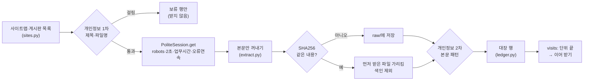

# M1-2 학교 문서 수집기·문서 대장 도구 구현과 시험 수집 (2026-10-02)

> 목적: 총괄계획 §4.2 M1 진행 순서 2번(이슈 #123). 학교 공개 문서를 수집 규칙대로 모아 문서 대장(SQLite)에 기록하는 도구를 만든다.
> 상태: **수집 완료.** PR #131(수집기) 머지 → 전체 수집(01:21~03:41) → 보완 PR #132 머지·`remeasure` → 누락 공지 다시 받기(16:02~16:13) → 2026 모집요강 등록. **최종 대장 3,892행, 실패 0, 대장에 없는 글 0**(§8.5). 남은 일: 업무 시간 제한 삭제 코드 PR. 이슈는 다음 릴리스 때 닫는다.
> 브랜치: `feat/#123-corpus-collector` · 코드: `tools/corpus/` · 관련: `문서대장-형식-20261001.md`(§7 바뀐 점), 총괄계획 §4.6 안건 2·4

## 1. 한눈에

## 2. 구성 (`tools/corpus/corpus/`)

| 파일 | 역할 | 핵심 |
|---|---|---|
| `polite.py` | 수집 예절을 코드로 강제 | `PoliteSession.get()`(polite.py:124): robots 확인 → 업무 시간이면 `Stop` → 2초 간격 → 403·429·5xx면 간격 2배, 5번 연속 `Stop`. `wildcard_disallows()`(polite.py:32): 표준 `urllib.robotparser`가 못 읽는 `/*/topMngr` 규칙 |
| `sites.py` | K2Web 화면 해석(네트워크 없음) | 사이트맵 `sitemap_links()`(묶음 이름 포함), 게시판 `board_rows()`(고정 공지·`새글` 표시 처리), FAQ `faq_items()`, 모집요강 `viewer_files()`(출력용 링크, 없으면 PDF 뷰어 원본) |
| `extract.py` | 본문만 꺼내기·측정·자동 제안 | `page_body()`(extract.py:52): 게시판 위젯만 빼고 학사일정·교과목개요·종합민원 위젯은 남김. `post_parts()`(extract.py:94): 제목 + `view-con`, 작성일·수정일. 주제·학년도·묶음·유효 기간 제안 |
| `pii.py` | 개인정보 2단계 | `judge()`: 1차 키워드 6개, 2차 패턴 4개(학교 업무 전화 제외) |
| `hwp.py` | HWP 5.0 글자·표 수 | OLE `BodyText/SectionN` → raw deflate → `HWPTAG_PARA_TEXT`(UTF-16LE), 표는 `CTRL_HEADER`의 `tbl ` |
| `ledger.py` | 문서 대장 | M1-1 스키마 + `visits`(이어 받기). `upsert()`는 `reviewed=1` 행의 확인 칸을 덮지 않음. CSV 왕복(UTF-8 BOM), `purge_excluded()`(제외 원본 삭제) |
| `collect.py` | 수집 순서 | 본교 페이지 → 학사규정 → FAQ → 입학 → 학과 29곳 → 공지 3년. 단위가 끝나면 `visits`에 기록, 실패가 있던 단위는 다음에 다시 |
| `scope.py` | 수집 범위 상수 | 게시판 번호·입학 전형 메뉴·학과 사이트 제외 묶음·사람 정보 메뉴 |
| `cli.py` | 명령 | `collect`·`export-review`·`import-review`·`add-file`·`stats`·`failures` |

의존성: requests(Apache-2.0)·beautifulsoup4(MIT)·olefile(BSD)·pypdfium2(Apache-2.0/BSD-3), 개발용 pytest(MIT). 모두 허용형.

## 3. 결정과 근거

| 결정 | 근거 | 버린 대안 |
|---|---|---|
| 화면 구조를 실제 화면으로 다시 확인한 뒤 해석기를 썼다 | [실측] 조사 때 받아 둔 화면 100여 개로 검증: 본교 메뉴 189쪽, 학과 사이트 29곳, FAQ 20건/쪽, 모집요강 링크, 작성일 위치(`view-util dl.writer`) | 표본 스크립트의 정규식 재사용 → 작성일이 `view-info`에 없다는 것을 놓쳤다(실측에서 발견) |
| 게시판 위젯만 빼고 다른 위젯은 남김 | [실측] 학사일정은 `schdulmanage`, 교과목개요는 `sbjMng`, 종합민원 부서표는 `qna` 위젯 안에 본문이 있다. 위젯을 모두 빼면 학사일정 2,522자 → 0자 | 위젯 전부 제거 |
| 입력칸(`input`)을 지우지 않음 | [실측] html.parser가 `<input>` 뒤 내용을 입력칸 안에 넣어, 지우면 학사일정 2,551자 → 45자 | `input` 제거 |
| 1차 보류 글은 열지도 않음 | 수집 규칙 ⑦ "내려받지 않는다" — 글 본문도 내려받기다. FAQ는 답이 목록 화면에 이미 와 있어도 원본을 저장하지 않는다 | 받은 뒤 보류 |
| 사람 정보 페이지는 받되 보류 | [원문] 조사 보고서 §4 "교수진 연락처를 답에 쓸지는 정책으로 정할 일" — 아직 정하지 않았다 | 수집 범위에서 빼기(되돌리기 어려움) / 통과(정책 선결정) |
| 읽지 못한 파일은 보류 | 수집 규칙 ⑧ "자동 검사만으로 통과시키지 않는다"의 연장 | 통과 |
| 같은 내용은 파일 한 번, 행은 출처마다 | [실측] 수시1·2차·정시가 같은 모집요강 PDF를 쓴다(아래 §4). 출처는 남기고 색인은 한 번만 | 행도 하나로 합치기(출처 손실) |
| 유효 기간 제안은 작성일·수정일 중 늦은 날 | [실측] 고정 공지 "2026년 학생예비군…"은 작성일 2025-02-04. 해마다 고쳐 쓰고 작성일은 그대로다 | 작성일만 |
| 테스트는 합성 화면 | 저장소가 공개라 학교 화면을 넣지 않는다. 구조(클래스·중첩)만 따르고 글은 지어냈다 | 실제 화면 저장 |
| 글자 수 도구 변경(pypdfium2·BeautifulSoup) | [판단] pdftotext는 pip로 안 깔리는 GPL CLI, MarkItDown은 수집기에 무겁다. 글자 수는 크기 가늠용 | 표본과 같은 도구 |

## 4. 시험 수집 (2026-10-02 00:30~00:34, 금요일 업무 시간 밖)

대상별로 요청 상한을 두고 실제 사이트에 돌렸다(임시 폴더, 대장은 시험용).

| 대상 | 요청 | 행 | 보류 | 중복 | 빈 페이지·글 | 실패 |
|---|---|---|---|---|---|---|
| FAQ + 입학 | 45 | 118 | 2 | 3 | 1 | 0 |
| 학사규정 | 15 | 6 | 1 | 0 | 7 | 0 |
| 공지(학사) | 25 | 22 | 0 | 0 | 0 | 0 |
| 학과 사이트 | 20 | 10 | 2 | 0 | 2 | 0 |
| 본교 안내 페이지 | 15 | 12 | 0 | 0 | 1 | 0 |
| **합계** | **120** | **168** | **5** | **3** | **11** | **0** |

- FAQ **85건 + 입시 FAQ 11건**: 조사 때 센 수와 같다.
- 요청 시작 간격 2초를 지켰고(기록 시각), 403·429·5xx는 한 번도 없었다.
- 형식: html 136·pdf 25·hwp 6·docx 1. 첨부 실측: PDF 11개 평균 293KB·5,120자, HWP 4개 평균 435KB·843자(서식류가 많았다).

### 발견

| 발견 | 뜻 | 반영 |
|---|---|---|
| 규정 PDF 1개가 2차 '학번형 숫자'로 보류. 걸린 숫자는 9자리, 앞 글자가 "학번"인 **서식 예시** 칸(날짜 아님, 숫자는 출력하지 않고 모양만 확인) | 규칙이 의도대로 잡았다. 예시 번호인지 실제 번호인지는 사람이 본다 | 그대로(검수 #124) |
| 입시 FAQ "합격자가 아닌데 부여된 예비번호는…"이 1차 '합격자'로 보류 | 일반 질문도 키워드에 걸린다(오탐). 검수에서 풀면 다음 수집 때 받는다 | FAQ 1차 보류는 원본을 남기지 않게 고침 |
| 수시1차·수시2차·정시 모집요강이 같은 파일 | 행 3개, 파일 1개, 색인 1개 | 중복 처리 그대로 |
| 편입학 모집요강 PDF(9쪽) **글자 0자** | 그림 PDF. OCR 없이는 내용이 없다 | `image_heavy=1`. OCR 여부는 #125·#127에서 |
| 산업체위탁·e-MU 전공심화·편입학은 아직 **2026학년도 판**만 있다 | 유효 기간이 지나 `보관`으로 제안된다 | 검수 때 확인, 2027판이 올라오면 다시 수집 |
| 학과 '로드맵'처럼 그림만 있는 페이지가 행에서 빠졌다 | 그림 위주 내용의 양을 셀 수 없다 | 글 100자 미만이라도 그림이 있으면 `image_heavy=1` 행으로 남김 |
| FAQ 주제 제안이 '기타'로 많이 빠짐(계정·강의실·출결 등) | 검수 부담 | 주제 낱말 보강(시설 낱말을 '강의'보다 먼저) |

## 5. 검증

| 확인 | 결과 |
|---|---|
| `pytest` (네트워크 없이, 합성 화면) | **65개 통과**: 해석기 16, 규칙(개인정보·ID·HWP·수집 예절) 30, 대장 7, 수집 통합 12 |
| 수집 통합 테스트가 확인하는 것 | 3년 기준일·고정 공지·오래된 쪽에서 멈춤, 1차 보류는 요청 자체를 안 함, 2차 패턴, 중복 파일 1개, 본문 빈 글, 이어 받기(두 번째 실행은 글·첨부 요청 0), 사람이 푼 보류의 재검사, 학과 사이트 제외 묶음, 업무 시간 멈춤 |
| `ruff check --select F,E9,W6` | 통과 |
| `git diff --check`, 줄 끝 공백, AI 서명 | 없음 |
| 실제 사이트 시험 수집 | §4 |

## 6. 남은 일

1. PR 머지 뒤 **전체 수집**(맥북, `Assets/corpus/`, 업무 시간 밖, 약 2.5시간): `python -m corpus collect`. 멈추면 같은 명령으로 이어 받는다.
2. 결과 기록: 받은 수(종류·형식·주제), 실패 목록, 첨부 실측 크기(`stats`), 보류 건수 → 이 문서 §7에 추가하고 이슈 #123 닫기.
3. 2026학년도 모집요강 등록: `add-file Assets/test_docs/2026학년도 입학전형 신입생 모집요강.pdf --doc-id ipsi/file/2026-신입생-모집요강 --site ipsi --topic 입시 --year 2026 --valid-until 2026-02-28 --group 모집요강:신입생`.
4. 검수(#124)에서 볼 것: 보류(1차 오탐·사람 정보 페이지·읽지 못한 파일), 2026판만 있는 모집요강, 학년도 비어 있는 모집요강(e-MU 전문학사·전공심화), 제3자 저작물 표시.

## 7. 면접 포인트

- "수집 규칙을 문서로만 두지 않고 HTTP 세션 한 곳에 넣었다. 모든 요청이 `PoliteSession.get()`을 지나므로 robots.txt·2초 간격·업무 시간·오류 연속 멈춤을 우회할 길이 없다. 표준 robots 해석기가 와일드카드를 못 읽는다는 것도 학교 robots.txt로 확인하고 따로 구현했다."
- "개인정보 검사를 내려받기 전후 두 단계로 나눴고, 1차에 걸리면 글 자체를 열지 않는다. 검사를 못 한 파일(그림·암호 HWP)도 통과시키지 않고 보류한다. 사람이 보류를 풀면 다음 수집 때 받되, 받은 내용을 다시 검사해 패턴이 나오면 확인 대기로 되돌린다."
- "실제 화면으로 해석기를 검증하다가 html.parser가 입력칸 뒤 내용을 입력칸 안에 넣는 바람에 학사일정이 2,551자에서 45자로 줄어드는 문제를 찾았다. 그 경우를 합성 화면 테스트로 고정했다."
- "단위(글 하나와 첨부)를 끝까지 처리했을 때만 기록해서, 업무 시간이 되어 멈추거나 오류가 나도 같은 명령으로 이어 받는다. 실패가 있던 단위는 기록하지 않아 다음 실행이 다시 시도한다."

## 8. 전체 수집 결과 (2026-10-02 01:21~03:41, 맥북)

`caffeinate -is .venv/bin/python -m corpus collect` (PR #131 머지 직후, develop `0234c59`). **요청 4,173회, 2시간 20분, 실패 0, 403·429·5xx 0, 멈춤 없음.**

| 단계 | 시간 | 단계 | 시간 |
|---|---|---|---|
| 본교 안내 페이지 | 6분 19초 | 공지 학사(11) | 28분 35초 |
| 학사규정 | 2분 29초 | 공지 장학(17) | 24분 56초 |
| FAQ | 16초 | 공지 행사(18) | 16분 42초 |
| 입학(모집요강·입시결과) | 1분 14초 | 공지 채용(19) | 16분 20초 |
| 학과 사이트 29곳 | 14분 55초 | 공지 일반(33) | 23분 37초 |
| | | 입학 공지(9) | 4분 27초 |

### 8.1 받은 것

대장 **3,768행**, 원본 **1.1GB**(`Assets/corpus/raw/`), 글자 약 778만.

| 묶음 | 행 | 글자 | 비고 |
|---|---|---|---|
| 공지 본문(3년) | 1,607 | 141만 | 게시판별: 학사 380·장학 277·행사 255·채용 330·일반 336·입학 28 (+누락 117, §8.4) |
| 공지 첨부 | 1,556 | 541만 | PDF 809(평균 991KB·5,545자), HWP 562(평균 230KB·2,185자), 그림 176(평균 1.5MB), pptx 18·xlsx 7·docx 6·기타 1. 10MB 넘는 첨부 7개 |
| 안내 페이지 | 457 | 46만 | 본교 148·학과 304(29곳)·입학 5 |
| 학사규정 첨부 | 35 | 26만 | 조사 때 센 35건과 같음 |
| 모집요강·입시결과 | 17 | 22만 | 모집요강 12(3전형 같은 파일 → 색인 1번), 입시결과 5 |
| FAQ | 96 | 2만 | 85 + 입시 11 |

- 조사 추정과 비교: 본교 공지 3년 약 1,460건 → **1,578건**(누락 41 별도), 첨부 약 1,900개 → **1,556개**, 첨부 1개 1천~5천 자 가정 → PDF 5,545자·HWP 2,185자.
- 형식: html 2,160·pdf 828·hwp 566(이 중 12개는 내용이 HWPX)·그림 177·pptx 18·xlsx 11·docx 7·기타 1.
- 그림 위주(OCR 후보): PDF 첨부 228(평균 247자), 공지 본문 197, 안내 페이지 66, 그림 첨부 176.

### 8.2 개인정보 보류 484건

| 사유 | 건수 | 내용(모양만 확인, 글자는 출력하지 않음) |
|---|---|---|
| 읽지 못한 파일 | 229 | 그림 176·HWP 19(내용이 HWPX 12, 빈 파일 4, 암호·배포용 3)·pptx 18·xlsx 7·docx 7·pdf 1·기타 1 |
| 2차 본문 패턴 | 157 | 가린 이름 70·학번형 38·휴대전화 31·여러 개 18. 가린 이름 일치 939개 중 754개가 앞뒤가 한글 아닌 이름 모양(`*` 906개) → 대부분 실제 명단으로 보인다. 학번형 일치 588개 중 9자리 496개, 날짜 모양 3개 → 대부분 학번으로 보인다 |
| 1차 제목·파일명 | 63 | 합격자 38·명단 14·대상자 11 (글 50·첨부 12·FAQ 1은 열지 않음) |
| 사람 정보 페이지 | 35 | 교수진·행정직원·교내전화번호·학생회·임원현황 |

→ 2018년 조사 때 본 "학번 목록이 공지 본문에 있다"는 것이 최근 3년에도 있다. 2차 검사가 없었다면 그대로 학습·색인에 들어갈 뻔했다.

### 8.3 색인 상태

| 색인 | 보관 | 제외 |
|---|---|---|
| 651 (116만 자) | 2,442 (469만 자) | 675 (194만 자) |

- `보관`이 많은 것은 규칙대로다: 공지의 유효 기간 기본값이 "게시 학기 끝"이라 지난 학기 공지는 서비스 색인에서 빠진다. 학습·평가 데이터(데이터셋용 색인)에는 보관 문서도 쓴다.
- 800자 청크로 어림하면 서비스 색인 약 1,450개, 보관까지 약 7,300개(중복 제거 전).

### 8.4 수집 뒤 발견한 빈틈 → 보완 PR

| 빈틈 | 실측 | 보완 |
|---|---|---|
| 그림 포스터만 있고 첨부가 없는 공지가 대장에 없음 | **117건**(입학 공지 76, 본교 41). 예: 입학 공지 "2027학년도 수시1차 모집 안내" | 모든 글을 대장에 남김(그림만 → `image_heavy`, 내용 없음 → 색인 제외 행). 끝낸 글이라도 대장에 행이 없으면 다시 처리 |
| `.hwp`인데 내용은 HWPX | 12개(zip, mimetype `application/hwp+zip`) | 내용으로 형식 판단, HWPX 글자·표 수 추출(`<hp:t>`, `<hp:tbl>`) |
| 학교가 0바이트로 내려주는 첨부 | 4개(한 글의 첨부 4개) | 원본 없이 `빈 파일` 행 |
| 위 행들을 다시 받지 않고 고칠 방법 | — | `remeasure` 명령(요청 없음, 사람이 확인한 행은 두고 읽지 못한 행만 다시 재기) |

보완 PR #132 머지(2026-10-02 15:55, develop `9daf5ed`): 테스트 71개 통과, 변이 확인 3건(되돌리면 테스트가 실패함).

- `remeasure`(15:56, 요청 없음, 실행 전 대장 백업 `Assets/corpus/backups/ledger-before-remeasure-20261002.sqlite`): 읽지 못한 226행 확인 → HWPX 12개 형식 정정·글자 추출(4개는 2차 패턴으로 계속 보류), 0바이트 첨부 4행 `빈 파일`로 정리. **보류 484 → 472.**
- 누락 공지 다시 받기: 평일 업무 시간이라 18:01에 자동 시작하도록 걸어 둠(`collect --only notices`, 맥북, `caffeinate`). 결과는 §8.5에 덧붙인다.

### 8.5 누락 공지 다시 받기와 최종 대장 (2026-10-02 16:02~16:13)

- 사용자 결정으로 **수집 규칙 ②의 평일 9~18시 제한을 뺐다**(총괄계획 §7). robots.txt·2초 간격·오류 연속 멈춤·공개 페이지만·개인정보 2단계는 그대로. 이번 실행은 업무 시간 제한만 끈 세션으로 돌렸고, 코드에서 제한을 빼는 수정은 별도 PR(`chore/#123-corpus-anytime`)로 올린다.
- `collect --only notices`: **요청 308회, 10분 16초, 실패 0.** 새 행 123(누락 글 117 + 오늘 올라온 글 2와 첨부), 이미 끝낸 글 1,624 건너뜀, 보류 1(새 첨부의 학번형 숫자), 중복 1.
- 확인: 처리한 글 1,778건 중 대장에 없는 글 **0건**(이전 117건). 그림 위주 공지 본문 314건.
- 2026학년도 모집요강 등록(`add-file`, 누리집에 없어 `Assets/test_docs` 사본 사용): `ipsi/file/2026-freshman-admission-guide`, PDF 22MB·46,146자, 개인정보 통과, 유효 기간 2026-02-28이 지나 `보관`(안건 4의 연도 시험에서는 학습판).

| 최종 대장 | 값 |
|---|---|
| 행 | **3,892** (공지 본문 1,726·공지 첨부 1,560·안내 페이지 457·FAQ 96·학사규정 35·모집요강·입시결과 18) |
| 원본 | 1.2GB, 글자 약 786만 |
| 게시판별 공지(3년) | 학사 383·장학 287·행사 264·채용 348·일반 339·입학 104 |
| 개인정보 보류 | **473** (읽지 못한 파일 213·2차 본문 패턴 162·1차 제목·파일명 63·사람 정보 페이지 35) |
| 색인 상태 | 색인 670·보관 2,552·제외 670 |
| 실패 | 0 |

이슈 #123 완료 기준("수집 범위의 원천이 모두 대장에 기록되고 실패 목록이 있다", "테스트가 통과한다")을 채웠다. 남은 일은 업무 시간 제한을 뺀 코드 PR 하나다.
