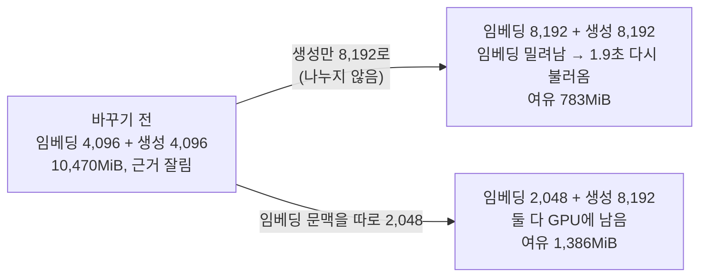

# 업로드 파이프라인 보강 PR 2 — 생성·임베딩 문맥 분리, 사고 모드 끄기, Chroma 1.5.5 (이슈 #126, M1 6번)

> 날짜: 2026-10-03 · 브랜치 `chore/#126-runtime-settings` · 실측 장소: 데스크탑(RTX 4070 SUPER 12,282MiB, Ollama 0.30.7)
> 관련: 설계 `업로드-파이프라인-보강-설계-20261002.md` §2(PR 2 묶음), 총괄계획 §4.6 안건 1·5, 데스크탑 실측 `docs/rag/research/기반모델-후보-데스크탑-실측-20261001.md`

## 0. 결론

| 항목 | 결과 |
|---|---|
| 생성 문맥 4,096 → 8,192 | 적용. 실제 서비스 경로로 질문 1개 HTTP 200, `ollama ps`에서 생성 모델 문맥 8,192·100% GPU |
| 임베딩 문맥을 따로 2,048 | 적용. 두 모델이 GPU에 함께 남는다(10,896 / 12,282MiB). 나누지 않고 둘 다 8,192로 올리면 생성 모델을 올릴 때 임베딩 모델이 밀려났다 |
| 생성 사고 모드 끄기 | 적용(`OllamaLLM(reasoning=False)` → Ollama `think=false`). 사고 모드가 없는 EXAONE에도 오류 없음 |
| Chroma 서버 1.0.0 → 1.5.5 | 적용. 세 컬렉션의 id·본문·메타데이터·임베딩 해시가 올리기 전과 같다 |
| 설계 전제 "임베딩 글은 최대 800자·약 700토큰" | **틀렸다.** 6월 색인 최대 1,482자·1,178토큰, 새 형식 표본까지 넣으면 1,785자·1,372토큰(PDF). 2,048 안이라 결론(잘림 없음)은 유지 |
| 설계 전제 "문맥만 줄이면 벡터가 그대로" | 맞다(한 개씩 임베딩하면 4,096과 2,048이 16개 모두 비트까지 같음). 대신 **묶음 임베딩은 같은 조건에서도 결과가 조금씩 달라진다**는 것을 새로 찾았다(§6) |

## 1. 증상 — 무엇이 문제였나

| 증상 | 수치·근거 |
|---|---|
| 긴 질문의 근거가 잘린다 | 2026-10-01 실측: 문맥 4,096에서 EXAONE 27문항 중 4개의 프롬프트가 잘림(가장 긴 질문 4,969~7,800토큰) |
| 생성 문맥만 키울 수 없다 | 생성(`OllamaLLM(num_ctx=...)`)과 임베딩(`_ollama_embedding_options()`)이 같은 환경 변수 `OLLAMA_NUM_CTX` 하나를 썼다 |
| 생성 문맥을 키우면 임베딩 모델도 커진다 | 2026-10-01 실측: 문맥 8,192에서는 EXAONE이 임베딩 모델과 함께 GPU에 남지 못했다 |
| 사고 모드가 모델 기본값 | `OllamaLLM`에 `reasoning` 지정이 없었다. Qwen3·Gemma는 기본으로 사고 글을 만든다 → 느려지고 후보 비교 조건이 달라진다 |
| Chroma 서버·클라이언트 버전이 다르다 | 서버 이미지 `chromadb/chroma:1.0.0`, ai-server 파이썬 클라이언트 `chromadb==1.5.5` |

## 2. 재현·측정 — 문맥 크기별 GPU 메모리

Ollama API를 직접 불러(서비스 코드와 무관) 모델을 하나씩, 그리고 서비스 순서대로(임베딩 → 생성 → 다시 임베딩) 올리며 `ollama ps`와 `nvidia-smi`로 쟀다. 입력은 합성 문장. 아무것도 올리지 않았을 때 892MiB(화면 등).

| 조건 | `ollama ps` 크기 | GPU 사용 | 두 모델 함께 남나 |
|---|---|---|---|
| 임베딩 4,096 혼자 | 4.4GB | 5,272MiB | — |
| 임베딩 2,048 혼자 | 4.1GB | 5,021MiB | — |
| 임베딩 8,192 혼자 | 5.0GB | 5,979MiB | — |
| 생성(EXAONE) 4,096 혼자 | 5.2GB | 6,207MiB | — |
| 생성(EXAONE) 8,192 혼자 | 5.8GB | 6,897MiB | — |
| **바꾸기 전**: 임베딩 4,096 + 생성 4,096 | 4.4 + 5.2GB | 10,470MiB (여유 1,812) | 남음, 다시 임베딩 0.1초 |
| **나누지 않고 올린 경우**: 임베딩 8,192 + 생성 8,192 | 5.0 + 5.8GB | 생성을 올릴 때 **임베딩이 밀려남** → 다시 임베딩에 1.9초(다시 불러옴) → 그 뒤 11,499MiB (여유 783) | 처음엔 밀려남 |
| **바꾼 뒤**: 임베딩 2,048 + 생성 8,192 | 4.1 + 5.7GB | 10,896MiB (여유 1,386) | 남음, 다시 임베딩 0.2초 |

실제 서비스 경로(화면 → 백엔드 → AI 서버)로 질문 1개를 보낸 뒤에도 같은 상태였다: 생성 5.7GB·문맥 8,192·100% GPU, 임베딩 4.1GB·문맥 2,048·100% GPU, GPU 10,470MiB.

## 3. 원인 근거

- 임베딩 모델의 메모리는 문맥 크기에 따라 커진다(KV 캐시): 2,048 → 4,096 → 8,192에서 4.1 → 4.4 → 5.0GB.
- 임베딩에 들어가는 글은 문맥보다 훨씬 짧다(§5: 최대 1,178토큰). 임베딩 문맥을 생성 문맥에 맞춰 키우면 쓰지 않는 칸에 메모리만 쓴다.
- Ollama는 새 모델을 올릴 자리가 모자라면 쉬고 있는 모델을 내린다. 둘 다 8,192일 때 생성 모델을 올리면서 임베딩 모델이 내려간 것이 이 동작이다. 질문마다 임베딩 → 생성 순서로 쓰므로, 자리가 빠듯하면 질문마다 다시 불러오는 일이 생길 수 있다.

## 4. 대안과 버린 이유

| 안 | 내용 | 판단 |
|---|---|---|
| 그대로 `OLLAMA_NUM_CTX`만 8,192 | 코드 변경 없음 | 버림. 임베딩도 8,192가 되어 5.0GB, 생성 모델을 올릴 때 밀려남(실측) |
| 임베딩 모델을 0.6B로 교체 | 메모리 크게 절약 | 보류. 전체 재색인과 검색 품질 재측정이 필요하다(설계 6단계 안건 5에서 재순위 모델을 넣거나 학교 서버가 12GB일 때 다시 보기로 함) |
| KV 캐시 8비트 | 메모리 절약 | 보류. 정확도 영향을 따로 재야 하고 지금은 자리가 모자라지 않다 |
| **임베딩 문맥만 따로 2,048 (채택)** | 환경 변수 하나 추가 | 재색인 불필요(§6), 두 모델이 함께 남음 |

구현 세부 판단:

- 환경 변수 이름은 `OLLAMA_NUM_CTX`를 생성 문맥으로 두고 `OLLAMA_EMBEDDING_NUM_CTX`를 더했다. `OLLAMA_LLM_NUM_CTX`로 이름을 바꾸는 안은 이미 있는 `.env`(데스크탑은 `OLLAMA_NUM_CTX=4096`을 직접 적어 둠)가 조용히 무시되는 위험이 있어 버렸다. 이름 짝은 기존 `OLLAMA_LLM_MODEL`·`OLLAMA_EMBEDDING_MODEL`과 맞췄다.
- 사고 모드는 환경 변수로 열지 않고 코드에 `reasoning=False`로 고정했다. 측정 조건(temperature 0, 사고 모드 끔)이 설정 실수로 흔들리지 않게 하기 위해서다.

## 5. 임베딩 문맥 2,048에서 잘리는 글이 있는가

설계(안건 5)는 "청크 최대 800자·표 사실 420자 → 약 700토큰 이하"로 계산했다. 실제 색인에서 다시 쟀다(가장 긴 글을 하나씩 문맥 8,192로 임베딩해 Ollama가 센 토큰 수).

| 색인 | 항목 수 | 글자 수 p50 / p99 / 최대 | 가장 긴 글의 토큰 |
|---|---|---|---|
| `documents`(원문 청크·표 사실, 6월 색인) | 2,695 | 73 / 843 / 1,456 | 1,156 |
| `retrieval_chunks`(검색 전용 청크, 6월 색인) | 214 | 530 / 1,192 / 1,482 | 1,178 |
| 새 형식 표본 41개(#127, 6월 색인 포함 전체 기준 형식별 최대) | docx 106 · html 167 · hwp 390 · pdf 19,439 | 최대: docx 912 · html 877 · hwp 1,110 · **pdf 1,785** | docx 600 · html 640 · hwp 771 · **pdf 1,372** |

- **설계의 "최대 800자" 전제는 틀렸다.** 청크 크기 설정(800자)보다 긴 글이 색인에 들어간다. 종류별로 보면 긴 글은 모두 원문 청크(최대 1,743자)와 그 검색용 청크(최대 1,785자)이고, 표 사실은 최대 423자다(`TABLE_FACT_MAX_CHARS` 420자 상한).
- 가장 긴 글이 1,372토큰(2027 모집요강 PDF)으로 2,048의 67%다 → 잘리지 않는다는 결론은 유지된다. 다만 여유가 33%라 서비스 전체 색인(M1 8번) 뒤 같은 방법으로 다시 잰다.
- 코드 주석과 `.env.example` 설명을 두 번 고쳤다: 처음 커밋의 "800자" → 6월 색인 실측 "약 1,200토큰" → 새 형식 표본 실측 "약 1,400토큰(1,785자·1,372토큰)".

## 6. 문맥을 줄여도 벡터가 그대로인가 — 그리고 새로 찾은 것

처음 확인(같은 글 40개를 16개씩 묶어 문맥 4,096과 2,048로 임베딩)에서 비트까지 같은 벡터가 `documents` 36/40, `retrieval_chunks` 20/40뿐이었다(최대 절대 차이 0.009). 원인을 가르려고 조건을 하나씩 바꿨다(16개, 같은 글).

| 비교 | 비트까지 같음 | 코사인 최소 |
|---|---|---|
| 한 개씩, 2,048 두 번 (같은 조건 반복) | 16/16 | 1.0000000 |
| 한 개씩, 4,096 대 2,048 (문맥만 다름) | **16/16** | 1.0000000 |
| 16개 묶음, 2,048 두 번 (**같은 조건 반복**) | **9/16** | 0.9984391 |
| 16개 묶음, 4,096 대 2,048 | 6/16 | 0.9985737 |
| 2,048에서 한 개씩 대 16개 묶음 | 5/16 | 0.9980477 |

- **문맥 크기는 벡터를 바꾸지 않는다**(한 개씩 16/16). 처음 본 차이는 문맥이 아니라 **묶음 임베딩 자체가 같은 조건에서도 조금씩 다르게 나오는 것** 때문이었다(같은 묶음을 두 번 보내도 9/16).
- 6월에 저장된 벡터와 비교하면 코사인 최소 0.9972·평균 0.9989(retrieval_chunks), 최소 0.9982·평균 0.9998(documents). 6월 이후 Ollama 판 변경과 묶음 차이가 섞인 값이다.
- 의미: 질문은 한 개씩 임베딩하므로 같은 색인에서는 검색이 결정론적이다. 하지만 **같은 문서를 다시 색인하면 벡터가 미세하게 달라질 수 있다** → 평가 기준점은 그때의 색인 백업과 묶어 기록해야 한다. 업로드를 한 개씩 임베딩으로 바꿀지(느려짐)는 M1 8번 서비스 색인 전에 정한다.

## 7. 부작용·위험 관리

| 위험 | 한 일 |
|---|---|
| Chroma 서버를 올리면 저장 파일이 새 형식으로 바뀔 수 있다 | 올리기 전에 `deploy/backup.sh`(데스크탑 `~/backups/documind/20261003-200622`, MySQL 36KB·Chroma 55MB) → 올리기 전 해시 → 올린 뒤 해시 비교: 세 컬렉션 모두 같음 |
| 버전 확인을 잘못할 수 있다 | `/api/v2/version`은 1.0.0 이미지와 1.5.5 이미지 모두 `"1.0.0"`을 돌려준다(버전 확인에 못 씀). 이미지 ID(`sha256:0771874e…`, 2026-03-10 빌드)와 컨테이너 안 `chroma --version`(1.0.0 이미지는 `1.0.0`, 1.5.5 이미지는 `1.4.1`)으로 바뀐 것을 확인 |
| 데스크탑 `.env`가 새 기본값을 덮는다 | 데스크탑 `.env`는 `OLLAMA_NUM_CTX=4096`을 직접 적어 두었다 → `.env.bak-20261003-before-pr2`로 복사한 뒤 8,192로 바꾸고 `OLLAMA_EMBEDDING_NUM_CTX=2048`을 더함. 다른 줄은 그대로(diff 확인) |
| 사고 모드가 없는 모델에 `think=false`가 오류를 낼 수 있다 | Ollama 원문(`server/routes.go`)은 `think`가 참일 때만 "does not support thinking"을 낸다. EXAONE에 `think=false`로 실제 호출 → 정상 답 |
| 원격 빌드 실패 | 데스크탑 Docker 설정의 Windows 자격 증명 도우미 때문에 원격 빌드가 기반 이미지를 못 받을 수 있다 → 빈 설정 폴더(`~/.docker-nocreds`)로 빌드. 두 번 모두 성공 |

## 8. 검증

| 검증 | 결과 |
|---|---|
| 맥북 AI 서버 테스트 | 80 passed, 1 skipped (새 테스트 3개: 임베딩 옵션이 임베딩 문맥을 씀, 임베딩 요청에 임베딩 문맥이 실림, 생성 모델 문맥·사고 모드 끔) |
| 변이 확인(커밋 뒤, `main.py`만 되돌림) | 임베딩이 다시 생성 문맥을 쓰게 하면 2개 실패, `reasoning=False`를 지우면 1개 실패 → 복원 후 통과 |
| 데스크탑 서비스 | PR 2 브랜치로 다시 빌드, 6개 healthy, ai-server 시작 기록 `num_ctx=8192 embedding_num_ctx=2048` |
| 실제 질문 | `POST /api/chat` HTTP 200, 13.3초(첫 질문이라 모델 불러오기 포함), 출처 5개 |
| 새 형식 표본의 임베딩 글 길이 | #127 표본 41개(docx 1·hwp 10·pdf 10·html 20) 업로드 뒤 형식별 최대: pdf 1,785자·1,372토큰이 가장 김(§5) |

## 9. 남은 한계

- 묶음 임베딩이 같은 조건에서도 다르게 나온다(§6). 업로드를 한 개씩 임베딩으로 바꿀지는 M1 8번 전에 정한다.
- 여유가 1,386MiB다. 데스크탑에서 다른 프로그램이 GPU를 쓰면 모델이 밀려날 수 있다. 학교 서버 사양(E2)을 정할 때 이 여유를 함께 본다.
- 이번 측정은 지금 생성 모델(EXAONE)만 했다. 후보 모델(A.X 4.0 Light 등)은 M1 13번 본 비교 때 같은 방식으로 잰다.

## 10. 학습 포인트

- "설정을 바꿨다"가 아니라, 바꾸기 전·나누지 않은 경우·바꾼 뒤 세 조건을 같은 방법으로 재서 왜 나눠야 하는지를 수치로 보였다(밀려남 1회, 여유 783 → 1,386MiB).
- 설계 때 계산한 전제(최대 800자)가 실측과 달랐다. 결론은 같았지만 전제를 고쳐 적었다.
- 벡터가 다르게 나왔을 때 "문맥 탓"으로 끝내지 않고 조건을 하나씩 바꿔 원인(묶음 처리)을 가렸다.
- 버전 문자열을 믿지 않고 이미지 ID와 바이너리로 확인했다.
