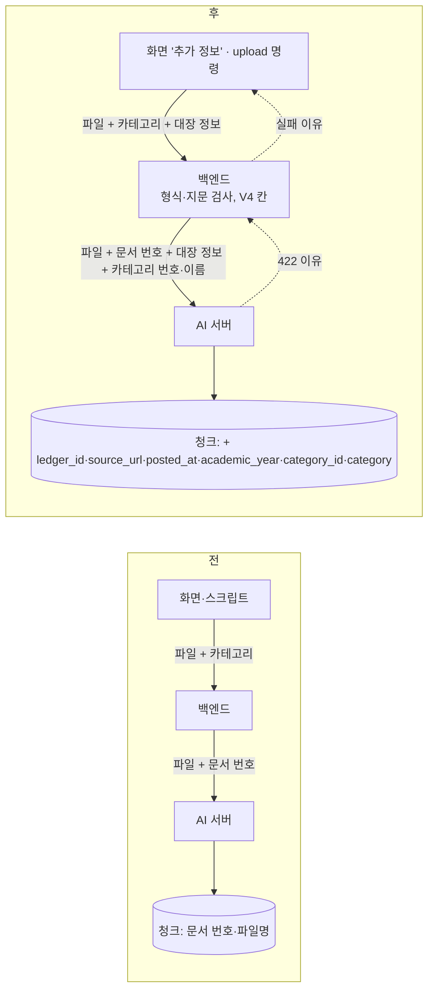

# 업로드 파이프라인 보강 구현 — PR 1 (이슈 #126, M1 6번)

> 날짜: 2026-10-02 · PR [#136](https://github.com/QyongGin/DocuMind/pull/136) squash 머지(develop `a10e7c8`, 2026-10-03). #126은 PR 2까지 끝낸 뒤 다음 릴리스 때 닫는다
> 설계: `업로드-파이프라인-보강-설계-20261002.md` (결정 1~4, 네 관점 점검 ①~④)
> PR 2(임베딩 문맥 2,048 분리·생성 사고 모드 끄기·Chroma 1.5.5)는 데스크탑을 켜는 날 #127과 함께 한다.

## 1. 결론

- **된 것**: 업로드 한 번에 문서 대장 정보(대장 ID·원래 주소·게시일·학년도)와 카테고리가 서비스 DB 칸과 AI 서버 청크 메타데이터(세 컬렉션 모두)에 들어간다. 같은 파일은 앱과 DB 두 겹으로 막고, 실패한 문서는 막지 않는다. 처리 실패 이유가 DB에 남아 관리자 화면에 보인다. 대장 행을 순서대로 올리는 `python -m corpus upload` 명령과 실행 안내서가 생겼다.
- **실측으로 확인**: MySQL 8.4(운영과 같은 이미지)에서 Flyway V1~V4가 적용되고 운영 설정(Hibernate validate)으로 서버가 떴다. DB 유일 제약이 다섯 경우 모두 설계대로 동작했다.
- **안 된 것**: 데스크탑에서 실제 업로드는 하지 않았다(#127). 화면은 빌드·lint만 확인했다. 답변 출처에 원래 주소 링크를 다는 일은 M2(출처 개선 B6)에서 한다.

## 2. 변경 전 → 후

| 용어 | 뜻 | 위치 |
|---|---|---|
| DocumentSource(문서 출처) | 대장 ID·원래 주소·게시일·학년도 값 객체. 형식 검사(주소 http·https 1,000자, 학년도 1990~2100, 게시일 YYYY-MM-DD, 대장 ID 영숫자·`/._-` 200자) | `backend/.../domain/document/DocumentSource.java` |
| 파일 지문 | 파일 내용의 SHA-256(16진수 64자) | `documents.content_sha256`, `DocumentService.sha256Of()` |
| 살아 있는 문서 | 지우지 않았고(is_active) 실패하지 않은(processing_status ≠ FAILED) 문서. 같은 파일 비교 대상 | `DocumentRepository.findLiveByContentSha256()` |
| active_content_sha256 | 살아 있는 문서일 때만 지문 값을 갖는 MySQL 생성 열. 유일 색인으로 동시 업로드 경쟁을 막는다 | `V4__add_document_source_and_fingerprint.sql` |
| 문서 단위 메타데이터 | 업로드마다 한 번 받아 그 문서의 모든 청크에 같은 값으로 넣는 메타데이터 | ai-server `DOCUMENT_METADATA_KEYS`, `_apply_document_metadata()` |

## 3. 바꾼 곳

| 층 | 파일 | 내용 |
|---|---|---|
| DB | `V4__add_document_source_and_fingerprint.sql` | 칸 6개(source_ledger_id·source_url·source_posted_at·academic_year·content_sha256·processing_error) + 생성 열·유일 색인 + 지문 색인 |
| 백엔드 | `Document`, `DocumentSource`, `DocumentController`, `DocumentService`, `DocumentProcessingService`, `DocumentRepository`, `DocumentListResponse`, `DocumentProgressResponse` | 출처 칸 받기·저장, 지문 계산·같은 파일 409(`DuplicateDocumentException`, data에 기존 문서 번호·이름), 저장 때 DB 제약 위반도 409로, AI 서버로 메타데이터 전달, 실패 이유 저장(CustomException 메시지 그대로·예상 못 한 오류는 일반 문구), 목록·진행률에 실패 이유 |
| 백엔드 공통 | `ErrorCode`(INVALID_DOCUMENT_SOURCE 400·DUPLICATE_DOCUMENT 409·DOCUMENT_UNREADABLE 422), `CustomException(ErrorCode, message)`, `GlobalExceptionHandler`(예외 메시지 사용·409 data), `ApiResponse.fail(message, data)` | |
| 백엔드 → AI 서버 | `FastApiClient`, `FastApiDocumentMetadata` | 값 있는 칸만 multipart로(ledger_id·source_url·posted_at·academic_year·category_id·category). 422의 `detail`이 문장이면 DOCUMENT_UNREADABLE(그 문장), 목록이면 일반 실패. Spring 7에서 422 예외 이름이 `UnprocessableContent`로 바뀌어 상태 코드 숫자로 판단 |
| AI 서버 | `main.py` | `/documents`가 Form 6칸을 받아 `_document_metadata_from_form()`(빈 값 제외) → `_store_document_chunks()`에서 원문 청크·표 사실·source block·retrieval chunk 모두에 넣음. 이 키들은 로더 메타데이터가 덮지 못한다 |
| 화면 | `AdminDashboardPage.jsx`, `documentApi.js`, `App.css` | '추가 정보(선택)' 접기: 원래 주소·게시일·학년도. 목록에 '실패' 표시와 이유, 학년도. 진행 알림 실패 문구 = 저장된 이유 |
| 수집기 | `corpus/upload.py`, `cli.py`, `ledger.py`(uploads 표), `README.md` | §4 |

## 4. 대량 업로드 명령 (`tools/corpus`)

| 단계 | 동작 |
|---|---|
| 고르기 | `--set service`: `index_status='색인'`(704행) / `--set dataset`: `split='학습' AND pii_status='통과'`(3,329행·파일 3,122개). 파일이 있고 글 형식인 행만, 대장 ID 순. `--formats`·`--limit`로 표본 |
| 확인 | 대상·주소·고른 행 수·형식별 수를 보여 주고 `y/N`를 묻는다(서비스·데이터셋 주소 혼동 방지). `--dry-run`은 요청 없이 파일 이름 5개까지 |
| 로그인 | 비밀번호는 실행 때 입력(`getpass`), 저장 안 함. 환경변수 `DOCUMIND_ADMIN_PASSWORD`가 있으면 그 값 |
| 카테고리 | 대장 주제와 같은 이름의 카테고리를 찾고, 없으면 만든다(결정 1 보완) |
| 올리기 | 파일 이름 = 대장 제목에서 문서 확장자를 떼고 **내용 형식의 확장자**(예: `.hwp`로 올라온 HWPX → `.hwpx`. 백엔드가 확장자·서명을 맞춰 보기 때문). 출처 칸은 http(s) 주소만 |
| 기다리기 | 응답이 PROCESSING이면 진행률을 2초마다 보고 완료·실패까지 기다린다(문서당 30분 상한) |
| 기록 | `uploads`(target·doc_id·sha256·document_id·status·reason·base_url·at). service 대상은 대장 `uploaded_document_id`도 채움. 다시 실행하면 ready·exists·failed를 건너뛰고, `--retry-failed`면 failed를 다시 |
| 예외 | 409 → exists(기존 번호), 같은 파일을 가리키는 여러 행(데이터셋) → 한 번만 올리고 나머지 exists, 401·403 → 멈춤, 실패 연속 5번 → 멈춤 |

대장에 시험 실행(`--dry-run`): 서비스 704행(html 618·pdf 63·hwp 22·docx 1), 데이터셋 3,329행. 원래 주소가 http(s)가 아닌 행은 1개(`local:` 2026 모집요강, 보관)라 주소 칸을 보내지 않는다.

## 5. 검증

| 확인 | 결과 |
|---|---|
| 백엔드 gradle test | 102개 실패 0(새 14: 출처 검사 3, FastApiClient 3, 문서 관리 5, 업로드 API 3 — 409 응답 data 모양 고정 포함) |
| AI 서버 pytest | 77 passed, 1 skipped(새 4: 빈 값 제외, 로더가 문서 키를 못 덮음, 세 컬렉션 모두 메타데이터, `/documents` Form 전달) |
| 수집기 pytest | 75 passed(새 8: 파일 이름, 출처 칸, 고르기, 기다림·기록·이어 올리기, 409·실패 기록·재시도, 데이터셋 같은 파일 한 번, 연속 5번 멈춤, 비밀번호 틀림·토큰 만료 멈춤) |
| 화면 | eslint·`npm run build` 통과. 실제 화면은 #127 |
| MySQL 8.4 실측(맥북 Docker, 임시 컨테이너) | Flyway V1~V4 적용, `prod` 설정(validate)으로 서버 기동. 유일 제약: A(살아 있음) 들어감 → 같은 지문 B 막힘(1062) → A를 FAILED로 바꾼 뒤 B 들어감 → 같은 지문 C 막힘 → B를 지운 뒤 C 들어감 |
| 변이 확인(커밋 뒤) | 같은 파일 막기·실패 문서 제외·실패 이유 저장·메타데이터 전달(백엔드), 메타데이터 넣기(AI 서버), 연속 실패 멈춤·같은 파일 한 번·완료 기다리기(수집기)를 하나씩 되돌리면 각각 1~2개 실패 |
| `git diff --check` | 통과 |

과정 기록: 첫 변이 확인을 커밋 전에 하다가 되돌리기(`git checkout -- backend/src/main`)로 백엔드 본 코드 12개 파일의 수정이 지워졌다. 이 대화의 편집 스크립트로 다시 적용해 테스트 102개 통과를 확인했고, 그 뒤 커밋하고 변이 확인을 다시 했다. 변이 확인은 커밋한 뒤에만, 되돌리기는 바꾼 그 파일에만 한다.

## 6. 한계와 남은 것

| 항목 | 내용 | 어디서 |
|---|---|---|
| 실제 업로드 | 데스크탑에서 표본 업로드(형식별)로 청크 메타데이터·실패 이유 표시를 확인해야 한다 | #127 |
| 동시 업로드 409 변환 | DB 제약 위반을 409로 바꾸는 길(`saveNewDocument`)은 H2 시험 DB에 제약이 없어 단위 시험이 없다. MySQL에서 제약 동작만 확인 | #127에서 같은 파일 두 번 동시 업로드로 확인 가능 |
| 출처 링크 표시 | 답변 출처에 원래 주소 링크 | M2 B6(출처 개선) |
| 올린 뒤 정보 고치기 | 학년도·주소 수정 + 청크 메타데이터 갱신 | M3 관리 기능 |
| 카테고리 이름 바꾸기·삭제 | 청크의 category 이름도 함께 고쳐야 한다(번호는 그대로) | M3 |
| 예전 문서 | DB 문서 1~4·색인 101~105는 지문·대장 정보가 없다 | #127 A5 정리 때 지우고 새로 올린다 |
| 비밀번호 | 명령이 사용자에게 묻는다. Claude는 데스크탑(Tailscale 주소)에 비밀번호를 넣지 않는다 | 실행은 사용자 |

## 7. 학습 포인트

- "같은 파일 막기를 앱 검사와 DB 제약 두 겹으로 했습니다. MySQL은 부분 유일 색인이 없어서, '살아 있고 실패하지 않은 문서일 때만 지문 값을 갖는 생성 열'에 유일 색인을 걸었습니다. 지운 문서와 실패한 문서는 NULL이 되어 다시 올릴 수 있습니다. 운영과 같은 MySQL 8.4 컨테이너에서 다섯 경우를 직접 넣어 확인했습니다."
- "AI 서버가 422로 준 거절 이유만 화면에 그대로 보이고, 예상하지 못한 오류의 내부 글은 일반 문구로 바꿉니다. 운영자는 스스로 고칠 수 있고, 내부 정보는 새지 않습니다."
- "대량 업로드는 백엔드 처리 실행기(스레드 1·대기열 20)를 넘지 않도록 한 문서씩 완료를 기다리고, 결과를 대장 SQLite에 남겨 끊겨도 이어 올립니다. 서비스와 데이터셋 색인 주소를 헷갈리지 않게 실행 전에 확인을 묻습니다."
- "문서 단위 메타데이터는 청크를 만든 뒤 한 지점(`_store_document_chunks`)에서 네 종류 색인 항목 모두에 넣어, 새 색인 종류가 생겨도 빠지지 않게 했습니다."
