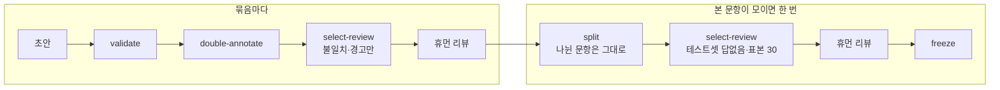

# 평가셋 분할 고정 — 나뉜 문항은 다시 나누지 않기 (2026-10-10)

> M1 10번 실행 3단계 중. 첫 30문항을 준비하다 분할 명령이 30문항씩 쌓는 흐름과 맞지 않는 것을 발견해 고쳤다. 결정은 ADR-0022, 이슈 #129.

## 1. 배경

평가셋은 30문항 묶음마다 자동 검증 → 이중 라벨링 → 휴먼 리뷰를 하고, 첫 30문항은 리뷰 시간·불일치 비율을 재는 시험 묶음이다. 그런데 도구는 250문항을 한 번에 다루는 흐름으로 만들어져 있었다.

| 문제 (코드에서 확인) | 결과 |
|---|---|
| `split`이 실행할 때마다 모든 문항을 처음부터 다시 나눈다 | 다음 묶음을 리뷰하려고 다시 나누면 앞 묶음의 개발셋·테스트셋 배정이 바뀐다 |
| `select-review`가 나뉘지 않은 문항이 있으면 멈춘다 | 묶음마다 `split`을 다시 돌려야 한다 |
| 표본을 실행마다 그때 들어온 테스트셋 자동 승인 문항에서 최대 30개 뽑는다 | 30문항 묶음의 테스트셋 문항이 매번 전부 표본이 되어, 결국 테스트셋 전체를 사람이 본다(ADR-0019와 어긋남) |
| `select-review`가 자동 검증 전 문항(`validation` 없음)을 막지 않는다 | 막는 대신 오류(AttributeError)로 멈춘다 |

## 2. 변경 내용

| 파일 | 바꾼 것 |
|---|---|
| `tools/corpus/corpus/evalset/split.py` | `assign_parts`: `part`가 있는 문항은 그대로. 새 문항은 같은 단위(문서 묶음, 큰 문서는 장)에 나뉜 문항이 있으면 그쪽, 없으면 주제마다 테스트셋 약 40%가 되도록 단위째 배정(이미 나뉜 테스트셋 수를 셈에 넣음) |
| 〃 | `select_for_review`: 나누기 전에는 불일치·경고만 정하고 나머지는 '분할 대기'(자동 승인 안 함). 표본은 파일 전체에서 `sample_size`개까지(이미 뽑은 표본 수를 뺌). 자동 검증 전 문항도 막는다 |
| 〃 | `freeze_text`: 휴먼 리뷰 대상 고르기를 거치지 않은 문항이 있으면 고정을 거부 |
| `tools/corpus/corpus/evalset/cli.py`·`report.py` | `split` 출력에 그대로 둔 문항 수, 보고에 '고르기 전' 문항 수, 도움말 |
| `tools/corpus/README.md` | 흐름을 '묶음마다'와 '한 번'으로 나눠 적음. 정답 초안은 색인 텍스트로 쓴다는 주의 |
| `docs/adr/0022-…`, `0018-…`, `README.md` | 결정 기록, ADR-0018 이름 바꿈 오기 수정 |

## 3. 동작 원리

- **나눌 단위**는 그대로다: 근거 문서의 문서 묶음(답 없는 문항은 가까운 문서), 묶음 문항이 10개를 넘으면 장 단위. 단위를 모든 문항으로 다시 계산하므로, 처음에 묶음째 나뉜 문서가 나중에 10개를 넘어 장 단위로 바뀌어도 장 안의 기존 문항이 모두 같은 쪽이라 새 문항이 그쪽을 따른다.
- **비율**: 주제마다 목표 테스트셋 수 = 전체 문항 수 × 0.4. 이미 테스트셋인 문항 수에서 시작해, 새 단위를 섞은 순서대로 목표에 가까워지는 쪽에 넣는다. 아무 문항도 나뉘지 않았을 때는 예전과 같은 결과다(같은 씨앗).
- **표본**: `select-review`를 여러 번 돌려도 '표본' 문항 수의 합이 `--sample`(기본 30)을 넘지 않는다.

## 4. 검증

| 확인 | 방법 | 결과 |
|---|---|---|
| 테스트 | `tools/corpus`에서 `.venv/bin/python -m pytest -q` (가나대학 합성 데이터) | 124 → 128 통과(새 테스트 4개 + 기존 테스트 하나에 자동 검증 전 문항 확인 추가) |
| 변이 확인 | 커밋 뒤 `split.py`만 한 곳씩 망가뜨리고 그 파일만 `git checkout`으로 되돌림 | 8/8 잡음 |
| 예전과 같은 결과 | 나뉜 문항이 없는 합성 평가셋(문서 25개·주제 3개)을 씨앗 20개로 예전 코드(develop `462d790`)와 새 코드에 넣어 대조 | 20/20 같음 |
| 공백 오류 | `git diff --check` | 없음 |

변이 8건: 이미 나뉜 문항도 다시 나눔 · 새 문항이 같은 묶음의 반대쪽으로 감 · 이미 나뉜 테스트셋 수를 비율 계산에서 뺌 · 나누기 전 문항을 자동 승인 · 표본 상한을 묶음마다 새로 · 자동 검증 전 문항을 막지 않음 · 분할 대기 수를 알리지 않음 · 고르기를 안 한 문항도 고정.

## 5. 한계

- 처음 분할은 본 문항이 모두 모인 뒤라, 첫 30문항의 테스트셋 답없음·표본 리뷰 시간은 그때 잰다. 첫 30문항에서는 불일치·경고 문항의 리뷰 시간과 불일치 비율만 잰다.
- 처음 분할을 다시 하고 싶을 때(예: 고정 전 문항을 크게 바꿈)는 `part`를 지우는 방법뿐이다. 필요해지면 옵션을 더한다.
- 학기마다 새 문항의 표본 수와 '새 학년도 문항은 테스트셋에 먼저'(설계 결정 ⑤-4)는 아직 코드에 없다. 학기 갱신 때 정한다.

## 6. 학습 포인트

- **재실행해도 결과가 같은 명령(idempotent)**: 데이터를 쌓아 가는 흐름에서는 "다시 돌리면 처음부터 계산"하는 명령이 앞선 결정(여기서는 사람이 이미 본 표본)을 조용히 뒤집는다. 한 번 정한 값은 고정하고 새 것만 정하게 바꿨다.
- **통계 표본의 단위**: "표본 30"은 테스트셋 전체에서 뽑아야 "0/30이면 오류율 약 10% 이하"로 읽힌다. 묶음마다 뽑으면 개수도 해석도 달라진다.
- **설계와 코드의 어긋남 찾기**: 설계 문서의 실행 순서(나누기는 초안이 다 모인 뒤)와 작업 계획(30문항씩 리뷰)이 서로 달랐고, 코드는 앞쪽만 지원했다. 실제 데이터를 넣기 전에 흐름을 따라가 보다 발견했다.
