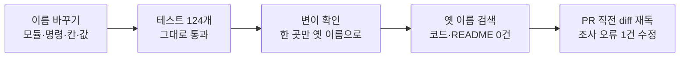

# 평가셋 용어 통일 — 문서·코드를 실무 용어로 (2026-10-08)

> M1 10번 평가셋. 실행 2단계(평가셋 도구, PR #141·#142) 뒤, 실행 3단계(첫 30문항)에 들어가기 전에 용어를 한 번에 정리했다. 코드는 PR #143(develop `2a8b57a`), 문서는 문서 구조 전환 PR에 함께 넣는다. 용어 기준표는 `docs/project/용어집.md`.

## 1. 배경

평가셋 설계와 도구를 만들면서 "기계 검사·교차 확인·검수·정답지·꾸러미·연습용/실전용" 같은 자체 조어가 문서·코드·대화에 섞였다. 문제는 세 가지였다.

| 문제 | 영향 |
|---|---|
| 논문·실무 자료의 용어와 다르다 | 근거 자료(CRAG, annotation 관련 자료)를 읽고 옮길 때마다 번역이 필요하다. 면접·인계 때 설명이 통하지 않는다 |
| 같은 개념에 이름이 여럿이다 | 예: 개발용·연습용, 확인용·실전용. 문서마다 달라 같은 것인지 확인해야 한다 |
| 코드 이름과 문서 이름이 다르다 | 명령 `fence`·`need`가 무엇을 하는지 문서와 맞춰 봐야 안다 |

실제 평가셋 파일이 생기기 전(첫 30문항 전)이라 평가셋 파일의 칸 이름을 바꿔도 옮길 데이터가 없다. 지금이 바꾸는 비용이 가장 낮은 때였다.

## 2. 변경 내용

### 코드 (PR #143, `tools/corpus` 20개 파일)

| 종류 | 예전 | 지금 |
|---|---|---|
| 모듈 | `checks` · `cross` · `judge` | `validation` · `double_annotation` · `scoring` |
| 명령 | `check` · `cross` · `fence` · `need` · `judge` | `validate` · `double-annotate` · `isolation-test` · `select-review` · `score` |
| 평가셋 파일 칸 | `machine` · `cross` · `need` · `refusal` | `validation` · `second_annotation` · `review_reason` · `unanswerable` |
| 값 | 분할 연습·실전, 답 유형 거절, 리뷰 이유 "실전용 거절" | `dev`·`test`, 답없음, "테스트셋 답없음" |
| 출력 문구·리뷰 화면·README | 정본, 정답지, 교차 확인, 기계 검사, 검수, 꾸러미 | 평가셋 파일, 정답, 이중 라벨링, 자동 검증, 휴먼 리뷰, 작업 단위 |

판정 규칙·분할 방법·집계 계산은 바꾸지 않았다(이름만 바꾼 리팩토링).

### 문서

- `docs/project/용어집.md` 새로 만듦: 용어 · 영어 원어 · 뜻 · 코드·데이터 이름 · 예전 이름을 한 표에 둔다. 새 용어를 만들거나 바꿀 때 이 표를 먼저 고친다.
- 평가셋 설계·파일 형식·리뷰 지침·도구 구현 보고서, 총괄계획, 설계 6단계 근거 대장, ADR-0010·0018~0020, 조사 문서의 용어를 용어집 기준으로 바꿨다. 파일 이름도 `평가셋-정본형식` → `평가셋-파일형식`, `평가셋-검수지침` → `평가셋-리뷰지침`으로 바꿨다.
- `AGENTS.md`: §2 표의 명령 이름과 §4 용어 예시를 새 이름으로 바꿨다(한 개념 한 이름, 처음 나올 때 영어 원어를 붙이는 원칙은 그대로).

## 3. 동작 원리 — 이름만 바꾼 리팩토링을 어떻게 믿나

이름 바꾸기에서 흔한 버그는 "쓰는 쪽은 바꾸고 읽는 쪽은 안 바꾼" 반쪽 변경이다. 예를 들어 이중 라벨링 결과를 `second_annotation`에 쓰고 리뷰 화면이 `cross`에서 읽으면, 오류 없이 빈 칸으로 보인다. 테스트가 그대로 통과한다는 것만으로는 이 경우를 잡는지 알 수 없어서, 바꾼 이름을 한 곳씩 옛 이름으로 되돌려 테스트가 실패하는지 봤다.

## 4. 검증

| 확인 | 방법 | 결과 |
|---|---|---|
| 테스트 | `tools/corpus`에서 `.venv/bin/python -m pytest -q` | 124 통과 |
| 변이 확인 | 커밋 뒤 한 곳씩 옛 이름으로 되돌리고 그 파일만 `git checkout`으로 복구 | 12/12 잡음 |
| 옛 이름 잔존 | 코드·README에서 옛 명령·모듈·칸 이름 검색 | 0건 |
| 공백 오류·AI 서명 | `git diff --check`, 커밋 메시지 검색 | 0건 |
| 기준 커밋 | 작업 브랜치의 기준이 develop 최신(`3bc0769`)인지 | 같음 |

변이 12건의 내용:

| 묶음 | 되돌린 곳 | 건수 |
|---|---|---|
| 명령 이름 | `validate`·`double-annotate`·`isolation-test`·`select-review`·`score` → 옛 이름 | 5 |
| 평가셋 파일 칸(한쪽만) | 이중 라벨링 결과 쓰기, 휴먼 리뷰 이유 쓰기, 답없음 근거 읽기, 고친 문항의 자동 검증 결과 지우기 | 4 |
| 값 | 분할 값 `dev`, 채점의 답없음, 허용 답 유형의 답없음 | 3 |

PR 직전에 diff를 다시 읽다가 명령 도움말의 조사 오류("가짜 정답로" → "가짜 정답으로", 정답지 → 정답으로 바꾸며 받침이 생김)를 찾아 따로 커밋했다.

## 5. 한계

- 평가셋 파일 칸 이름이 바뀌어 옛 이름으로 쓴 파일은 읽지 못한다. 지금은 실제 평가셋 파일이 없어서 영향이 없지만, 앞으로 칸 이름을 바꿀 때는 옮기기 스크립트가 필요하다.
- 조사 오류 같은 문구 문제는 테스트가 잡지 못한다. 사람(또는 diff 재독)이 본다.
- 이슈 #129 본문은 아직 예전 용어(기계 검사·교차 확인·검수·연습용/실전용)로 쓰여 있다. 문서 PR 뒤 Projects 보드를 정리할 때 함께 고친다.
- 변이 확인은 저장소 테스트를 쓰는 작성자 환경(맥북 가상환경)에서 했다. 의존성 목록 누락 같은 환경 문제는 이 방법으로 잡지 못한다(CI가 없음).

## 6. 학습 포인트

- **용어는 코드 설계의 일부다**: 한 개념 한 이름(ubiquitous language, 도메인 주도 설계의 용어)이 문서·코드·대화에 같이 쓰여야 인계받는 사람이 문서만 보고 코드를 찾는다.
- **리팩토링 검증은 "테스트 통과"로 끝나지 않는다**: 이름 바꾸기의 실제 위험(반쪽 변경)을 겨냥한 변이를 넣어, 테스트가 그 위험을 잡는지 확인했다.
- **바꾸는 시점**: 데이터가 생기기 전에 저장 형식(칸 이름)을 바꿨다. 데이터가 생긴 뒤였다면 옮기기 스크립트와 버전 관리가 필요했다.
