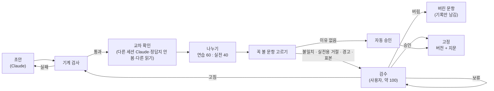

# 평가셋 정본 형식 (M1 10번 실행 1단계)

> 상태: 초안(2026-10-05). 결정 ⑦(전수 검수 → 꼭 볼 문항만) 반영. 근거: `평가셋-설계-20261004.md` 결정 ①~⑥. 2단계 코드(기계 검사·검수 화면·나누기)와 11번 채점기는 이 문서의 칸 이름을 그대로 쓴다.
> 짝 문서: `평가셋-검수지침-20261005.md`(사람이 무엇을 보고 어떻게 판정하나).

## 1. 파일

| 파일 | 위치 | 내용 | 저장소 |
|---|---|---|---|
| 정본 | `Assets/eval/evalset.jsonl` | 문항 한 줄씩(§2 칸). 평가·학습 정본이 같은 형식 | 커밋 안 함(학교 글) |
| 검수 기록 | `Assets/eval/review/검수기록-<날짜시각>.jsonl` | 검수 화면이 내보낸 판정(문항 ID·판정·이유·걸린 초·고친 칸) | 커밋 안 함 |
| 색인 글 | `Assets/eval/index_text/<색인 백업 이름>/` | 서비스 색인 글을 문서별로 내보낸 것(근거 원문 표시·인용 대조·부재 확인용) | 커밋 안 함 |
| 고정 기록 | `Assets/eval/frozen_v<번호>.txt` | 버전·SHA-256·문항 수·색인 백업 이름·날짜(§6) | 커밋 안 함 |
| 실전용 결과 | `Assets/eval/sealed/` | 실전용 문항별 채점 결과(봉인, 결정 ⑤) | 커밋 안 함 |
| 코드 | `tools/corpus/corpus/evalset/`(`python -m corpus evalset …`) | 기계 검사·규칙 판정·나누기·고정(교차 확인·검수 화면은 다음 PR) | 커밋(테스트는 합성 데이터만) |

## 2. 문항 한 줄의 칸

| 칸 | 뜻 | 값 | 채우는 쪽 | 근거 결정 |
|---|---|---|---|---|
| `id` | 문항 ID. 한 번 정하면 바꾸지 않음 | 평가 `ev-0001`, 학습 `tr-…`(M2) | 초안 | ④ |
| `rev` | 고친 횟수 | 1부터 | 검수 화면 | ④ |
| `set` | 본 문항 / 쉬운 문항 | `본` · `쉬운`(FAQ 제목 낱말 그대로) | 초안 | ⑥ |
| `split` | 학습/평가 | `평가` · `학습` | 초안 | 안건 4 |
| `part` | 연습용/실전용 | `연습` · `실전` · `null`(나누기 전) | 나누기 | ⑤ |
| `question` | 질문 글 | 문자열 | 초안 | ① |
| `shape` | 답의 모양(하나) | `값` · `목록` · `절차` · `예아니오` · `설명` · `거절` | 초안 | ① |
| `tags` | 꼬리표(여럿) | `표 근거` · `글 근거` · `해마다 바뀜` · `연도 시험` · `다른 말` · `FAQ 제목` · `조건` · `비교·계산` · `여러 근거` | 초안 | ① |
| `topic` | 주제 | 대장 주제(근거 문서 기준, 자동). 근거 문서가 없는 거절 문항은 질문 주제 | 기계 검사 | ⑥ |
| `answer` | 정답 문장(1~2문장) | 문자열. 거절 문항은 "문서에서 확인할 수 없다" + (있으면) 가까운 정보 | 초안 | ② |
| `facts` | 필수 사실 | `[{"name": 이름, "values": [허용 표기…]}]` — 값 1개 · 목록 항목 n개 · 절차 필수 단계 n개 · 예아니오는 첫 칸 `가부` + 조건 · 설명은 핵심 낱말 2~3개 · 거절은 빈 목록 | 초안 | ② |
| `forbidden` | 금지 값 | `[{"value": 값, "why": "지난해 값" · "옆 칸 값" · "다른 학과 값" · "지어낼 법한 값"}]` | 초안 | ② |
| `evidence` | 근거 | `[{"doc": 대장 ID, "quote": 색인 원문 그대로, "where": 쪽·장·표 이름, "section": 장 이름(문항이 10개를 넘는 문서만)}]` — 첫 칸이 주 근거(평가 몫 문서). `where`는 사람용 단서이고 기준은 `quote`. 표 줄은 구분선(`|`) 없이 써도 같은 줄로 본다 | 초안 | ②·⑤ |
| `also` | 허용 근거 | 같은 사실이 있는 다른 서비스 색인 문서의 대장 ID 목록(학습 몫이어도 됨) | 기계 검사 + 초안 | ② |
| `year` | 학년도 | 숫자 또는 `null` | 초안 | ①(시간 꼬리표) |
| `valid_until` | 유효 기간 | 대장의 근거 문서 유효 기간. 지나면 교체 대상 | 기계 검사 | 안건 5 |
| `refusal` | 거절 문항 정보 | `{"kind": "가까운 빈칸"·"잘못된 전제"·"자료 없음"·"무관", "near": 대장 ID 또는 null, "check": {"terms": [...], "hits": 숫자, "hit_docs": [...], "at": 날짜, "index": 색인 백업 이름, "trace": 참/거짓}}` — 거절 문항이 아니면 `null` | 초안 + 기계 검사 | ③ |
| `made_by` | 만든 도구 | 예: `claude-opus-5-5`. Claude가 만든 행은 평가 몫 밖으로 나가지 않는다 | 초안 | 안건 4 |
| `made_at` | 만든 날 | `YYYY-MM-DD` | 초안 | — |
| `machine` | 기계 검사 결과 | `{"quote_ok", "facts_in_quote", "doc_ok", "values_ok", "dup_of", "refusal_ok", "prev_year_ok", "errors": [...], "warnings": [...], "at"}` — 오류는 초안으로 돌려보내고 경고는 사람이 본다 | 기계 검사 | ④ |
| `cross` | 교차 확인 결과 | `{"model": 모델 이름, "reader": 원본을 읽은 방법, "answer": 그 모델의 답, "verdict": "일치"·"불일치"·"애매", "at"}` — 비교 후보가 아닌 모델, 서비스와 다른 읽기. 담당은 다른 세션의 Claude(정답지를 보지 않음, `model`에 모델 이름과 "다른 세션") | 교차 확인 | ⑦·⑦-1 |
| `need` | 사람이 볼 이유 | `"불일치"` · `"실전용 거절"` · `"경고"` · `"표본"` · `null`(자동 승인) | 기계 검사 + 교차 확인 | ⑦ |
| `review` | 검수 결과 | `{"status": "승인"·"고침"·"버림"·"보류"·"자동 승인", "reason": 이유, "at": 날짜시각, "sec": 걸린 초}` | 검수 화면 | ④ |
| `note` | 메모 | 문자열 | 누구나 | — |

## 3. 상태 흐름



- 나누기는 사람 검수보다 먼저 한다. 표본 30을 실전용의 자동 승인 문항에서 뽑기 때문이다(결정 ⑦). `part` 값은 2026-10-05에 `개발`·`확인`에서 `연습`·`실전`으로 이름만 바꿨다.
- 버린 문항은 지우지 않고 `review.status = 버림`으로 남긴다(왜 버렸는지가 지침 손질의 근거).
- 자동 승인 문항은 `review.status = 자동 승인`, `need = null`. 연습용 자동 승인 문항은 M2에서 챗봇이 틀릴 때 정답지도 확인하고, 틀렸으면 `rev`를 올려 고친다(결정 ⑦).
- 고정 뒤에 고치면 `rev`를 올리고 새 버전으로 다시 고정한다.

## 4. 예시 (합성 — 가나대학)

답 있는 문항:

```json
{"id":"ev-0001","rev":1,"set":"본","split":"평가","part":null,
 "question":"가나대 원서비 얼마예요?","shape":"값","tags":["표 근거","다른 말","연도 시험"],"topic":"입시",
 "answer":"2027학년도 전형료는 30,000원입니다.",
 "facts":[{"name":"전형료","values":["30,000원","3만 원","30000원"]}],
 "forbidden":[{"value":"25,000원","why":"지난해 값"}],
 "evidence":[{"doc":"gana/viewer/1","quote":"전형료 30,000원","where":"모집요강 12쪽 전형료 표"}],
 "also":[],"year":2027,"valid_until":"2027-02-28","refusal":null,
 "made_by":"claude-opus-5-5","made_at":"2026-10-05","machine":null,"review":null,"note":""}
```

거절 문항(가까운 빈칸):

```json
{"id":"ev-0002","rev":1,"set":"본","split":"평가","part":null,
 "question":"가나대 2028학년도 정원 몇 명이에요?","shape":"거절","tags":["연도 시험"],"topic":"입시",
 "answer":"2028학년도 정원은 문서에서 확인할 수 없습니다. 문서에는 2027학년도 모집 인원이 있습니다.",
 "facts":[],"forbidden":[{"value":"40명","why":"지어낼 법한 값"}],
 "evidence":[],"also":[],"year":2028,"valid_until":null,
 "refusal":{"kind":"가까운 빈칸","near":"gana/viewer/1",
   "check":{"terms":["2028","정원"],"hits":0,"hit_docs":[],"at":"2026-10-05","index":"20261004-201713","trace":false}},
 "made_by":"claude-opus-5-5","made_at":"2026-10-05","machine":null,"review":null,"note":""}
```

## 5. 기계 검사가 하는 일 (2단계 구현)

| 검사 | 통과 조건 |
|---|---|
| 인용 일치 | `evidence[].quote`가 해당 문서의 색인 글에 있다(공백만 고르게 맞춘 뒤 글자 그대로) |
| 사실 포함 | 모양이 거절·설명이 아니면, `facts`마다 허용 표기 하나 이상이 인용 안에 있다 |
| 문서 확인 | 주 근거 문서가 대장에서 `split=평가`, `index_status=색인`, `[평가질문제외]` 아님, 글 100자 이상 |
| 값 목록 | `shape`·`tags`·`set`·`refusal.kind`가 정해진 값 안에 있다 |
| 중복 | 공백·문장부호를 뺀 질문이 다른 문항과 같지 않다 |
| 거절 기록 | 거절 문항은 `refusal.check`가 있고 `hits`가 0이거나 `hit_docs`를 사람이 확인했다 |
| 분포 보고 | 주제·모양·꼬리표·문서당 문항 수를 목표(결정 ⑥)와 나란히 출력(실패가 아니라 보고) |

## 6. 고정 기록 형식

```
version: v1
date: 2026-10-xx
evalset_sha256: <id 순으로 정렬한 정본의 SHA-256>
index_backup: <색인 백업 이름>
counts: 본 250 (연습 150 / 실전 100), 쉬운 96
by_shape: 값 75 · 목록 38 · 절차 37 · 예아니오 25 · 설명 25 · 거절 50
by_topic: 입시 n · 학사 n · 장학·등록금 n · 학과·캠퍼스 생활 n · 기타 n
split_seed: <나누기 씨앗>
```
