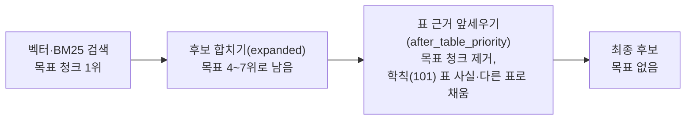

# 표본 종단 테스트 (이슈 #127 일부, M1 7번)

> 날짜: 2026-10-03 · 장소: 데스크탑(PR 2 브랜치 `chore/#126-runtime-settings`: 생성 문맥 8,192·임베딩 2,048·Chroma 1.5.5) · 업로드: 맥북 `corpus upload`(사용자가 비밀번호 입력)
> 관련: 총괄계획 §4.2 M1 7번, PR 2 보고서 `업로드-파이프라인-보강-PR2-설정정리-20261003.md`, 설계 `업로드-파이프라인-보강-설계-20261002.md`

## 0. 결론

| 확인 | 결과 |
|---|---|
| 형식마다 올라가나 | **41개 모두 처리 완료**(docx 1 · hwp 10 · pdf 10 · html 20), 실패 0 |
| 대장 정보가 청크까지 가나 | 41개 모두 대장 ID·원래 주소·파일 지문·카테고리가 DB와 모든 색인 항목에 들어감. 게시일·학년도는 대장에 값이 있는 문서만 |
| 형식마다 근거 청크를 찾나 (완료 기준) | **검색 단계(벡터·BM25)에서는 7문항 모두 찾음.** 최종 후보에는 5/7 — HTML 두 문항이 표 근거를 앞세우는 단계에서 빠짐(기존 순위 로직, M2) |
| 새로 찾은 문제 | ① `corpus upload`가 카테고리 생성의 201 응답을 실패로 봄 → 수정 ② 표 질문마다 표 사실 전체(18,941개)를 훑어 **질문당 약 5.5초** ③ PDF 표 사실이 문서 하나에 최대 3,081개 → 업로드 최대 193초 ④ HTML 본문에 화면 요소(학년도 선택 목록·"게시물 검색")가 남은 페이지가 있음 |

## 1. 표본 고르기

- `corpus upload --formats <형식> --limit <수>`는 대장 ID 순서로 앞에서부터 고른다. 그래서 HTML 20개는 학과 사이트 두 곳(항공기계공학과 11·건축학과 9) 페이지이고, 본교 안내 페이지(www, 297개)는 표본에 없다. PDF 10개는 입시결과 5개(2022~2026)·2027 모집요강 2개·학사 공지 첨부 3개, HWP 10개는 입시 1개·학사 공지 첨부 8개·장학 공고 2개(그중 표 0~26개).
- 표본은 서비스 대상(`--set service`)으로 올렸다. 문서 번호는 5~45번이라 예전에 AI 서버로 직접 올린 101~105번과 겹치지 않는다(A5 정리 전 번호 충돌 주의 — 서비스 전체를 올리기 전에 101~105를 정리해야 한다).

## 2. 업로드 결과

| 형식 | 문서 | 처리 시간(명령 기준) | 색인 항목(원문·표 사실·검색 청크) |
|---|---|---|---|
| docx | 1 | 6.3초 | 원문 20 · 표 사실 28 · 검색 20 |
| hwp | 10 | 2.1~10.5초 | 원문 1~32 · 표 사실 0~143 |
| html | 20 | 2.1~4.2초 | 원문 1~9 · 표 사실 0~17 |
| pdf | 10 | 4.2~**193.5초** | 원문 1~81 · 표 사실 2~**3,081** |

- PDF가 느린 이유: OpenDataLoader 표 사실(`OPENDATALOADER_JSON_TABLE_FACTS_ENABLED=true`)이 입시결과 PDF 하나에서 2,140~3,081개 나온다. 색인 항목 3,108개를 64개씩 49번 임베딩하는 데 시간이 든다(묶음당 1.4~3.2초). HWP·HTML·DOCX의 표 사실은 마크다운 표 경로(`_extract_table_facts`)라 청크당 40개 상한(`TABLE_FACT_MAX_PER_CHUNK`)을 받지만, PDF의 OpenDataLoader 경로(`_build_opendataloader_json_index_artifacts`)는 표 사실을 상한 없이 모두 색인한다(코드 확인).
- 표본 41개의 표 사실 합계 16,460개(PDF 16,143 · HWP 236 · HTML 53 · DOCX 28). 예전 101~105의 2,481개를 더해 지금 18,941개.
- 업로드 중 발견: 명령이 카테고리를 만들 때 백엔드의 201 Created를 실패로 보고 멈췄다(카테고리는 실제로 만들어짐). 테스트의 가짜 백엔드가 200을 돌려주게 만들어져 테스트로는 못 잡았다. 실제 백엔드 계약(로그인 200, 카테고리 생성 201, 업로드 200·409, 진행률 200)과 명령을 전부 대조해 이 한 곳만 어긋난 것을 확인하고 고쳤다(브랜치 `fix/#126-category-created-status`, 테스트 75 통과, 되돌리면 1개 실패).

## 3. 대장 정보 확인

| 칸 | DB(`documents`) | 색인 메타데이터 |
|---|---|---|
| 대장 ID·원래 주소·파일 지문 | 41/41 | 대장 ID·원래 주소 41/41 (모든 항목) |
| 카테고리 | 41/41 (입시·학사·장학·등록금·학과·캠퍼스 생활 4개 생성) | 41/41 |
| 게시일 | 게시판 글의 첨부만(학과 페이지·입시 파일은 대장에 없음) | 같음 |
| 학년도 | 학과 페이지 20개 빼고 21/21 | 같음 |

예전 101~105번 항목에는 이 정보가 하나도 없다(A5, M1 8번에서 정리).

## 4. 임베딩 글 길이 (임베딩 문맥 2,048 점검)

| 형식 | 가장 긴 글 | 토큰 |
|---|---|---|
| pdf | 1,785자 | 1,372 |
| hwp | 1,110자 | 771 |
| docx | 912자 | 600 |
| html | 877자 | 640 |

가장 긴 글도 2,048의 67%라 잘리지 않는다. 긴 글은 모두 원문 청크·검색용 청크이고 표 사실은 최대 423자. 서비스 전체 색인 뒤 다시 잰다.

## 5. 검색 확인 (`/debug/rag-trace` — 답을 만들지 않고 검색 후보만 보는 진단 경로, top_k 5)

질문은 표본 문서 내용을 보고 하나씩 만들었다(목표 문서가 정답 근거).

| 형식 | 목표 문서 | 벡터 상위 10 | BM25 상위 5 | 최종 후보 순위 | 걸린 시간 |
|---|---|---|---|---|---|
| hwp | 장학 공고(15) | 1위 | 1위 | 4위 (앞에 예전 101~105 문서) | 15.5초(첫 질문, 임베딩 모델 다시 불러오기 3.7초 포함) |
| hwp | 학자금 이자 지원 공고(14) | 1위 | 1위 | 1위 | 7.0초 |
| pdf | 학점인정 자격증 표(24) | 1위 | 1위 | 1위 | 0.9초 |
| pdf | 2027 모집요강(21) | 3위(1위는 2026 모집요강) | 1위 | 1위 | 7.2초 |
| html | 학과 실습실(29) | 1위 | 1위 | **빠짐** | 6.5초 |
| html | 학과 교과목 개요(42) | 1위 | 1위 | **빠짐** | 6.4초 |
| docx | 외국인 전형 지원서 양식(5) | 4위 | 1위 | 12위 | 1.0초 |

- HTML 두 문항은 '무엇·과목' 같은 목록 질문이라 표 사실 후보가 생기고, 표 근거를 앞세우는 단계가 표가 없는 학과 안내 글 청크를 통째로 뺐다. 새 형식 로더가 아니라 기존 순위 로직의 문제다. 서비스 문서 704개 중 618개가 HTML이라 M2(B1)에서 먼저 볼 대상이다. 평가셋 실패 유형 태그(M1 11번)에 "후보 선택 단계 탈락"을 따로 둘지 그때 정한다.
- 예전 101~105번(학칙·2026 모집요강·합성 문서)이 후보에 계속 끼어든다. 합성 장학금 표(105)는 지어낸 값이라 서비스에 있으면 안 된다 → M1 8번 A5 정리.

## 6. 표 질문 지연

| 질문 | 표 사실 전체 조회 | 총 시간 | 그중 임베딩 | Chroma 검색 |
|---|---|---|---|---|
| 표 사실 조회가 들어간 5문항 | 함(후보 14~1,270개 채점) | 6.4~7.2초 | 0.1~0.5초 | 0.02초 |
| 들어가지 않은 2문항 | 안 함 | 0.9초 | 0.3~0.4초 | 0.01초 |

- `_lookup_lexical_table_fact_candidates`가 질문마다 `collection.get(where={"chunk_role": "table_fact"})`로 표 사실 전체(지금 18,941개)를 가져와 파이썬에서 채점한다. 질문당 약 5.5초가 여기서 나간다(옛 총괄계획 §2.2(보관)에서 예상한 문제를 실측으로 확인).
- 서비스 전체(PDF 63개)를 올리면 표 사실이 표본의 몇 배가 된다 → 질문 시간이 그만큼 늘어난다. 평가(M1 12·13번)도 질문마다 이 시간을 낸다. **서비스 전체 색인 전에 처리 방향을 정해야 한다.**

## 7. 그 밖에 본 것

- HTML 본문 추출에 화면 요소가 남은 페이지: 건축학과 '일반과정'(45번) 첫 청크가 "게시물 검색 / 2026 학년도 / 2025 학년도 …"로 시작한다. 학년도별 교육과정 표가 어느 학년도인지 글에 드러나지 않는다.
- 학과 페이지 20개에는 학년도·게시일이 없다(대장에 없음). 학과 안내는 "바뀔 때까지 유효"라 맞지만, 교육과정처럼 학년도별로 다른 표는 M2 연도 구분(A4)에서 다시 본다.

## 8. 다음 (M1 8번 전에 정할 것)

1. 예전 문서 정리(A5): DB 1~4번·색인 101~105번을 어떻게 정리할지(합성 문서는 서비스에서 빼야 함, 실제 학칙·2026 모집요강은 대장 경로로 다시 올릴지)
2. 표 사실 전체 조회 지연: 서비스 전체 색인 전에 고칠지, 전체를 올려 잰 뒤 고칠지
3. 묶음 임베딩이 같은 조건에서도 다르게 나오는 문제(PR 2 보고서 §6): 업로드를 한 개씩 임베딩으로 바꿀지, 색인 백업으로 베이스라인을 묶을지

## 9. 재현 방법

| 무엇 | 어디서 | 방법 |
|---|---|---|
| 업로드 | 맥북 | `tools/corpus`에서 `corpus upload --set service --formats <형식> --limit <수>` |
| DB 확인 | 데스크탑 | MySQL 컨테이너에서 `documents`의 처리 상태·대장 칸·카테고리 조회 |
| 색인 확인 | 데스크탑 | ai-server 이미지로 임시 컨테이너(`--network documind_desktop_default`)를 띄워 chromadb 클라이언트로 문서별 항목·메타데이터 집계, 가장 긴 글은 Ollama로 토큰 수 측정 |
| 검색 확인 | 데스크탑 | 같은 임시 컨테이너에서 `POST http://ai-server:8000/debug/rag-trace`, 단계별 후보(`stages`)의 document_id 위치 확인 |

## 10. 추가: 같은 글 사본과 학습·평가 누수 정리 (2026-10-03, 사용자 결정)

- **발견**: #126 설계 결정 2에서 정해 둔 "글만 같은 PDF 4쌍은 대장에서 하나만 색인"을 하려고 4쌍을 열어 보니, 2쌍(외국인유학생관리규정의 "(1)" 사본, 자격증장학금 신청 매뉴얼)이 한쪽은 학습·한쪽은 평가로 갈려 있었다. 파일 이름의 "(1)"이나 붙은 공지 제목이 달라 다른 문서 묶음으로 잡혔기 때문이다(#124 묶음 합치기는 같은 파일 지문만 봤다).
- **범위 측정**: 평가 262행 × 학습 3,304행의 글을 모두 뽑아(실패 0, 51초) 정규화 글 해시와 8글자 조각 포함률로 대조. 질문을 만들 평가 문서 228개 중 **같은 글 2개, 90% 이상 겹침 5개**(학생 출결 관리 규정 HWP ↔ 규정 게시판 PDF 91%, 오시는길 페이지 4개 95~99%). 50~90% 겹침은 해마다 다시 올라오는 공지(장학생 선발·현역병 모집)와 학과 교과과정의 공통 교양 표였다.
- **결정(사용자)**: 학습·평가 나눔은 그대로 두고 7개로는 평가 질문을 만들지 않는다. 버린 안: 묶음·나눔을 다시 뽑기(고정한 평가 몫이 흔들림), 그대로 두고 채점 때만 확인(점수가 부푼 뒤에야 앎).
- **반영**: 대장 백업 `Assets/corpus/backups/ledger-before-dupfix-20261003.sqlite` → 같은 글 4쌍의 사본 4행을 '보관'으로(원본으로 남길 쪽: 학습 쪽, 둘 다 학습이면 학사규정 게시판·이름에 "(1)" 없는 것) → 평가 7행 메모에 `[평가질문제외]` 표시. 나눔 지문 `bea6f3a8…` 그대로(doc_id·split·group_id 불변 확인). 서비스 색인 704 → 700행, 질문 만들 평가 문서 228 → 221개, 남은 업로드 660개.
- **남은 일**: 표본으로 올린 사본 1개(`붙임1)조기취업자 학사관리 운영규정.pdf`, 문서 25번)를 관리 화면에서 삭제(사용자). 평가셋 작성 규칙(M1 10번)에 "반복 공지·공통 교양 표는 해마다·학과마다 바뀌는 값만 묻는다"를 넣는다. 새 문서를 대장에 넣을 때 같은 검사를 돌리는 일은 수집기 보강 후보로 남긴다.
