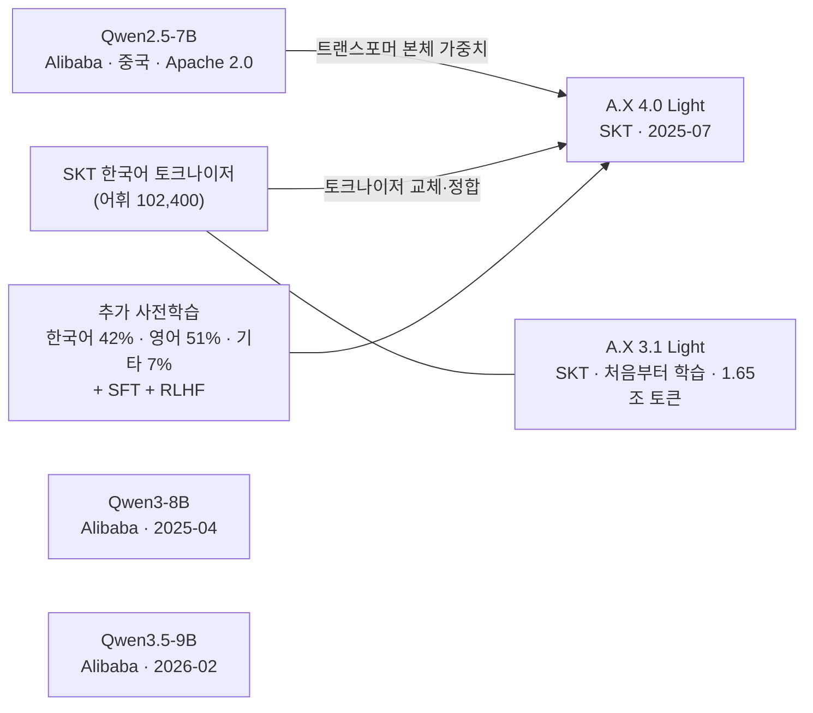
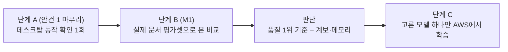

# A안 후보 모델 심층 조사 — 상업 이용·학교 사용·출처 국가·한국어 점수 (2026-10-01)

> 목적: 설계 6단계 안건 1에서 추천한 A안(A.X 4.0 Light + Qwen3-8B + Qwen3.5-9B)을 "후회하기 전에" 네 가지로 다시 확인한다. ① 상업적으로 써도 되나 ② 학교 챗봇에 써도 되나(법·규제 포함) ③ 어느 나라 모델인가(기반 모델 계보) ④ 한국어 점수가 제3자 평가에서도 높은가.
> 방법: 조사 에이전트 3개(제3자 한국어 평가, 한국 법·규제, 모델 계보·알려진 문제)로 출처를 모으고, **핵심 주장은 Claude가 원문으로 다시 확인했다**. 법령은 국가법령정보센터 본문, 정부 발표는 정책브리핑·개인정보위·국정원 원문, 모델은 SKT GitHub·Hugging Face 파일, 논문은 arXiv 원문. 토크나이저·설정 비교는 맥북에서 직접 했다. 에이전트 보고서에서 원문과 다른 곳 12건은 §8.
> 이전 문서: `기반모델-후보-상세조사-20261001.md`(안건 1 1차 상세 조사)
> 상태: **조사 결과만 담는다. 후보 확정은 사용자 결정 뒤 ADR 목록(총괄계획 §4.3)에 기록한다.** 법률 자문이 아니다.

## 0. 결론 먼저

| | A.X 4.0 Light | Qwen3-8B | Qwen3.5-9B |
|---|---|---|---|
| ① 상업 이용 | ✅ Apache 2.0 (원 모델 Qwen2.5-7B도 Apache 2.0) | ✅ Apache 2.0 | ✅ Apache 2.0 |
| ② 학교 챗봇 (법) | ✅ 가능. AI 기본법 고지·표시 의무는 지켜야 함(모든 모델 공통) | ✅ 같음 | ✅ 같음 |
| ② 학교 챗봇 (인식) | △ "중국 모델 기반"이라는 질문을 받을 수 있음 | ✗ 중국 모델 | ✗ 중국 모델 |
| ③ 만든 곳 | SKT(한국). **본체 가중치는 Alibaba Qwen2.5-7B(중국)**에서 출발, 토크나이저는 SKT 것으로 교체 | Alibaba(중국) | Alibaba(중국) |
| ④ 한국어 (제3자) | 2026 수능 국어 원점수 **47점(6등급)** | **38점(7등급)** | 제3자 자료 없음 |
| ④ 한국어 (회사 자료) | SKT 표에서 7~8B 중 최상위권 | SKT 표에서 A.X와 비슷, Alibaba 자체 한국어 표에서 GPT-4o보다 낮음 | **한국어 단독 수치가 어디에도 없음** |

- **A안 세 모델은 모두 중국 Alibaba 계보다.** A.X 4.0 Light도 SKT가 Qwen2.5-7B에 한국어를 추가로 학습시킨 모델이다(SKT 공식 GitHub에 명시).
- **법적으로는 써도 된다.** 라이선스는 모두 Apache 2.0이다. 중국산 AI에 대한 정부 조치(2025년 딥시크)는 **개인정보를 해외로 보내는 인터넷 서비스**에 대한 것이었고, 공개 모델을 학교 서버에 설치해 쓰는 것을 막는 규정은 찾지 못했다. AI 기본법의 의무(AI 사용 사전 고지, 결과물 표시)는 모델 국적과 관계없이 적용된다.
- **걸리는 것은 인식(평판)이다.** 정부는 딥시크 서비스를 경계했고, 국가 사업(독자 AI 파운데이션 모델)에서는 "가중치를 처음부터 학습한 것"만 독자 모델로 인정했다. 국정원은 딥시크가 동북공정·김치·단오절 같은 질문에 언어별로 다르게 답한다고 지적했다. 학교가 제안을 검토할 때 "중국 모델이냐"는 질문이 나올 수 있다.
- **한국어 점수**: A.X 4.0 Light가 Qwen3-8B보다 높다는 것은 **제3자 시험(2026 수능 국어)에서도 확인**됐다. 절대 수준은 7B급답게 높지 않다(6등급). Qwen3.5-9B는 한국어 근거가 전혀 없다.
- **국산 계보 대안**: SKT **A.X 3.1 Light**는 SKT가 구조·데이터·학습을 모두 자체로 **처음부터** 만든 7B(Apache 2.0)다. 토크나이저가 A.X 4.0 Light와 **바이트까지 같고**, SKT 표에서 한국어 점수도 비슷하다. 대신 KV 캐시가 토큰당 512KB(A.X 4.0 Light의 약 9배)라 VRAM이 약 +1.5GB 더 든다.
- **후속 조사(§12)로 보완**: 제3자 **W&B 호랑이 리더보드 4**(106개 모델)에서는 순서가 달랐다. 지문 읽기(KorQuAD)에서 A.X 4.0 Light(73.9)가 지금 쓰는 EXAONE 3.5(87.2)·Gemma 4 E4B(83.2)·Qwen3-8B(79.0)보다 낮았다. 벤치마크마다 순서가 달라 일반 점수로는 결론이 안 난다. 그래서 중국 계보가 아니면서 지문 읽기가 강한 **Gemma 4 E4B(미국 Google, Apache 2.0)**를 후보에 넣는 안을 추가했다(§12.5).

## 1. 어느 나라 모델인가 (계보)

| 모델 | 만든 곳 | 출발한 가중치 | 한국어 적응 | 근거 |
|---|---|---|---|---|
| A.X 4.0 Light | SK텔레콤 (한국) | **Qwen2.5-7B** (Alibaba, 중국) | 토크나이저 교체 → 추가 사전학습 → SFT → RLHF | SKT GitHub(`SKT-AI/A.X-4.0`) README, LICENSE 첫머리의 "Built with Qwen 2.5" 고지 |
| A.X 3.1 Light | SK텔레콤 (한국) | **없음 (처음부터)** | 한국어 중심 1.65조 토큰으로 SKT 슈퍼컴퓨터 TITAN에서 학습 | Hugging Face 모델 카드 |
| Qwen3-8B | Alibaba Qwen 팀 (중국) | 자체 | 다국어(119개 언어) | 모델 카드·기술 보고서 |
| Qwen3.5-9B | Alibaba Qwen 팀 (중국) | 자체 | 다국어(201개 언어) | 모델 카드 |

직접 확인한 것 (맥북):

| 확인 | 결과 | 뜻 |
|---|---|---|
| A.X 4.0 Light와 Qwen2.5-7B의 config 비교 | 층 28, 은닉 3,584, 헤드 28/KV 4, FFN 18,944 **모두 같음**. 다른 것은 어휘 수(102,400 대 152,064), 특수 토큰 번호, 문맥 길이, rms_norm_eps | 본체 구조가 Qwen2.5-7B 그대로다 |
| 두 모델의 어휘 비교 | 같은 토큰 문자열 37.7%, **같은 번호(id)까지 같은 토큰 0개** | 어휘와 임베딩을 통째로 새로 만들었다 |
| A.X 4.0 Light와 A.X 3.1 Light의 토크나이저 | 파일 md5가 같다(바이트까지 동일) | SKT가 자체 한국어 토크나이저를 두 모델에 같이 썼다 |
| 어휘 중 한글·한자 토큰 비율 | A.X(4.0·3.1 동일) 한글 58.6%·한자 1.0% / Qwen3-8B 2.3%·16.9% / Qwen3.5 2.7%·22.3% / Mi:dm 2.0 38.0%·2.7% / Kanana 1.5 1.8%·3.4% / Gemma 4 1.7%·7.7% | A.X는 한국어 중심 어휘다 |

- 참고로 카카오 Kanana 1.5는 기술 보고서 초록이 자체 사전학습 기법(단계적 사전학습·층 확장·가지치기·증류)을 설명하지만 "처음부터"라는 명시 문구는 초록에 없다. KT Mi:dm 2.0 Base는 카드에 "8B급 모델을 층 확장했다"고만 적혀 있고 그 8B가 무엇인지는 없다. **두 모델의 순수 국산 여부는 확인하지 못했다.**

## 2. 상업 이용 (라이선스)

| 모델 | 라이선스 | 원문 확인 | 우리가 지킬 것 |
|---|---|---|---|
| A.X 4.0 Light | Apache 2.0 | 조항이 표준 원문과 같음. 첫머리에 "Built with Qwen 2.5 — original model by Alibaba Cloud, licensed under the Apache License 2.0" 고지 | 라이선스 사본과 이 고지를 함께 배포, 수정한 파일 표시 |
| 원 모델 Qwen2.5-7B | Apache 2.0 | Hugging Face 태그·LICENSE 확인. (Qwen2.5 중 3B·72B는 별도 Qwen 라이선스라 조건이 다르다 — A.X 4.0 Light는 7B 기반이라 해당 없음) | — |
| A.X 3.1 Light | Apache 2.0 | 조항이 표준 원문과 같음. 첫머리에 "SK Telecom 상표는 허락 없이 못 쓴다"는 문구(Apache 2.0 6조와 같은 취지) | 라이선스 사본 |
| Qwen3-8B | Apache 2.0 | Qwen3 공식 GitHub: 공개 가중치 모델은 모두 Apache 2.0이라고 명시 | 라이선스 사본 |
| Qwen3.5-9B | Apache 2.0 | Qwen3.5 공식 GitHub는 Hugging Face의 LICENSE를 보라고 함 → 표준 원문과 같음 | 라이선스 사본 |

- `qwen.ai/usagepolicy`는 **Qwen 앱·챗 서비스의 이용 규칙**이다(계정, 18세 이상 등 서비스 가입 조건). 공개 가중치 모델의 사용 조건이 아니다.
- "월 사용자 1억 명 초과 시 허락" 같은 조건은 Qwen3.8-Flash-Next의 Qwen Community License 등 **다른 라이선스**에 있다. A안 모델에는 없다.

## 3. 학교 챗봇으로 써도 되나 (법·규제)

### 3.1 인공지능 기본법 (국가법령정보센터 본문 확인)

| 항목 | 원문 내용 | 우리 챗봇에 뜻하는 것 |
|---|---|---|
| 시행 | 2026-01-22 (법률 제20676호, 2025-01-21 제정). 시행령은 2026-08-20 시행본(대통령령 제36580호) | 이미 시행 중 |
| 고영향 AI (법 제2조 4호) | 교육 분야는 **차목 "유아교육·초등교육 및 중등교육에서의 학생 평가"**뿐. 사목은 채용·대출 심사처럼 권리·의무에 중대한 영향을 주는 판단·평가. 카목(대통령령 위임)으로 추가된 영역은 시행령에 없음 | 대학 입시·학사 **안내** 챗봇은 목록에 없다 → 고영향 AI가 아니다. 애매하면 과기정통부에 확인을 요청하는 절차가 있다(시행령 제25조, 30일 안에 회신) |
| 사업자 (법 제2조 7호) | 인공지능사업자 = 법인·단체·개인·국가기관등. 이용사업자 = 개발사업자가 제공한 AI를 이용해 제품·서비스를 제공하는 자 | 챗봇을 운영하는 학교(또는 운영 주체)가 이용사업자가 된다 |
| 투명성 의무 (법 제31조) | ① 생성형 AI를 이용한 서비스라는 사실을 이용자에게 **사전에 고지** ② 결과물이 생성형 AI로 **생성되었다는 사실을 표시** ③ 딥페이크형 결과물 표시 | 모델 국적과 관계없이 지켜야 한다 |
| 고지·표시 방법 (시행령 제23조) | 고지: 이용약관 등에 기재, **이용자 화면에 표시**, 장소 게시 등. 표시: 사람이 인식할 수 있는 방법 또는 기계 판독 방법(이 경우 안내 문구 1회 이상) | 채팅 화면에 "AI가 답변합니다" 안내 + 답변에 AI 생성 표시면 된다 |
| 예외 (시행령 제23조 ④) | 서비스 이름·화면·결과물 문구로 AI 활용이 명백한 경우, 내부 업무용으로만 쓰는 경우 등 | 예외에 기대기보다 화면 고지를 두는 편이 안전하다 |
| 과태료 (법 제43조) | 제31조 **①(사전 고지)**을 어기면 3천만원 이하. ②(표시)는 과태료 조항에 없음 | — |
| 계도기간 | 정부 발표(정책브리핑 2026-01-21): **최소 1년 이상 규제 유예**, 사실조사는 중대한 사회 문제가 생긴 예외적 경우에만 | 종료일은 발표에 없다 |

→ 설계에 반영할 요구사항 후보(합의 뒤 M3·M4에 추가): 채팅 화면 AI 사용 고지, 답변의 AI 생성 표시, 이용약관 기재.

### 3.2 중국산 AI에 대한 정부 조치 (원문 확인)

| 날짜 | 기관 | 내용 | 대상 |
|---|---|---|---|
| 2025-02-10 | 국가정보원 | 딥시크 서비스 활용 시 보안 유의 강조: 과도한 개인정보 수집, 모든 입력 데이터의 학습 활용, 광고주 등과의 정보 공유, 국외 서버 저장. **동북공정·김치·단오절 질문에 언어별로 다른 답변** 확인 | 딥시크 **서비스 사용** |
| 2025-02-15 | 딥시크(개인정보위와 협의) | 국내 앱 마켓 신규 다운로드 잠정 중단 | 앱 |
| 2025-04-24 | 개인정보보호위원회 | 사전 실태점검 결과: 처리방침을 중국어·영어로만 공개, 동의 없는 국외 이전, 프롬프트 입력 내용을 베이징 볼케이노 엔진에 전송, 학습 활용 거부 기능 없음 → 시정권고·개선권고 | 서비스의 **개인정보 처리** |

- 세 발표 모두 **개인정보가 해외로 나가는 인터넷 서비스**에 대한 것이다. 공개 모델을 학교 서버에 설치해 인터넷 없이 쓰는 경우를 다룬 문장은 없다. 우리 구성은 질문·답이 학교 서버 밖으로 나가지 않으므로 이 조치들의 핵심 우려(국외 이전)에는 해당하지 않는다.
- 공공·교육기관이 중국산 공개 모델을 내부에 설치하는 것을 금지하거나 제한하는 규정은 찾지 못했다(찾지 못함 ≠ 없음).

### 3.3 정부 사업의 '독자성' 기준 (정책브리핑 2026-01-15, 1차 평가 결과 브리핑)

- 2차 진출: LG AI연구원, 업스테이지, SK텔레콤. 네이버클라우드 탈락.
- 기술적 독자성 기준: **가중치를 초기화한 뒤 학습해 가중치를 형성·최적화한 것.**
- 네이버 탈락 사유: 외부 인코더와 가중치를 (업데이트할 수 없는 고정 상태로) 그대로 쓴 것을 독자 모델로 인정하기 어렵다.
- 이것은 **국가 사업의 선정 기준이지 사용 규제가 아니다.** 다만 한국 정부와 업계가 "외국 모델 가중치에서 출발한 모델"을 어떻게 보는지 보여 준다. 이 기준으로 A.X 4.0 Light는 독자 모델이 아니고, A.X 3.1 Light는 독자 모델이다.

### 3.4 판단

- 법적으로 막는 것은 없다.
- 학교에 제안할 때 "중국 모델이냐"는 질문에는 사실대로 답해야 한다. A.X 4.0 Light는 "SKT가 Qwen2.5(중국)를 한국어로 다시 학습한 모델, 학교 서버 안에서만 돌아 데이터가 나가지 않음"으로 설명할 수 있다. Qwen3·3.5는 "중국 Alibaba 모델"이다.
- 제안서의 설득력이라는 면에서는 순수 국산 계보(A.X 3.1 Light)가 유리하다.

## 4. 한국어 점수는 정말 높은가

### 4.1 제3자 평가: 2026학년도 수능 국어 LLM 리더보드

- 출처: Marker-Inc-Korea `Korean-SAT-LLM-Leaderboard` GitHub의 한국어 README "26년 수능 모델 성능 비교 결과"(마지막 갱신 커밋 2025-11-20). 2025년 11월 시행 수능 국어로 잰다. 데이터 누출을 막으려고 **시험 전에 나온 모델만** 올린다.

| 순위 | 모델 | 표준점수 | 원점수(100점) | 추정 등급 |
|---|---|---|---|---|
| 19위 | exaone_4.0_32b | 100 | 56 | 5등급 |
| **20위** | **SKT A.X-4.0-Light** | 92 | **47** | **6등급** |
| **21위** | **qwen3-8B** | 83 | **38** | **7등급** |

- A.X 4.0 Light > Qwen3-8B가 **회사 표가 아닌 제3자 시험에서도** 나왔다.
- 한계: 시험 한 번(45문항)이라 흔들림이 크다. 사고 모드 사용 여부 같은 설정이 표에 없다. 긴 지문 독해라 RAG의 "근거 읽기"와 조금 닮았지만 같은 작업은 아니다.
- Qwen3.5-9B(2026-02)는 시험 뒤에 나와서 없다. A.X 3.1 Light도 표에 없다.

### 4.2 회사가 직접 잰 점수

SKT 카드(A.X 4.0 Light·A.X 3.1 Light, 같은 평가 체계):

| 벤치마크 | A.X 4.0 Light | A.X 3.1 Light | Qwen3-8B (추론 끔) | EXAONE 3.5 7.8B | Kanana 1.5 8B |
|---|---|---|---|---|---|
| KMMLU | 64.15 | 61.70 | 63.53 | 53.76 | 48.28 |
| CLIcK | 68.05 | **71.22** | 62.71 | 64.30 | 61.30 |
| KoBALT | **30.29** | 27.43 | 26.57 | 21.71 | 23.14 |
| Ko-MT-Bench | 79.50 | 78.56 | 64.06 | **81.06** | 76.30 |
| Ko-IFEval | 72.99 | 70.04 | **73.39** | 65.01 | 69.96 |
| HRM8K | 40.12 | 41.70 | **52.50** | 31.88 | 30.87 |

(A.X 3.1 Light 카드에서는 CLIcK의 Qwen3-8B가 63.31, EXAONE이 64.11로 A.X 4.0 Light 카드와 조금 다르다. 위 표의 다른 모델 값은 A.X 4.0 Light 카드 기준.)

Alibaba Qwen3 기술 보고서 표 30 "한국어(ko)" (Alibaba가 잼):

| 모델 | 모드 | MLogiQA | INCLUDE | MMMLU | MT-AIME24 | PolyMath | 평균 |
|---|---|---|---|---|---|---|---|
| Qwen3-8B | 사고 | 60.0 | 80.0 | 74.7 | 76.7 | 42.3 | 66.7 |
| Qwen3-8B | 비사고 | 52.5 | 76.0 | 66.5 | 23.3 | 16.3 | **46.9** |
| GPT-4o (2024-11-20) | 비사고 | 63.7 | 80.0 | 80.5 | 13.3 | 12.9 | 50.1 |
| Gemma-3-27B-IT | 비사고 | 58.8 | 76.0 | 75.9 | 20.0 | 18.3 | 49.8 |

- 우리는 사고 모드를 끄고 쓸 것이므로 비사고 행이 기준이다. 한국어 지식(MMMLU)은 GPT-4o 80.5 대 Qwen3-8B 66.5다.

### 4.3 Qwen3.5-9B

- 모델 카드에는 한국어가 섞인 다국어 평균(MMMLU 81.2, 사고 모드 기준)만 있다. 한국어 단독 수치는 회사 자료·제3자 자료 모두 찾지 못했다.
- 참고: 카카오 Kanana 2 카드의 같은 표에서 Qwen3.5-2B는 한국어 고유 지식이 약했다(HAERAE-CoT 27.84, KoSimpleQA 3.21). 9B에 그대로 옮길 근거는 없다.

### 4.4 판단

- A.X 4.0 Light: 회사 표에서 높고, 제3자 시험에서도 Qwen3-8B보다 높았다. 다만 절대 수준은 7B급답게 높지 않다(수능 6등급).
- Qwen3-8B: 회사 표마다 평가가 갈린다(SKT 표 KMMLU는 A.X와 비슷, 대화 품질은 낮음). 제3자 시험에서는 A.X보다 낮았다.
- Qwen3.5-9B: 근거가 없다. 셋 중 가장 불확실하다.
- **어느 자료도 우리 작업(학교 문서의 표를 읽고 근거로 답하기, 없으면 거절)을 재지 않는다.** 최종 판단은 M1 평가셋이다.

## 5. 알려진 위험

### 5.1 한국어 답에 다른 언어가 섞이는 현상

- OLA 논문(arXiv 2601.03589, 2026-01): 한국어·영어를 섞은 질문 실험에서 **Qwen2.5가 다른 모델보다 답 중간에 언어가 바뀌는 경우가 많았다**고 적었다. 또 이 현상이 **다른 언어 모델을 가져와 추가 학습한 모델에서 더 자주 나온다**는 선행 연구를 인용한다. A.X 4.0 Light가 이런 모델이다.
- Qwen3.5 모델 카드: 반복을 줄이려고 presence_penalty를 높이면 가끔 **언어가 섞이고** 성능이 조금 떨어질 수 있다고 적었다.
- Qwen3·Qwen3.5·A.X 4.0 Light의 한국어 답에 한자·중국어가 섞이는 비율을 정량으로 잰 자료는 **찾지 못했다**.
- 어휘 구성으로 보면 Qwen은 한자 토큰이 17~22%, A.X는 1%다(§1). 섞일 "재료"가 Qwen 쪽에 훨씬 많다는 뜻이지, 실제로 섞인다는 증거는 아니다.
- → 데스크탑 실측에서 **답변에 한자(CJK 문자)가 들어간 비율**을 직접 잰다(출력 문자열 검사라 간단하다).

### 5.2 중국 관련 주제의 편향

- China Media Project(2026-02-09, Alex Colville): Qwen3가 민감 주제를 피하는 것을 넘어 **중국 관련 질문에 전반적으로 긍정적인 정보를 주도록 정렬돼 있다**고 분석했다(사고 과정을 강제로 끌어내는 기법 사용).
- 국정원(2025-02-10): 딥시크가 동북공정·김치·단오절에 언어별로 다르게 답했다.
- 학교 안내 챗봇은 학교 문서 밖 질문을 거절해야 하므로 기능상 영향은 작다. 그래도 학생이 역사 질문을 던졌을 때 거절이 새면 학교 평판 문제가 된다.
- → 실측에 **민감 역사·문화 질문 몇 개**(국정원 예시: 동북공정·김치·단오)를 넣어, 범위 밖으로 거절하는지와 답이 새는지를 본다. A.X 4.0 Light는 SKT가 SFT·RLHF를 다시 했지만 본체의 성향이 남아 있는지는 확인된 바 없다.

## 6. 국산 계보 대안: A.X 3.1 Light

| 항목 | 내용 |
|---|---|
| 만든 곳·방식 | SKT가 구조·데이터·학습을 모두 자체로, 처음부터 학습(카드). 한국어 중심 다국어 1.65조 토큰 |
| 공개 | 2025-07-10 (Hugging Face) |
| 라이선스 | Apache 2.0 (+ SKT 상표 문구) |
| 구조 | Llama형, 7.26B, 32층, **KV 헤드 32개(GQA 없음)**, 문맥 32K |
| 토크나이저 | A.X 4.0 Light와 **파일까지 같음** → 토큰 효율도 같음(EXAONE의 81%) |
| 한국어 (SKT 표) | KMMLU 61.70, CLIcK 71.22, Ko-MT-Bench 78.56, Ko-IFEval 70.04 — A.X 4.0 Light와 비슷 |
| 제3자 평가 | 찾지 못함(수능 리더보드에 없음) |
| GGUF | 커뮤니티 변환본(mykor, mradermacher). Q4_K_M 4.72GB |
| **VRAM** | KV 캐시가 토큰당 **512KB**(A.X 4.0 Light 56KB의 약 9배). 문맥 4,096에서 KV 2.15GB → 생성 모델 합 6.87GB, **지금 EXAONE보다 +1.5GB**. KV를 8비트로 줄이면 +0.45GB. 동시 4명이면 KV가 6.44GB 더 든다 |
| 학습 (A10G) | 7B급이라 16비트 LoRA(약 19GB)·QLoRA(약 5GB) 모두 가능 |

→ "순수 국산"이라는 설득력은 가장 좋지만, 메모리 효율은 나쁘다. 데스크탑 실측과 학교 서버 사양에서 불리하다.

## 7. 선택지 (결정 대기)

| 안 | 구성 | 장점 | 약점 |
|---|---|---|---|
| **1 (추천)** | A.X 4.0 Light + **A.X 3.1 Light** + Qwen3-8B | 토크나이저가 같은 두 SKT 모델로 "Qwen 본체 대 순수 국산"의 품질 차이를 직접 잰다. 차이가 작으면 학교에 국산 계보를 낼 수 있다. Qwen3-8B는 범용 베이스라인 | A.X 3.1 Light는 VRAM 실측 필요(KV가 큼) |
| 2 | 원래 A안: A.X 4.0 Light + Qwen3-8B + Qwen3.5-9B(조건부) | 최신 세대까지 본다 | 셋 다 중국 계보. Qwen3.5-9B는 한국어 근거 없음·학습 빠듯 |
| 3 | 한국 기업 모델: A.X 4.0 Light + A.X 3.1 Light + Kanana 1.5 8B | 중국 모델(Qwen) 자체는 뺀다 | A.X 4.0 Light는 여전히 Qwen 본체. Kanana는 SKT 표에서 한국어 지식이 가장 낮다 |

공통: EXAONE 3.5는 베이스라인으로만 함께 잰다. 후보를 정하면 데스크탑 실측(동시 적재 VRAM, temperature=0 응답, **한자 섞임 비율**, **민감 질문 거절**)을 한다.

## 8. 에이전트 보고서에서 바로잡은 것

| # | 에이전트 주장 | 원문 확인 결과 |
|---|---|---|
| 1 | 고영향 AI에 교육 분야(학생 평가·**입시**)가 들어가고 시행령에 명시 | 법 제2조 4호 차목은 **유아·초·중등 학생 평가**뿐. 시행령에 입시·학생 관련 추가 영역 없음 |
| 2 | 과태료 계도기간 **2027년 1월까지** | 정부 발표 원문은 **"최소 1년 이상 규제 유예"**. 종료일 없음 |
| 3 | 국정원 발표 2025-02-09 | 국정원 보도자료 날짜는 **2025-02-10** |
| 4 | 개인정보위 2025-04-24 시정권고 → 앱 다운로드 차단 | 다운로드 잠정 중단은 **2025-02-15**(딥시크 측 조치). 04-24는 실태점검 결과·시정권고 |
| 5 | Qwen3 기술 보고서의 한국어 평균 **47.7** | 47.7은 **일본어 표(표 29)** 값. 한국어 표 30의 Qwen3-8B는 사고 66.7, 비사고 **46.9** |
| 6 | 수능 리더보드는 영문 README 기준으로 인용 | 영문 README에는 A.X·Qwen3가 없다. **한국어 README**(26년 수능)에 있다. 순위(20위·21위)는 맞음 |
| 7 | A.X 4.0 Light 카드의 평가 조건이 "온도 0.0, 0-shot" | 카드에 온도·shot 표기 **없음**(메타데이터에 "chat CoT"만) |
| 8 | A.X 4.0의 K-Viscuit 80.2·K-DTCBench 89.6·KoEduBench 58.1 | 이미지 입력 모델 **A.X 4.0 VL Light**의 카드 점수(K-DTCBench는 카드에 90.0). 텍스트 모델 점수가 아니고, 회사 자료다 |
| 9 | Qwen3에 월 1억 명 조건·"Built with Qwen" 표시·18세 조건 | Qwen3 GitHub: 공개 가중치는 **모두 Apache 2.0**. 18세 조건은 **Qwen 앱 이용 규칙**, 월 사용자 조건은 **다른 Qwen 라이선스**의 것 |
| 10 | A.X 4.0 Light의 토크나이저 변경이 SKT 공식 발표에 명시되지 않음 | SKT GitHub에 **"기존 토크나이저를 한국어 토크나이저로 교체한 후 기존 모델과 정합"**이라고 명시 |
| 11 | China Media Project가 Qwen3.5-9B의 11~20층에서 검열 회로를 찾음 | 해당 글에 **층·회로 분석이 없다**. 분석 대상은 Qwen3, 방법은 사고 과정 강제 |
| 12 | SKT A.X Light가 독자 AI 사업 평가에 영향 | 1차 평가 브리핑 원문에 A.X 4.0 Light와의 관계는 없다. 근거 없음 |

## 9. 확인하지 못한 것

- 공공·교육기관의 중국산 공개 모델 **내부 설치**를 다룬 공식 지침(찾지 못함)
- Qwen3·Qwen3.5·A.X 4.0 Light의 한국어 답 한자 섞임 비율 → 데스크탑 실측
- 민감 역사·문화 질문에서 A.X 4.0 Light(본체 Qwen2.5)의 응답 성향 → 실측
- Qwen3.5-9B·A.X 3.1 Light의 제3자 한국어 평가
- Kanana 1.5·Mi:dm 2.0이 처음부터 학습한 모델인지(초록·카드에 명시 문구 없음)
- 인하공전이 외국산 AI에 대해 내부 방침을 갖고 있는지(학교 협조 전이라 알 수 없음)

## 10. 학습 포인트 (면접)

- "파생 모델의 국적은 회사 이름이 아니라 **출발한 가중치**로 따져야 한다. A.X 4.0 Light는 한국 회사 모델이지만 config를 비교하면 본체가 Qwen2.5-7B 그대로였고, 토크나이저만 SKT 것으로 바뀌어 있었다."
- "라이선스(법적으로 써도 되나)와 평판(학교가 받아들이나)은 다른 질문이다. 전자는 원문으로 확인했고, 후자는 제안 전략의 문제라 국산 계보 대안을 같은 평가에 넣었다."
- "벤치마크 주장은 회사 자료와 제3자 자료를 나눠 봤다. 회사 표의 순서(A.X > Qwen3-8B)가 제3자 수능 시험에서도 같았는지 확인했다."
- "AI 기본법은 모델이 아니라 서비스에 의무를 건다. 어떤 모델을 쓰든 AI 사용 사전 고지와 결과물 표시가 필요하다."

## 11. 출처

- 인공지능 기본법: https://www.law.go.kr/lsInfoP.do?lsiSeq=268543 · 시행령: https://www.law.go.kr/lsInfoP.do?lsiSeq=288781
- 정책브리핑 AI 기본법 시행(2026-01-21): https://www.korea.kr/news/policyNewsView.do?newsId=148958380
- 국정원 딥시크 보안 유의(2025-02-10): https://www.nis.go.kr/CM/1_4/view.do?seq=334
- 개인정보위 딥시크 실태점검 결과(2025-04-24): https://www.pipc.go.kr/np/cop/bbs/selectBoardArticle.do?bbsId=BS074&mCode=C020010000&nttId=11145
- 독자 AI 파운데이션 모델 1차 평가 브리핑(2026-01-15): https://www.korea.kr/news/policyNewsView.do?newsId=156740468
- SKT A.X 4.0 GitHub: https://github.com/SKT-AI/A.X-4.0 · A.X 4.0 Light: https://huggingface.co/skt/A.X-4.0-Light · A.X 3.1 Light: https://huggingface.co/skt/A.X-3.1-Light · A.X 4.0 VL Light: https://huggingface.co/skt/A.X-4.0-VL-Light
- Qwen2.5-7B: https://huggingface.co/Qwen/Qwen2.5-7B-Instruct · Qwen3 GitHub: https://github.com/QwenLM/Qwen3 · Qwen3.5 GitHub: https://github.com/QwenLM/Qwen3.5 · Qwen 앱 이용 규칙: https://qwen.ai/usagepolicy
- Qwen3 기술 보고서(표 30 한국어): https://arxiv.org/abs/2505.09388
- 수능 국어 LLM 리더보드: https://github.com/Marker-Inc-Korea/Korean-SAT-LLM-Leaderboard/blob/main/Korean_README.md
- OLA 논문: https://arxiv.org/abs/2601.03589 · China Media Project: https://chinamediaproject.org/2026/02/09/tokens-of-ai-bias/
- Kanana 기술 보고서: https://arxiv.org/abs/2502.18934 · Kanana 2 카드(Qwen3.5-2B 비교): https://huggingface.co/kakaocorp/kanana-2-3b-instruct

## 12. 후속 조사 — 1안 구체화와 "이게 최선인가" 확인 (같은 날)

### 12.1 1안을 구체적으로

| 역할 | 모델 | 이 모델로 알고 싶은 것 |
|---|---|---|
| 한국어 특화 (본체는 Qwen2.5) | A.X 4.0 Light | 한국어 특화가 우리 작업(근거 읽고 답하기)에 도움이 되나 |
| 순수 국산 대조군 | A.X 3.1 Light | 본체가 중국산이 아니어도 같은 품질이 나오나. 토크나이저가 같아서 본체·학습 차이만 남는다 |
| 범용 기준 | Qwen3-8B (원안) | 범용 모델과 비교해 얼마나 다른가 |
| 베이스라인 | EXAONE 3.5 7.8B (현재) | 바꾼 모델이 지금보다 나은가. **라이선스 때문에 후보는 아니다** |

비교 방법 (코드 확인: 생성 모델은 `ai-server/main.py:6743` `llm.ainvoke`, `:6844` `llm.astream` 두 곳에서만 쓰이고, 검색은 임베딩만 쓴다 → `OLLAMA_LLM_MODEL` 하나만 바꾸면 검색은 그대로 두고 생성만 비교된다):

| 단계 | 하는 일 | 통과 기준 / 산출물 |
|---|---|---|
| A. 동작 확인 (데스크탑, 사용자 승인 뒤) | 후보 + EXAONE을 Ollama에 올려 임베딩과 함께 적재 → ① VRAM ② 속도 ③ temperature=0 응답(반복·사고 글 누출) ④ 한국어 답의 한자 섞임 비율(질문 20개 정도) ⑤ 민감 질문(동북공정·김치·단오) 범위 밖 거절 | 통과 못 하면 후보 교체. **사고 모드를 우리 코드 경로(`OllamaLLM`, Ollama 생성 API)에서 끌 수 있는지**도 여기서 확인 |
| B. 본 비교 (M1 평가셋 완성 뒤) | 같은 색인·같은 검색 결과·같은 프롬프트로 생성 모델만 바꿔 전체 문항 | 정답률·환각·과잉 거절·출처 정확도(M1 지표) + 속도·한자 섞임·VRAM |
| 판단 | 품질 1위를 기준으로, 국산 계보 모델이 "의미 없는 차이" 안이면 국산 우선 | 차이 기준은 M1 베이스라인을 잰 뒤 정한다 |
| C. 학습 | 고른 모델 하나만 AWS에서 LoRA | 학습 비용은 후보 수와 무관 |

- 비용: 데스크탑 디스크 모델당 약 5GB, 평가 실행 모델당 1회. 학습은 하나만 하므로 후보를 늘려도 학습 비용은 같다.
- A.X 3.1 Light의 메모리: 품질 비교는 느려도 되므로 KV는 그대로 두고, 모자라면 일부를 CPU로 넘겨서 잰다(속도 비교에서만 불리). 서빙할 때는 KV 8비트 등으로 줄인다.

### 12.2 추가 조사: 제3자 W&B 호랑이 리더보드 4

- 출처: W&B 한국의 호랑이(Horangi) 평가 프레임워크(`wandb/llm-leaderboard-korean`)와 결과 대시보드(`hw-oh/horangi-dashboard`의 `index.html` 데이터, **갱신 2026-09-30 18:15 KST**, 106개 모델).
- 우리 작업과 가까운 항목: **지문 읽기 = KorQuAD 1.0**(지문을 주고 답을 찾음, 정확 일치·F1 채점), **환각 방지 = 번역 TruthfulQA + HalluLens**(지문 없이 질문, GPT-4o-mini가 맞음·지어냄·거절 판정), **통제 = 지시 따르기**, **표현 = 한국어 생성 품질**. 각 벤치마크 100문항이라 흔들림이 크다.
- **주의**: 모델 설정 파일을 보면 Qwen3-8B(`enable_thinking: true`, temperature 0.6), Qwen3.5-9B(reasoning enabled, temperature 1.0), Gemma 4 E4B(`enable_thinking: true`)는 **사고 모드를 켜고** 쟀다. A.X 4.0 Light·EXAONE 3.5·Mi:dm은 사고 모드가 없는 모델이다. 우리는 사고를 끄고 쓸 계획이라 Qwen·Gemma 점수는 우리 조건보다 유리하게 나왔을 수 있다.

| 모델 | 출신 | 종합 | 지문 읽기 | 환각 방지 | 통제 | 표현 | 수학 | 함수 호출 | 평가 모드 |
|---|---|---|---|---|---|---|---|---|---|
| Qwen3.5-9B | 중국 | 65.5 | 66.5 | **63.9** | 83.7 | 56.0 | 76.2 | 65.9 | 사고 켬 |
| Gemma 4 E4B | 미국 | 62.3 | 83.2 | 51.1 | **85.0** | **68.7** | 55.2 | 71.0 | 사고 켬 |
| Qwen3-8B | 중국 | 59.3 | 79.0 | 51.0 | 79.3 | 63.1 | 65.8 | 90.4 | 사고 켬 |
| A.X 4.0 Light | 한국(본체 중국) | 52.3 | 73.9 | 42.7 | 76.9 | 65.8 | 29.2 | 55.4 | 사고 없음 |
| EXAONE 3.5 7.8B (현재) | 한국 | 50.0 | **87.2** | 52.0 | 71.0 | 64.9 | 29.8 | 56.2 | 사고 없음 |
| Mi:dm 2.0 Base | 한국 | 49.4 | 85.2 | 48.3 | 73.9 | 64.8 | 23.7 | 0 | 사고 없음 |

(A.X 3.1 Light·Kanana 1.5·Ministral·Granite는 리더보드에 없다. 호랑이의 "A.X-3.1"은 35B 모델이다.)

읽는 법:
- 종합 점수 차이는 상당 부분 **수학·함수 호출·코딩**에서 나온다. 학교 안내 챗봇에는 필요 없는 능력이고 사고 모드의 덕도 크다.
- 우리 작업과 가까운 **지문 읽기**에서는 **지금 쓰는 EXAONE 3.5가 가장 높다**(87.2). 모델을 바꾸면 근거 읽기가 지금보다 나빠질 위험이 있다는 뜻이다 → M1 비교에 EXAONE 베이스라인이 꼭 필요하다.
- A.X 4.0 Light는 지문 읽기(73.9)·환각 방지(42.7)가 이 표의 소형 모델 중 낮다. SKT 자사 표와 수능 국어에서는 Qwen3-8B보다 높았던 것과 반대다.

### 12.3 세 근거를 모으면

| 근거 | 주체 | A.X 4.0 Light 대 Qwen3-8B |
|---|---|---|
| SKT 모델 카드 | 회사 | 지식은 비슷, 대화 품질은 A.X가 높음 |
| 2026 수능 국어 | 제3자 | A.X 47점 > Qwen3-8B 38점 |
| 호랑이 4 | 제3자 (Qwen은 사고 켬) | Qwen3-8B가 종합·지문 읽기·환각 방지 모두 높음 |

→ **일반 벤치마크로는 결론이 나지 않는다.** 원래 계획대로 우리 평가셋으로 골라야 하고, 후보는 "어느 하나가 이길 가능성이 있는 모델"을 넓게 담는 게 맞다.

### 12.4 빠진 후보가 있었나 (원자료 확인)

| 모델 | 출신 | 라이선스 | 크기·구조 | 판단 |
|---|---|---|---|---|
| **Gemma 4 E4B** | 미국 Google | Apache 2.0 | 실효 4.5B(임베딩 포함 8B), 공식 QAT GGUF 5.15GB, KV 아주 작음 | **추가 후보**: 호랑이 지문 읽기 83.2·통제 85.0·표현 68.7, 12GB에 여유. Unsloth 학습 지원(E4B LoRA 17GB). 약점: 사고를 끈 성능 미확인, 토큰 110%, 전 세대 gemma-3n-E4B는 수능 국어 34점 |
| Ministral 3 8B | 프랑스 Mistral | Apache 2.0 | 8.9B, 공식 GGUF Q4_K_M 5.20GB | 언어 목록에 한국어 있음. 한국어 단독 수치·제3자 평가 없음 → 보류 |
| IBM Granite 4.2 8B | 미국 IBM | Apache 2.0 | 8.8B, 공식 GGUF Q4_K_M 5.35GB | "시험한 언어"에 한국어. 영어 외 성능이 영어만 못할 수 있다고 카드가 적음. 한국어 수치 없음 → 보류 |
| Tri-7B | 한국 Trillion Labs | Apache 2.0 | 7.5B, KV 헤드 32개(GQA 없음) | 자사 이전 모델하고만 비교. A.X 3.1 Light와 같은 메모리 약점 → 보류 |
| Mi:dm 2.0 Base | 한국 KT | MIT | 11.5B | 호랑이 지문 읽기 85.2. 12GB에 임베딩과 함께 안 들어감 → **학교 서버가 16GB 이상이면 재검토** |
| gpt-oss-20b | 미국 OpenAI | Apache 2.0 | 20.9B MoE | 수능 국어 68점(4등급)으로 소형 중 가장 높음. 12GB 불가 → **16GB 이상 서버면 재검토** |
| Motif 2.6B | 한국 Moreh | Apache 2.0 | 2.6B, 전용 구조(`MotifForCausalLM`) | 작고 전용 구조 → 제외 |
| VAETKI, Nemotron 3 Nano 4B, Phi-4-mini | — | MIT / NVIDIA 자체 / MIT | 112B / 영어 전용 / 소형 | 크기·언어·근거 부족 → 제외 |

### 12.5 수정한 선택지 (결정 대기)

| 안 | 구성 (+ EXAONE 베이스라인) | 출신 | 장점 | 약점 |
|---|---|---|---|---|
| **확장안 (추천)** | A.X 4.0 Light + A.X 3.1 Light + **Gemma 4 E4B** + Qwen3-8B | 한국·한국·미국·중국 | 이길 가능성이 있는 계열을 모두 담는다. 학습 비용은 같고 평가만 1회 늘어난다 | 평가 시간·디스크(+5GB) |
| 수정 1안 | A.X 4.0 Light + A.X 3.1 Light + **Gemma 4 E4B** | 한국·한국·미국 (중국 원본 모델 없음) | 3개 유지, 중국 모델 제외, 지문 읽기가 강한 범용 모델 포함 | Qwen과의 비교값이 없다 |
| 원래 1안 | A.X 4.0 Light + A.X 3.1 Light + Qwen3-8B | 한국·한국·중국 | 근거 자료가 가장 많은 조합 | 호랑이 결과를 반영하지 못함 |

### 12.6 출처 (후속 조사)

- 호랑이 프레임워크: https://github.com/wandb/llm-leaderboard-korean (모델 설정 `configs/models/*.yaml`, 벤치마크 `src/benchmarks/*.py`) · 대시보드 데이터: https://github.com/hw-oh/horangi-dashboard
- Gemma 4 E4B: https://huggingface.co/google/gemma-4-E4B-it · 공식 GGUF: https://huggingface.co/google/gemma-4-E4B-it-qat-q4_0-gguf
- Ministral 3 8B: https://huggingface.co/mistralai/Ministral-3-8B-Instruct-2512 · Granite 4.2 8B: https://huggingface.co/ibm-granite/granite-4.2-8b · Tri-7B: https://huggingface.co/trillionlabs/Tri-7B · gpt-oss-20b: https://huggingface.co/openai/gpt-oss-20b
- 수능 국어 리더보드(gpt-oss·gemma-3n 행): https://github.com/Marker-Inc-Korea/Korean-SAT-LLM-Leaderboard/blob/main/Korean_README.md
