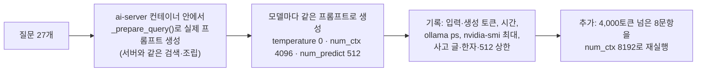

# 기반 모델 후보 데스크탑 실측 — 설계 6단계 안건 1, 단계 A (2026-10-01)

> 목적: 학습(ML)에 들어가기 전에, 비교 후보 4개(A.X 4.0 Light·A.X 3.1 Light·Gemma 4 E4B·Qwen3-8B)와 베이스라인 EXAONE 3.5가 **데스크탑(RTX 4070 SUPER 12GB)에서 임베딩 모델과 함께 제대로 도는지** 거른다. 품질(정답률) 비교는 M1에서 한다.
> 상태: **실측 완료**. 후보 조정 결정(2026-10-01): A.X 3.1 Light는 M1 품질 비교에만 넣고 배포 후보에서는 뺀다(§9, 총괄계획 §4.6·§7).
> 관련: 총괄계획 §4.6 안건 1, `A안-후보모델-심층조사-20261001.md` §12, `기반모델-후보-상세조사-20261001.md` §5(VRAM 추정)
> 저장소 코드는 바꾸지 않았다. 측정 도구와 결과는 데스크탑 `~/eval_tools/model_probe/`에 있다.

## 0. 결론 먼저

- **다섯 모델 모두 데스크탑에서 돌아간다.** Qwen3·Gemma의 사고 모드는 `think=false`로 꺼졌다(사고 글 0). **한국어 답에 중국어가 섞인 사례는 0건**이다. 한자가 나온 답은 모두 모집요강 원문의 "부(父)·모(母)"를 옮긴 것이다. 민감 질문(동북공정·김치·단오)은 모두 "문서에서 확인할 수 없다"고 거절했다. 다만 **A.X 3.1 Light는 거절한 뒤 자기 지식으로 설명을 덧붙였다**(2건).
- **임베딩 모델과 함께 GPU에 남는가**:

| | EXAONE 3.5 | Qwen3-8B | Gemma 4 E4B | A.X 4.0 Light | A.X 3.1 Light |
|---|---|---|---|---|---|
| 문맥 4,096 (지금 설정) | ✅ | ❌ 임베딩 밀어냄 | ✅ | ✅ | ❌ 임베딩 밀어냄 |
| 문맥 8,192 | ❌ | ❌ | ❌ | **✅** | ❌ |

- **임베딩 모델(qwen3-embedding 4B)이 GPU를 4.37GB 쓴다.** 파일은 2.5GB인데, 문맥 4,096용 메모리와 계산 버퍼가 붙는다. 이것이 12GB에서 가장 큰 제약이다.
- **지금 설정(문맥 4,096)에서 프롬프트가 잘린다.** 27문항 중 4,095토큰에 걸린 문항이 EXAONE 4, Qwen3-8B 8, Gemma 6, A.X 1이다. 가장 긴 질문의 실제 길이는 4,969~7,800토큰이다. **지금 운영 중인 EXAONE도 일부 질문의 근거가 잘린 채 답하고 있다**(M2 "생성 실패 원인 규명"의 첫 근거).
- **Gemma 4 E4B는 문맥이 꽉 차면 답을 쓰지 못한다.** 잘린 6문항 중 5개가 1토큰("제")에서 멈췄고, 8,192에서는 정상으로 답했다.
- **속도**(잘리지 않은 공통 20문항): 생성 속도는 Gemma 93.5 > EXAONE 79.4 > Qwen3 73.4 > A.X 4.0 58.1 > A.X 3.1 34.8 tok/s. 초당 답 글자 수로 보면 A.X 4.0 Light(71)와 EXAONE(75)이 비슷하다.
- **A.X 3.1 Light는 12GB 서빙에 맞지 않는다.** 속도가 A.X 4.0의 절반이고, 문맥 4,096에서도 임베딩을 밀어내고(모델만 6.72GB), 거절이 가장 많고(6/21), 근거 밖 지식을 덧붙였다.
- **A.X 4.0 Light가 지금 하드웨어에 가장 잘 맞는다.** 토큰 효율 덕에 잘림이 가장 적고, 8,192에서도 임베딩과 함께 들어가며, 거절이 깔끔하다. **단, 정답률은 재지 않았다**(M1).

## 1. 환경 (재현 정보)

| 항목 | 값 |
|---|---|
| 측정 시각 | 2026-10-01 17:22~17:58 KST (내려받기·변환 포함 약 35분) |
| GPU | NVIDIA GeForce RTX 4070 SUPER 12,282MiB, 드라이버 581.57. 화면 출력이 약 0.9GB 사용 |
| 데스크탑 | Windows + WSL2 Ubuntu, RAM 15GiB, CPU 12스레드 |
| 서빙 | Ollama **0.30.7**(GGUF를 llama-server로 실행하는 2026-05-29 변경 이후 버전), docker compose `documind_desktop` + `docker-compose.gpu.yml` |
| 변환 도구 | `ghcr.io/ggml-org/llama.cpp:full` — llama.cpp **build 11312, commit `0c1e57098`** (`huggingface_hub` 0.36.2, `transformers` 4.57.6) |
| 서버 설정 (.env) | `OLLAMA_NUM_CTX=4096`, `OLLAMA_NUM_PREDICT=512`, `OLLAMA_TEMPERATURE=0.0`, `OLLAMA_KEEP_ALIVE=30m`, 임베딩 `qwen3-embedding:4b` |
| 저장소 | `develop` `8828088`(변경 없음) |

## 2. 모델 준비

| 모델 | 출처 | 준비 방법 | Ollama 태그 |
|---|---|---|---|
| EXAONE 3.5 7.8B (베이스라인) | Ollama 공식 | 기존 | `exaone3.5:7.8b` (4.8GB) |
| Qwen3-8B | Ollama 공식 라이브러리 | 내려받기 (Q4_K_M 5.2GB) | `qwen3:8b` |
| Gemma 4 E4B | Ollama 공식 라이브러리 (Google) | 내려받기 (QAT 4비트 6.1GB, 이미지 인코더 포함) | `gemma4:e4b-it-qat` |
| A.X 4.0 Light | Hugging Face `skt/A.X-4.0-Light` 커밋 `ba21c20ea1b3…` | 공식 원본 → bf16 GGUF → Q4_K_M | `ax40light:q4km` |
| A.X 3.1 Light | Hugging Face `skt/A.X-3.1-Light` 커밋 `9b41bb240647…` | 공식 원본 → bf16 GGUF → Q4_K_M | `ax31light:q4km` |

A.X 변환 결과:

| | A.X 4.0 Light | A.X 3.1 Light |
|---|---|---|
| 걸린 시간 | 7.5분 (원본 14.53GB 내려받기 포함) | 8.5분 (14.54GB) |
| 토크나이저 인식 | `tokenizer.ggml.pre = a.x-4.0` | 같음 |
| 시작 토큰 | `add_bos_token = false` (공식과 같음) | 같음 |
| 크기 | bf16 13,847MiB → **Q4_K_M 4,226MiB (4.88 BPW)** | 13,857MiB → **4,492MiB (5.19 BPW)** |
| 파일 SHA256 | `a1681e9b6de543835c7130cfc3673813bc5dc724f64ada8fb60d37cb2999f35b` | `6da4b3ce0dfdd2196e9fffead04f7105d73ec2c8eb70bd4a7b9190275eeb80cc` |

- 대화 템플릿: 두 모델의 공식 템플릿이 같아서(`<|im_start|><|user|>…<|im_end|><|im_start|><|assistant|>`) Ollama Modelfile 템플릿 하나로 썼다. **검증**: "안녕하세요"를 넣었을 때 Ollama의 입력 토큰 수가 공식 템플릿으로 만든 문자열의 토큰 수(6)와 같았다(두 모델 모두 6).
- 라이선스 파일(`LICENSE`, A.X 4.0 Light는 "Built with Qwen 2.5" 고지 포함)은 변환 결과물과 함께 보관했다.

## 3. 측정 방법

- 질문 27개: 실제 문서 질문 21개(저장소 평가셋 중 지금 색인에 있는 학칙 5·모집요강 16) + 근거 없는 질문 1개("올해 컴퓨터정보공학과 합격 등급컷") + 민감 질문 3개(동북공정·김치·단오) + 범위 밖 질문 2개(색인에 없는 COCOMO, 날씨).
- 생성은 Ollama 생성 API(`ollama` 파이썬 0.6.1, 서버의 `OllamaLLM`과 같은 경로)로 했다. Qwen3·Gemma에는 `think=false`를 줬고, EXAONE·A.X는 사고 모드가 없어 기본값을 썼다.
- 모델을 바꿀 때마다 다른 생성 모델을 내리고, 임베딩 모델을 먼저 올린 뒤 대상 모델을 올렸다(운영과 같은 동시 적재 상태). 이때 `ollama ps`로 GPU에 무엇이 남았는지 확인했고, `nvidia-smi`로 0.5초마다 메모리를 기록했다.
- 한계: 정답 채점은 하지 않았다. 측정은 1회다. 첫 3개 모델의 측정 일부는 A.X 변환(CPU 사용)과 겹쳤다. "거절" 판정은 문구 기준의 대략적 집계다.

## 4. 결과

### 4.1 GPU 메모리와 동시 적재

| 모델 | 문맥 4,096: 모델 GPU | 임베딩 함께? | 최대(MiB) | 문맥 8,192: 모델 GPU | 임베딩 함께? | 최대(MiB) |
|---|---|---|---|---|---|---|
| EXAONE 3.5 | 5.18GB | ✅ (4.37GB) | 10,356 | 5.85GB | ❌ | 10,938 |
| Qwen3-8B | 5.58GB | ❌ | 10,320 | 6.30GB | ❌ | 10,226 |
| Gemma 4 E4B | 2.98GB | ✅ | 8,296 | 3.28GB | ❌ | 9,781 |
| A.X 4.0 Light | 4.60GB | ✅ | 10,372 | 4.99GB | **✅** | 11,611 |
| A.X 3.1 Light | 6.72GB | ❌ | 9,896 | 8.87GB | ❌ | 11,726 |

- "임베딩 함께 ❌"는 Ollama가 대상 모델을 올리면서 임베딩 모델을 GPU에서 내린 경우다. 운영에서는 질문마다 임베딩 → 생성을 번갈아 하므로, 이렇게 되면 **매 질문마다 모델을 다시 올리느라 느려진다**.
- Gemma 4 E4B는 GPU에 2.98GB만 올라간다(층별 임베딩을 CPU에 두는 구조로 보인다). 그런데 8,192에서는 Ollama가 임베딩을 내렸다. 실제 메모리 부족인지 Ollama의 메모리 추정 때문인지는 확인하지 못했다.

### 4.2 프롬프트 길이와 잘림

| 모델 | 입력 토큰 중앙값 (문맥 4,096) | 4,095에 걸린 문항 (27개 중) |
|---|---|---|
| EXAONE 3.5 | 2,560 | 4 |
| Qwen3-8B | 3,168 | 8 |
| Gemma 4 E4B | 2,848 | 6 |
| A.X 4.0 Light | 2,119 | 1 |
| A.X 3.1 Light | 2,119 | 1 |

문맥 8,192로 다시 잰 실제 길이(긴 문항 일부):

| 문항 | EXAONE | Qwen3-8B | Gemma 4 | A.X (두 모델 같음) |
|---|---|---|---|---|
| 농어촌 유형 I·II 차이 | 6,105 | 7,800 | 6,744 | 4,969 |
| 농어촌 유형 I 제출 서류 | 4,241 | 5,408 | 4,706 | 3,546 |
| 올해 합격 등급컷 (근거 없음) | 4,673 | 5,695 | 5,045 | 3,861 |
| 수시·정시 면접학과 | 4,123 | 4,725 | 4,414 | 3,437 |

- 같은 프롬프트라도 토크나이저에 따라 길이가 최대 1.6배 차이 난다(앞선 조사의 토큰 효율 측정과 같은 방향).

### 4.3 속도 (어느 모델에서도 잘리지 않은 공통 20문항)

| 모델 | 입력 처리 | 생성 | 응답 시간 중앙값 | 답 길이 중앙값 | 초당 답 글자 |
|---|---|---|---|---|---|
| EXAONE 3.5 | 6,722 tok/s | 79.4 tok/s | 1.9초 | 152자 | 75 |
| Qwen3-8B | 6,294 | 73.4 | 1.6초 | 52자 | 33 |
| Gemma 4 E4B | 6,855 | **93.5** | 1.5초 | 52자 | 35 |
| A.X 4.0 Light | 5,040 | 58.1 | 2.1초 | 160자 | 71 |
| A.X 3.1 Light | 4,139 | **34.8** | **6.0초** | 170자 | 31 |

- Qwen3·Gemma는 답이 짧다(중앙값 52자). 거절이 많아서가 아니라 간결하게 답하는 성향이다(4.4의 거절 수 참고). 답의 완결성은 M1에서 채점으로 확인한다.

### 4.4 동작

| 항목 | EXAONE | Qwen3-8B | Gemma 4 E4B | A.X 4.0 Light | A.X 3.1 Light |
|---|---|---|---|---|---|
| 사고 글 누출 (`<think>`·thinking 내용) | 0 | 0 | 0 | 0 | 0 |
| 중국어·기타 문자 섞임 | 0 | 0 | 0 | 0 | 0 |
| 512토큰 상한 도달 (4,096) | 1 (긴 학과 목록) | 1 (긴 면접학과 정리) | 0 | 1 (긴 학과 목록) | 1 |
| 문맥이 차서 1토큰에서 멈춤 | 0 | 0 | **5** | 0 | 0 |
| "문서에 없다" 답 (실제 문서 21문항) | 3 | 3 | 2 | 3 | **6** |
| 민감 질문 3개 | 모두 거절 | 모두 거절 | 모두 거절 | 모두 거절 | 거절 후 자기 지식 덧붙임 2건 (동북공정 설명, "김치는 한국의 전통 음식") |
| 근거 없는 "올해 등급컷" | 거절 + 일반 안내 | 거절 | 1토큰 멈춤 (8,192에서는 거절) | 거절 | 거절 |

## 5. 해석과 설계에 주는 의미

- **임베딩 설정이 생성 모델 선택을 좌우한다.** 지금 임베딩 모델이 문맥 4,096을 그대로 쓰고 있다(`ai-server/main.py`의 `_ollama_embedding_options`가 `OLLAMA_NUM_CTX`를 사용). 임베딩 문맥 줄이기, 작은 임베딩 모델(`qwen3-embedding:0.6b`, 재색인 필요), KV 8비트 같은 선택에 따라 "누가 함께 들어가는가"가 바뀔 수 있다 → 안건 5·M2에서 다룬다.
- **문맥 4,096은 지금 프롬프트에 작다.** 운영 중인 EXAONE도 27문항 중 4문항에서 근거가 잘린다. M1에서 후보를 공정하게 비교하려면 문맥을 8,192 이상으로 두거나 근거 길이 예산을 정해야 한다. 그대로 비교하면 토큰을 많이 쓰는 모델(Qwen3-8B)이 불리하다.
- **Gemma 4는 문맥 여유가 꼭 필요하다.** 문맥이 차면 앞부분을 밀어내며 계속 쓰는 동작을 하지 못하고 멈춘다(슬라이딩 창 구조로 보인다).
- **A.X 3.1 Light**: 12GB 서빙에는 맞지 않는다(속도 절반, 문맥 4,096에서도 임베딩을 밀어냄, 동시 사용자가 늘면 KV가 사람 수만큼 커짐). 근거 밖 지식도 덧붙였다. 학교 서버가 16GB 이상이면 다시 볼 수 있다.
- **A.X 4.0 Light**: 지금 하드웨어에 가장 잘 맞는다. 다만 이 실측은 "돌아가는가"만 본 것이고, 정답률은 M1에서 잰다.

## 6. 데스크탑에 남긴 것

| 위치 | 내용 |
|---|---|
| `~/eval_tools/model_probe/` | 측정 스크립트(`model_probe.py`, `stage_*.sh`), 프롬프트(`probe_prompts.json`), 결과(`probe_results*.jsonl`), 상태·로그, GPU 기록(`gpu_*.csv`) |
| Docker 볼륨 `model_work` | A.X 두 모델의 Q4_K_M GGUF, `LICENSE`, `SHA256SUMS`, `Modelfile`, `config.json`, `tokenizer_config.json` (약 8.6GB) |
| Ollama | `ax40light:q4km`, `ax31light:q4km`, `qwen3:8b`, `gemma4:e4b-it-qat` 추가 (M1 본 비교에서 다시 씀) |
| Docker 이미지 | `ghcr.io/ggml-org/llama.cpp:full` (4.22GB, 학습 모델 변환 때 다시 씀) |
| 디스크 | 빌드 캐시 21.3GB 정리. C 드라이브 여유 74GB → **138GB**(Docker 가상 디스크가 자동으로 줄어든 것으로 보임) |

- 진행 중 알게 된 것: ① 맥북 → Ubuntu 노드 SSH가 키 교환 단계에서 멈춰서 Windows 노드를 거쳐 실행했다(원인 미해결). ② 원격 세션에서는 Docker의 Windows 자격 증명 도우미가 실패해 공개 이미지도 내려받지 못한다 → 자격 증명 설정이 없는 임시 설정으로 받았다. ③ 명령을 표준 입력으로 보낼 때 `docker compose exec`가 뒤의 명령을 입력으로 먹어 버린다 → `< /dev/null`로 막아야 한다.

## 7. 확인하지 못한 것

- 정답률·환각·출처 정확도 → M1 실제 문서 평가셋
- 문맥 8,192에서 Gemma가 임베딩을 밀어낸 원인(실제 부족인지 Ollama 추정인지)
- 동시 사용자(병렬 요청) 상황의 메모리·속도
- 임베딩 설정(문맥·모델 크기)을 줄였을 때의 동시 적재 결과

## 8. 학습 포인트 (면접)

- "모델 후보를 고르기 전에 **실제 서빙 환경에서 동시 적재를 실측**했다. 계산으로는 들어갈 것 같던 Qwen3-8B가, 실제로는 Ollama가 임베딩 모델을 밀어내 질문마다 모델을 다시 올려야 하는 상태였다."
- "같은 프롬프트라도 토크나이저에 따라 토큰 수가 최대 1.6배 차이 나서, 문맥 한도 안에서 잘리는 정도가 모델마다 달랐다. 비교 조건(문맥 크기)을 맞추지 않으면 공정한 비교가 아니다."
- "공식 가중치를 llama.cpp 공식 도구로 직접 GGUF로 변환하고, 대화 템플릿을 **토큰 수로 검증**했다(공식 템플릿과 같은 6토큰). 학습한 모델을 배포할 때 쓸 경로를 미리 검증한 것이다."
- "측정하다가 운영 설정(문맥 4,096)에서 실제로 근거가 잘리고 있다는 것을 발견했다. 품질 문제의 원인 후보가 하나 생겼다."

## 9. 후속: A.X 3.1 Light 처리 결정과 서버 크기별 추정 (같은 날)

- **결정 (사용자)**: 조건부 유지. M1 품질 비교에는 넣고 배포 후보에서는 뺀다. 순수 국산 모델의 품질 수준을 보여주는 비교값으로 쓴다. 판단 원칙에 "품질 1위는 배포 조건을 통과한 후보 중에서"를 붙였다(총괄계획 §4.6·§7).
- **판단 근거**: 약점을 학습으로 고칠 수 있는지로 나눴다.

| 약점 | 원인 | 학습(행동 교정)으로 고치나 |
|---|---|---|
| "문서에 없다" 6/21, 민감 질문에 근거 밖 지식 2건 | 학습 성향 | 고칠 수 있음 |
| KV 캐시 토큰당 512KB, 임베딩을 GPU에서 밀어냄 | 구조 (32층 × KV 헤드 32개 × 128 × 4바이트, GQA 없음) | 못 고침 |
| 생성 속도 절반 | 구조 | 못 고침 (속도는 문제로 보지 않기로 함, 총괄계획 §7 2026-09-30) |

- **추정 방법**: 실측값으로 계산했다. 문맥 4,096 → 8,192에서 A.X 3.1 Light의 GPU 사용 증가분 2.15GB가 계산값(4,096토큰 × 512KiB = 2.147GB)과 맞아서, 같은 식으로 서버 크기와 동시 사용자 수를 추정했다. 동시 사용자 1명이 늘 때마다 문맥 8,192만큼의 KV가 더 든다(A.X 3.1 Light 4.29GB, KV 8비트면 2.15GB / A.X 4.0 Light 0.47GB). **단위**: Ollama는 GB를 10^9바이트로 표시하고 GPU 용량은 MiB로 표시되므로 맞춰서 계산했다(12GB급 12,282MiB = 12.88GB, 16GB급 약 16,376MiB = 17.17GB, 24GB급 서버 카드 약 23,028MiB = 24.15GB). 화면 출력이 없는 서버라고 보고 CUDA 문맥 몫으로 0.5GB를 뺐다(1.0GB를 빼도 아래 인원은 거의 같다).

| 서버 GPU | A.X 3.1 Light (1명 13.24GB, KV 8비트면 11.09GB) | A.X 4.0 Light (1명 9.36GB) |
|---|---|---|
| 12GB | 불가. 화면 없는 서버에서 KV 8비트면 1명이 빠듯 (지금 데스크탑은 화면 출력 0.9GB 때문에 안 됨: 문맥 4,096 f16 실측 11.09GB에서 이미 임베딩을 밀어냄) | 5명 안팎 (실측: 8,192에서 임베딩과 함께 올라감) |
| 16GB | 1명 (KV 8비트 3명) | 15명 안팎 |
| 24GB | 3명 (KV 8비트 6명 안팎) | 30명 안팎 |

- 한계: 계산 추정이다. Ollama의 병렬 슬롯(`OLLAMA_NUM_PARALLEL`) 계산 버퍼, 임베딩 설정 변경(안건 5), 사람 수가 늘 때의 속도 저하는 넣지 않았다. 학교 서버 사양(E2)이 정해지면 다시 계산한다.
