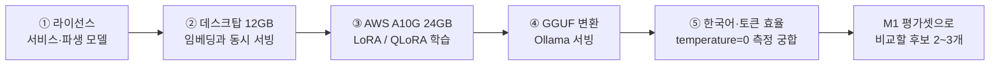

# 기반 모델 후보 상세 조사 — 설계 6단계 안건 1 (2026-10-01)

> 목적: 파인튜닝할 기반 모델 후보를 **M1 평가셋으로 비교할 2~3개**로 좁힌다. 1차 조사(`생성모델-라이선스-및-학습데이터-조사-20261001.md`)에서 라이선스로 거른 후보를 서빙·학습·변환·한국어 기준으로 자세히 본다.
> 방법: 조사 에이전트를 쓰지 않고 Claude가 원자료를 직접 받아 대조했다. Hugging Face의 모델 카드(README)·LICENSE·config.json·API 응답, llama.cpp 변환 소스, Ollama 공식 라이브러리·FAQ·GitHub 이슈, Unsloth 공식 문서. 한국어 토큰 수는 실제 학교 문서 2개로 맥북에서 직접 쟀다. **VRAM은 계산한 추정치다(데스크탑 실측 전).**
> 상태: **조사 결과만 담는다. 후보 확정은 사용자 결정 뒤 총괄계획 §4.6에 기록한다.**
> 관련: 총괄계획 §4.6 안건 1, 문제 E5(생성 모델 라이선스), E2(학교 서버 사양), D2(동시 사용)
> **후속 심층 조사**: `A안-후보모델-심층조사-20261001.md` (A안 세 모델의 상업 이용·학교 사용(AI 기본법·중국산 AI 조치)·출처 국가·제3자 한국어 점수, 국산 계보 대안 A.X 3.1 Light. 이 문서 §12의 선택지는 그 문서 §7로 바뀌었다)
> **법률 자문이 아니다.**

## 0. 결론 먼저

- **라이선스**: 1차 후보 6종(A.X 4.0 Light, Mi:dm 2.0, Kanana 1.5, Qwen3, Qwen3.5, Gemma 4)의 LICENSE는 표준 Apache 2.0·MIT 원문과 같다(덧붙은 조항 없음). 조건부 3종(Kanana 2, HyperCLOVA X SEED, Llama)의 제외 사유를 원문으로 확인했다. 특히 **Kanana 2는 온프레미스 배포 솔루션으로 제3자에게 제공하려면 카카오의 별도 상업 라이선스가 필요하다(4.1조 ii)**. 학교 서버에 배포해 인계하는 우리 계획과 정면으로 부딪친다.
- **새 모델은 없다**: 2026년에 나온 한국 모델 중 허용 라이선스는 모두 초대형이다(A.X K1 519B, A.X K2 692B, Motif-3 315B). 12GB에서 돌릴 수 있는 허용 라이선스 한국어 모델은 여전히 2025년에 나온 3종(A.X 4.0 Light, Mi:dm 2.0, Kanana 1.5)이다.
- **12GB 동시 서빙(추정)**: 지금 EXAONE 대비 A.X 4.0 Light −0.6GB, Kanana 1.5 +0.1GB, Qwen3-8B +0.3GB, Qwen3.5-9B +0.5~1.5GB, Gemma 4 12B +2.2GB, Mi:dm 2.0 Base +2.5GB. 6월에 지금 조합으로 11.7/12GB까지 차서 평가가 크게 느려진 기록이 있어, +0.5GB 이상은 실측 전에는 장담할 수 없다.
- **A10G 24GB 학습**: 7~8B는 QLoRA(4비트)로 여유가 있고, 16비트 LoRA는 7B만 여유가 있다. Qwen3.5는 QLoRA를 권하지 않는다(Unsloth 공식 가이드). 11~12B는 QLoRA만 되고, 학습 뒤 합치기(병합) 단계에서 RAM 16GB가 모자랄 수 있다.
- **한국어 토큰 효율(실측)**: 같은 학교 문서가 A.X 4.0 Light는 지금 EXAONE의 81% 토큰, Mi:dm 83%, Qwen3.5 103%, Kanana 108%, Gemma 4 110%, Qwen3-8B 124%가 된다.
- **한국어 능력**: 같은 표에서 비교할 수 있는 것은 A.X 카드(지식: A.X ≈ Qwen3-8B > EXAONE > Kanana)와 Mi:dm 카드뿐이다. Qwen3.5·Gemma 4는 한국어 단독 수치가 공식 자료에 없다. **어느 카드도 우리 작업(학교 문서의 표를 읽고 근거로 답하기, 없으면 모른다고 하기)을 재지 않는다** → 최종 판단은 M1 평가셋.
- **추천(결정 대기)**: A.X 4.0 Light + Qwen3-8B를 기본 2개로, Qwen3.5-9B를 조건부 3번째(데스크탑 실측에서 임베딩과 함께 12GB에 들어갈 때)로 비교한다. EXAONE 3.5는 후보가 아니라 베이스라인으로만 잰다. 선택지는 §12.

## 1. 확인 순서

앞 단계에서 떨어지면 뒤 단계가 좋아도 쓸 수 없다. 그래서 벤치마크 점수가 아니라 **제약 조건 순서**로 거른다.

## 2. 용어

| 용어 | 뜻 |
|---|---|
| 가중치(weights) | 모델 파일 본체. 4비트로 줄이면(양자화) 7~8B 모델이 약 4.5~5GB가 된다 |
| KV 캐시 | 모델이 앞 문장을 기억하려고 GPU에 잡아 두는 메모리. **문맥 길이와 동시 사용자 수에 비례해** 커진다. 크기 = 2(K·V) × 층 수 × KV 헤드 수 × 헤드 차원 × 2바이트 × 토큰 수 |
| num_ctx | 한 번에 모델에 넣을 수 있는 토큰 수. 지금 4,096 (`.env.example`의 `OLLAMA_NUM_CTX`) |
| GGUF | llama.cpp·Ollama가 읽는 모델 파일 형식. 학습한 모델을 이 형식으로 바꿔야 Ollama로 서빙할 수 있다 |
| Q4_K_M | GGUF 4비트 양자화 방식 하나. Ollama 라이브러리의 기본 형식 |
| LoRA / QLoRA | 모델 전체 대신 작은 덧붙임 가중치만 학습하는 방법. LoRA는 원본을 16비트로, QLoRA는 4비트로 GPU에 올려 놓고 학습한다(QLoRA가 메모리를 덜 쓴다) |
| 병합(merge) | 학습한 LoRA를 원본에 합쳐 모델 하나로 만드는 단계. GGUF 변환 전에 한다 |
| 사고 모드(thinking) | 답하기 전에 긴 추론 글을 먼저 만드는 모드. 느리고, 일부 모델은 greedy에서 문제가 생긴다 |
| greedy decoding | 매번 가장 확률 높은 토큰을 고르는 생성 방식. temperature=0과 같다. 우리 측정 원칙(총괄계획 §4.0-2) |
| 토크나이저 | 글을 토큰으로 자르는 규칙. 같은 한국어라도 모델마다 토큰 수가 다르다 |

## 3. 라이선스 (원문 대조)

### 3.1 후보 — 서비스·파생 모델 허용

| 모델 | LICENSE | 원문 대조 결과 | 우리가 지킬 것 |
|---|---|---|---|
| A.X 4.0 Light | Apache 2.0 | 조항 부분이 Apache 2.0 원문과 글자까지 같다. 맨 위에 SKT 저작권과 "Qwen 2.5 기반, Apache 2.0" 고지가 있다 | 라이선스·고지 사본 포함, 수정했다는 표시 |
| Mi:dm 2.0 Base·Mini | MIT (`LICENSE.txt`) | 표준 MIT 원문과 같다. Base와 Mini가 같은 파일 | 저작권·허가 고지 포함 |
| Kanana 1.5 8B·2.1B | Apache 2.0 | 마크다운 서식만 다르고 단어 일치율 99.4%(차이는 제목 표기뿐) | Apache 2.0과 같음 |
| Qwen3-8B, Qwen3.5-9B·4B | Apache 2.0 | 원문과 같다 | 같음 |
| Gemma 4 | Apache 2.0 (모델 카드가 `ai.google.dev/gemma/docs/gemma_4_license`로 연결) | 페이지 본문이 Apache 2.0 원문이고 "END OF TERMS AND CONDITIONS"에서 끝난다. 예전 Gemma 1~3의 별도 이용약관 조항은 본문에 없다(사이트 메뉴에 "Prohibited use" 링크는 있음) | 같음 |

### 3.2 제외 — 원문으로 확인한 사유

| 모델 | 라이선스 | 제외 사유 (원문 조항, 요약) |
|---|---|---|
| Kanana 2 (1.3B·3B·30B-A3B) | KANANA OPEN LICENSE | **4.1조**: 제3자에게 (i) API·클라우드·원격 접속으로 제공, **(ii) SI나 온프레미스 배포 솔루션의 일부로 제공**, (iii) 온디바이스로 제공하려면 카카오의 별도 상업 라이선스가 필요하고, 줄지는 카카오 재량(4.3조). 4.2조는 자기 서비스 운영만 예외로 둔다. 3.1조 (v): "Powered by Kanana" 표시, 출력으로 학습한 모델 이름 앞에 "Kanana" |
| HyperCLOVA X SEED (0.5B~32B, 최신 8B Omni 2025-12) | 자체 라이선스 | 2.2조: 라이선스가 철회 가능(revocable). 2.1조·12조: 네이버가 언제든 약관을 바꿀 수 있고, 따르지 않으면 사용을 멈춰야 한다. 4조: 월 1천만 명 초과이거나 네이버 서비스와 실질적으로 비슷하거나 경쟁하면 별도 허락. 3.1조: "Powered by HyperCLOVA X" 표시와 이름 접두사. → 학교에 인계할 서비스의 기반으로 두기에 약관이 불안정하다 |
| Llama 3.1·3.2 | Llama Community License | "Built with Llama" 표시, 학습한 모델 이름 앞에 "Llama", 사용 정책(AUP) 준수, 월 7억 명 기준. 서비스는 가능하지만 이름·표시 의무가 붙고 한국어 근거가 약하다(Mi:dm 카드 표에서 Llama-3.1-8B KMMLU 33.0, EXAONE 3.5 7.8B 52.6) |
| Qwen3.8-Flash-Next (2026-08) | Qwen Community License 1.0 | 전체 125B(활성 6B) + n-gram 임베딩 51B라 서빙 불가. 참고: Qwen3.8 중 이 모델만 라이선스가 바뀌었다(Qwen3.8-27B는 Apache 2.0) |
| Trillion Labs Trida-7B, Trida2.0-4B | Apache 2.0 / 기타 | Trida-7B는 확산(diffusion) 언어 모델(`TridaForDLM`, 문맥 4K)이라 llama.cpp·Ollama 대상이 아니다. Trida2.0-4B는 모델 카드가 스스로 연구용 체크포인트라고 하고, 전용 SGLang 포크로 서빙한다 |
| A.X K1(519B)·K2(692B), Motif-3(315B), Solar Open(103B) | Apache 2.0 / MIT / 기타 | 크기 |
| EXAONE 3.5·4.x | EXAONE NC | 1차 조사대로(E5). 개발·평가 중에는 베이스라인으로만 쓴다 |

## 4. 구조와 문맥 길이 (config.json·API 원자료)

| 모델 | 공개(HF) | 구조 | 파라미터 | 층 | KV 헤드×차원 | 문맥 | 어휘 |
|---|---|---|---|---|---|---|---|
| EXAONE 3.5 7.8B (현재) | 2024-12 | Exaone | 7.8B | 32 | 8×128 | 32K | 102,400 |
| **A.X 4.0 Light** | 2025-07-02 | Qwen2 (Qwen2.5-7B에 한국어 추가 학습) | 7.26B | 28 | **4×128** | **16K** | 102,400 |
| Mi:dm 2.0 Base | 2025-07-03 | Llama (8B를 층 확장) | 11.5B | 48 | 8×128 | 32K | 131,384 |
| Mi:dm 2.0 Mini | 2025-07-03 | Llama (Base를 가지치기·증류) | 2.3B | 48 | 8×128 | 32K | 131,392 |
| Kanana 1.5 8B | 2025-05-21 | Llama | 8.03B | 32 | 8×128 | 32K (YaRN으로 128K) | 128,259 |
| **Qwen3-8B** | 2025-04-27 | Qwen3 | 8.19B | 36 | 8×128 | 32K (YaRN으로 131K) | 151,669 |
| **Qwen3.5-9B** | 2026-02-27 | 혼합: 32층 중 24층이 선형 어텐션(Gated DeltaNet), 8층만 일반 어텐션. 비전 인코더 포함 | 9.65B | 32 | (일반층만) 4×256 | 262K | 248,070 |
| Qwen3.5-4B | 2026-02-27 | 같음 | 약 4B | 32 | 4×256 | 262K | 248,070 |
| Gemma 4 12B | 2026-05-23 | 혼합: 40층 슬라이딩 창(1,024토큰) + 8층 전역. 텍스트·이미지·오디오 | 11.95B | 48 | 창 8×256, 전역 1×512(K=V 공유) | 256K | 262,144 |

- **문맥 길이는 가르는 기준이 아니다.** 지금 `num_ctx`는 4,096이고, 오늘 로그의 최대 프롬프트는 1,757토큰이었다(총괄계획 §9 2026-10-01). 가장 짧은 A.X(16K)도 충분하다.
- 어휘 수는 `tokenizers`로 읽은 실제 값이다(config의 `vocab_size`는 여유분을 더한 값이라 다를 수 있다).

## 5. 데스크탑 12GB 동시 서빙 (추정)

### 5.1 계산 방법

- 가중치: Q4_K_M GGUF 파일 크기. Ollama 공식 라이브러리에 있으면 그 값(EXAONE 4.8GB, qwen3.5:9b 6.6GB), 없으면 Hugging Face의 변환본 파일 크기.
- KV 캐시: config 값으로 계산(§2의 식), f16, 동시 1명, `num_ctx` 4,096.
- 임베딩 `qwen3-embedding:4b`: 가중치 2.5GB + KV 0.60GB(36층·8×128, 4,096) = **3.1GB**. 모든 후보에 같다.
- 빠진 것: CUDA 문맥, 계산 버퍼, 윈도 화면 출력이 쓰는 메모리. 지금 조합(8.4GB)이 6월 평가 중 11.7/12GB까지 찼으므로, 이 몫이 약 3GB라고 보고 **"지금보다 얼마나 늘거나 주는가"**로 판단한다.

### 5.2 결과

| 모델 | 가중치 | KV/토큰 | KV(4K) | 생성 모델 합 | **지금 대비** | 동시 4명이면 KV 추가 |
|---|---|---|---|---|---|---|
| EXAONE 3.5 7.8B (현재) | 4.80 | 128KB | 0.54 | 5.34 | 0 | +1.61 |
| **A.X 4.0 Light** | 4.46 | **56KB** | 0.23 | 4.69 | **−0.64** | +0.70 |
| Kanana 1.5 8B | 4.92 | 128KB | 0.54 | 5.46 | +0.12 | +1.61 |
| **Qwen3-8B** | 5.03 | 144KB | 0.60 | 5.63 | **+0.30** | +1.81 |
| **Qwen3.5-9B** (텍스트만 변환) | 5.68 | **32KB** | 0.18 | 5.86 | **+0.53** | +0.40 |
| Qwen3.5-9B (Ollama 공식, 비전 포함) | 6.60 | 32KB | 0.18 | 6.78 | +1.45 | +0.40 |
| Gemma 4 12B | 7.12 | 전역 16KB + 창 0.34GB 고정 | 0.40 | 7.52 | +2.19 | +1.21 |
| Mi:dm 2.0 Base | 7.03 | **192KB** | 0.81 | 7.84 | +2.50 | +2.42 |
| Qwen3.5-4B | 2.74 | 32KB | 0.17 | 2.91 | −2.42 | +0.40 |
| Mi:dm 2.0 Mini | 1.43 | 192KB | 0.81 | 2.24 | −3.10 | +2.42 |

(단위 GB. "동시 4명"은 `OLLAMA_NUM_PARALLEL=4`일 때 늘어나는 KV. 지금 compose에는 이 값이 없고, 현재 Ollama 문서의 기본값은 1이다.)

### 5.3 읽는 법

- **A.X 4.0 Light만 지금보다 줄어든다.** KV 헤드가 4개라 KV 캐시가 EXAONE의 절반 이하다.
- Kanana·Qwen3-8B는 지금과 비슷하다(+0.1~0.3GB). 6월처럼 한계에 걸릴 수 있어 실측이 필요하다.
- Qwen3.5-9B는 텍스트만 변환하면 +0.5GB, Ollama 공식(비전 포함)을 그대로 쓰면 +1.5GB다. **실측 전에는 들어간다고 말할 수 없다.**
- Gemma 4 12B·Mi:dm 2.0 Base는 +2.2~2.5GB라 임베딩과 함께 12GB에 들어가지 않을 가능성이 높다. 넘치면 윈도 드라이버가 시스템 메모리로 넘겨 에러 대신 크게 느려진다(6월 평가 30분 넘게 지연된 현상이 이것으로 보인다).
- 동시 사용자에 강한 모델: KV/토큰이 작은 **Qwen3.5(32KB)·A.X(56KB)**. 약한 모델: Mi:dm(192KB)·Qwen3-8B(144KB). 학교 전체 규모(D2)에서 차이가 커진다.
- 줄일 수단(이번에 정하지 않음): KV 캐시 8비트(`OLLAMA_KV_CACHE_TYPE=q8_0`), 작은 임베딩 모델(`qwen3-embedding:0.6b` 0.64GB, 재색인 필요), 비전 부분 빼고 변환. 안건 3·5에서 다룬다.

## 6. 한국어 토큰 효율 (실측)

- 문서: `Assets/test_docs/`의 실제 문서 2개. 학칙 37,280자(한글 50%), 2026 모집요강 46,589자(한글 56%).
- 방법: `pdftotext -layout`으로 글자 추출 → 연속 공백·빈 줄 축소 → 각 모델의 `tokenizer.json`을 `tokenizers` 0.22.2(`ai-server/venv`)로 읽어 특수 토큰 없이 토큰 수를 셈. 맥북에서 실행.

| 모델 | 학칙 토큰 | 자/토큰 | 모집요강 토큰 | 자/토큰 | **EXAONE 대비** |
|---|---|---|---|---|---|
| EXAONE 3.5 (현재) | 24,865 | 1.50 | 28,057 | 1.66 | 100% |
| **A.X 4.0 Light** | 19,613 | 1.90 | 23,359 | 1.99 | **81%** |
| Mi:dm 2.0 (Base·Mini 같은 토크나이저) | 20,527 | 1.82 | 23,657 | 1.97 | 83% |
| Qwen3.5-9B | 25,113 | 1.48 | 29,442 | 1.58 | 103% |
| Kanana 1.5 | 24,772 | 1.50 | 32,138 | 1.45 | 108% |
| Gemma 4 12B | 26,207 | 1.42 | 32,070 | 1.45 | 110% |
| **Qwen3-8B** | 29,131 | 1.28 | 36,538 | 1.28 | **124%** |

- 같은 근거 글을 넣어도 Qwen3-8B는 A.X보다 토큰이 **약 1.5배**다. 토큰이 많으면 ① 4,096 안에 넣을 수 있는 근거가 줄고 ② 입력 처리와 답 생성이 느려지고 ③ KV 캐시가 더 든다.
- 한국어 모델 두 개(A.X·Mi:dm)가 한국어 전용 어휘로 가장 효율적이다. Qwen3.5는 어휘를 24만 개로 늘려 Qwen3보다 한국어 효율이 크게 좋아졌다(124% → 103%).

## 7. 한국어 능력 근거 (같은 표 안에서만)

카드마다 평가 설정이 달라 같은 표 안에서만 비교한다(1차 조사와 같은 원칙).

### 7.1 A.X 4.0 Light 카드의 경량 모델 표 (7~8B, 추론 없이)

| 벤치마크 | A.X 4.0 Light | Qwen3-8B | EXAONE 3.5 7.8B | Kanana 1.5 8B | Qwen2.5-7B |
|---|---|---|---|---|---|
| KMMLU (한국어 지식) | **64.15** | 63.53 | 53.76 | 48.28 | 49.56 |
| CLIcK (한국 문화·맥락) | **68.05** | 62.71 | 64.30 | 61.30 | 60.56 |
| KoBALT (한국어 언어학) | **30.29** | 26.57 | 21.71 | 23.14 | 21.57 |
| Ko-IFEval (한국어 지시 따르기) | 72.99 | **73.39** | 65.01 | 69.96 | 60.73 |
| Ko-MT-Bench (한국어 대화 품질) | 79.50 | 64.06 | **81.06** | 76.30 | 61.31 |
| HRM8K (한국어 수학) | 40.12 | **52.50** | 31.88 | 30.87 | 35.13 |

- **1차 조사에서 빠졌던 Qwen3-8B 열**: 한국어 지식·지시 따르기는 A.X와 거의 같지만, 한국어 대화 품질(Ko-MT-Bench 64.06)은 가장 낮다.
- Kanana 1.5 8B는 이 표에서 지식 점수가 EXAONE 3.5(지금 모델)보다 낮다.

### 7.2 Mi:dm 2.0 카드 (`*`는 KT 자체 평가 자료)

| 벤치마크 | Mi:dm 2.0 Base | Qwen3-14B | EXAONE 3.5 7.8B | Llama-3.1-8B | Mi:dm 2.0 Mini | Qwen3-4B | EXAONE 3.5 2.4B |
|---|---|---|---|---|---|---|---|
| KMMLU | **57.3** | 55.4 | 52.6 | 33.0 | 45.1 | 50.6 | 43.5 |
| HAERAE | **81.5** | 68.4 | 72.9 | 49.5 | 70.8 | 50.6 | 61.3 |
| Ko-IFEval | 82.0 | **83.6** | 69.1 | 60.1 | 73.3 | 75.9 | 65.4 |
| Ko-MTBench | **89.7** | 71.0 | 79.6 | 57.0 | 74.0 | 63.0 | 74.0 |
| 이해력 평균* | 76.1 | **76.8** | 67.2 | 51.5 | 61.9 | 66.6 | 62.5 |

- Mi:dm 2.0 Base는 한국어 항목 대부분에서 Qwen3-14B보다 높다. 다만 §5에서 12GB에 들어가지 않을 가능성이 높다.

### 7.3 참고: Kanana 2 카드의 Qwen3.5-2B

같은 표에서 Qwen3.5-2B는 한국어 고유 지식이 약했다: HAERAE-CoT 27.84(kanana-2-3b 43.75), KoSimpleQA 3.21(22.29), KoMT-Bench 5.21(6.92). **9B에도 그대로 적용된다는 근거는 없다.**

### 7.4 Qwen3.5-9B·Gemma 4 12B

- 공식 카드에는 한국어가 섞인 다국어 평균만 있다: MMMLU Qwen3.5-9B 81.2(사고 모드 기준), Gemma 4 12B 83.4%.
- 웹에는 "Gemma 4가 한국어를 잘한다" 같은 커뮤니티 평이 있지만 같은 조건 비교 근거를 찾지 못해 쓰지 않는다.

### 7.5 공통 한계

어느 카드에도 **한국어 표 읽기·근거 기반 답변·모를 때 거절**을 재는 수치가 없다. 이 능력은 M1 실제 문서 평가셋의 표 문항·답 없는 문항으로 잰다.

## 8. GGUF 변환과 Ollama 서빙

| 모델 | llama.cpp 변환 등록 | 토크나이저 등록 | GGUF | Ollama 공식 라이브러리 |
|---|---|---|---|---|
| A.X 4.0 Light | `Qwen2ForCausalLM` ✅ | `a.x-4.0` ✅ | 커뮤니티(mykor·Mungert 등) Q4_K_M 4.44~4.48GB | 없음 → Modelfile 직접 작성 |
| Mi:dm 2.0 | `LlamaForCausalLM` ✅ | `midm-2.0` ✅ | 커뮤니티(DevQuasar·Mungert 등) Base 7.03GB, Mini 1.43GB | 없음 (카드: KT GitHub에 llama.cpp·Ollama 사용법 안내) |
| Kanana 1.5 | `LlamaForCausalLM` ✅ | 1.5 전용 등록은 없음(2세대 `kanana2`만). 변환본은 여럿 있음 | 커뮤니티(mradermacher·DevQuasar) 4.92GB | 없음 |
| Qwen3-8B | `Qwen3ForCausalLM` ✅ | ✅ | **공식** `Qwen/Qwen3-8B-GGUF` 5.03GB | ✅ `qwen3:8b` 5.2GB |
| Qwen3.5-9B | `Qwen3_5ForConditionalGeneration` ✅ | `qwen35` ✅ | 커뮤니티(unsloth·bartowski·lmstudio) 5.68GB + 비전 0.92GB. Qwen 공식 GGUF는 없음 | ✅ `qwen3.5:9b` 6.6GB |
| Gemma 4 12B | `Gemma4UnifiedForConditionalGeneration` ✅ | `gemma4` ✅ | **공식** QAT q4_0 6.98GB, ggml-org·unsloth | ✅ `gemma4:12b` 7.7~8.0GB |

- **Ollama가 GGUF를 upstream llama.cpp의 llama-server로만 실행하도록 바뀌었다**(PR #16031, 2026-05-29 병합). 그 전인 3월에는 Hugging Face의 Qwen3.5 GGUF가 Ollama에서 열리지 않는 문제가 있었다(#14545·#14636). 이제는 llama.cpp가 여는 GGUF면 Ollama에서도 열릴 것으로 본다. **데스크탑 Ollama 이미지(`ollama/ollama:latest`)가 언제 받아졌는지는 확인하지 못했다** → 실측 때 버전 확인.
- Hugging Face에서 가져온 GGUF는 Modelfile(대화 템플릿, 사고 모드 해석기)이 빠지거나 틀린 경우가 있다(#16936). 학습한 모델은 어차피 우리가 GGUF로 바꾸므로, **Modelfile(TEMPLATE 등)을 직접 쓰는 절차**가 필요하다 → 안건 5.

## 9. AWS A10G 24GB 학습

Unsloth 공식 요구 사항 표(최소치, 모델에 따라 더 들 수 있음):

| 파라미터 | QLoRA (4비트) | LoRA (16비트) |
|---|---|---|
| 3B | 3.5GB | 8GB |
| 7B | 5GB | 19GB |
| 8B | 6GB | 22GB |
| 9B | 6.5GB | 24GB |
| 11B | 7.5GB | 29GB |
| 14B | 8.5GB | 33GB |

| 모델 | 16비트 LoRA | 4비트 QLoRA | 판정 |
|---|---|---|---|
| A.X 4.0 Light (7.26B) | 약 19GB → 여유 5GB | 약 5GB | ✅ 둘 다 가능 |
| Kanana 1.5 8B·Qwen3-8B | 약 22GB → 여유 2GB | 약 6GB | ✅ QLoRA 권장, 16비트는 짧은 길이에서만 |
| Qwen3.5-9B | 22GB (Unsloth Qwen3.5 가이드) | **비권장** — 가이드가 밀집·MoE 모두 양자화 차이가 커서 QLoRA를 권하지 않는다고 적음 | △ 16비트 LoRA만, 여유 2GB |
| Qwen3.5-4B | 10GB | 비권장 | ✅ |
| Gemma 4 12B | 약 29GB 이상 → 불가 | 약 7.5~8.5GB(11~14B 기준, 12B 전용 수치 없음) | △ QLoRA만 |
| Mi:dm 2.0 Base (11.5B) | 약 29GB → 불가 | 약 7.5GB | △ QLoRA만 |
| Mi:dm 2.0 Mini (2.3B) | 8GB 이하 | 3.5GB 이하 | ✅ |

- 학습 도구 지원: Unsloth가 Qwen3.5(0.8B~122B)와 Gemma 4(E2B·E4B·12B·26B·31B) 학습을 공식 가이드로 지원한다. Qwen2(A.X)·Llama(Mi:dm·Kanana)·Qwen3는 오래 쓰인 구조라 도구가 가장 안정적이다.
- **RAM 16GB 주의**: 병합하면 16비트 전체 모델이 메모리에 올라간다. 7~8B는 약 15~16GB, 11~12B는 약 23~24GB다. 7~8B는 GPU(24GB)에서 병합하면 되지만, 11~12B는 GPU·RAM 모두 빠듯해 디스크 스왑이 필요할 수 있다. **확인 필요(학습 단계에서 실측).** GGUF 변환 스크립트는 기본이 지연 로딩이라 병합보다 메모리를 덜 쓴다.

## 10. temperature=0(결정론 측정)과의 궁합

| 모델 | 사고 모드 | 원문 권장·경고 | 우리 측정과 |
|---|---|---|---|
| A.X 4.0 Light | 없음 | 카드 예시가 `do_sample=False`(greedy) | ✅ 그대로 |
| Mi:dm 2.0 | 없음 | 카드 예시가 `do_sample=False` | ✅ 그대로 |
| Kanana 1.5 | 없음 | 샘플링 권장 없음 | ✅ 그대로 |
| Qwen3-8B | 기본 켜짐, `enable_thinking=False`로 끔 | 사고 모드에서는 greedy를 쓰지 말라고 적음(성능 저하·끝없는 반복). 비사고 모드 권장은 temperature 0.7 | △ 사고를 끄고 재야 함. greedy에서 반복이 생기는지 실측 |
| Qwen3.5-9B | 기본 켜짐, Qwen3의 `/think`·`/nothink` 스위치는 공식 지원 안 함(API 파라미터로 끔) | 비사고 모드에도 반복을 줄이려고 presence_penalty 1.5를 권함 | △ 실측 필요 |
| Gemma 4 | 설정 가능 | 권장 temperature 1.0·top_p 0.95·top_k 64 (Unsloth 가이드 인용) | △ 실측 필요 |

한국 모델 3종은 사고 모드가 없어 지금 측정 방식을 그대로 쓸 수 있다. Qwen·Gemma는 사고를 끄고 greedy에서 반복·품질 저하가 없는지 먼저 확인해야 한다.

## 11. 학교 서버 사양(E2)과의 관계

- 생성 모델을 고르면 M5에서 학교에 요구할 GPU가 정해진다. 서버는 화면 출력이 없어 데스크탑보다 여유분이 적다고 가정한 추정이다.

| 생성 모델 크기 | 임베딩 4B와 함께 (동시 1명) | 예 |
|---|---|---|
| 2~4B | 8GB급 GPU | Qwen3.5-4B, Mi:dm 2.0 Mini (한국어 품질 미확인) |
| 7~9B | 12GB급 GPU (지금 데스크탑과 같은 급). 여러 명 동시 사용이면 16GB 권장 | A.X 4.0 Light, Qwen3-8B, Kanana 1.5, Qwen3.5-9B |
| 11~12B | 16GB급 GPU 이상 | Mi:dm 2.0 Base, Gemma 4 12B |

- 동시 사용자가 늘면 KV 캐시가 사람 수만큼 는다(§5.2 마지막 열). 이 점에서 A.X·Qwen3.5가 유리하다.
- 5월의 학교 Windows 서버(Quadro P2000 5GB)는 지금 쓸 수 없고, 7~9B 조합은 올라가지 않는다(1차 판단과 같음).

## 12. 종합과 선택지 (결정 대기)

| | 라이선스 | 12GB 동시 서빙 | A10G 학습 | Ollama 변환 | 한국어 근거 | 토큰 효율 | temperature=0 |
|---|---|---|---|---|---|---|---|
| **A.X 4.0 Light** | ✅ | ✅ −0.6GB | ✅ | ✅ Modelfile 직접 | ✅ 같은 표 최상위권 | ✅ 81% | ✅ |
| **Qwen3-8B** | ✅ | △ +0.3GB | ✅ QLoRA | ✅ 공식 | △ 지식 높음, 대화 품질 낮음 | ✗ 124% | △ |
| **Qwen3.5-9B** | ✅ | ? +0.5~1.5GB | △ 16비트만, 빠듯 | ✅ 공식 | ? 한국어 단독 수치 없음 | ✅ 103% | △ |
| Kanana 1.5 8B | ✅ | △ +0.1GB | ✅ QLoRA | ✅ Modelfile 직접 | △ 같은 표 최하위 | △ 108% | ✅ |
| Mi:dm 2.0 Base | ✅ | ✗ +2.5GB | △ QLoRA만, 병합 메모리 | ✅ Modelfile 직접 | ✅ 같은 표 최상위 | ✅ 83% | ✅ |
| Gemma 4 12B | ✅ | ✗ +2.2GB | △ QLoRA만, 병합 메모리 | ✅ 공식 | ? | △ 110% | △ |
| 소형(Qwen3.5-4B, Mi:dm Mini) | ✅ | ✅ 여유 | ✅ | ✅ | ? / △ | 103% / 83% | △ / ✅ |

선택지 (M1 평가셋으로 비교할 후보):

| 안 | 구성 | 장점 | 약점 |
|---|---|---|---|
| **A (추천)** | A.X 4.0 Light + Qwen3-8B + Qwen3.5-9B(조건부: 실측에서 12GB에 들어갈 때) | 한국어 특화 1 + 검증된 범용 1 + 최신 세대 1. 최신 세대가 우리 작업에서 얼마나 나은지 알 수 있다 | Qwen3.5-9B는 학습이 빠듯하고(16비트 LoRA만) 사고 모드·반복 확인이 필요하다 |
| B (안전) | A.X 4.0 Light + Qwen3-8B + Kanana 1.5 8B | 셋 다 지금 조건(12GB 서빙, A10G 학습, 결정론 측정)에 맞는다 | Kanana는 같은 표에서 지금 모델보다 한국어 지식이 낮아 새로 배울 것이 적다 |
| C (서버 대비) | A.X 4.0 Light + Qwen3-8B + 소형 1개(Qwen3.5-4B 또는 Mi:dm 2.0 Mini) | 학교 서버가 작을 때(8GB급) "작은 모델 + 학습"이 얼마나 되는지 미리 안다 | 소형은 한국어 품질이 불확실하다 |

- 공통: EXAONE 3.5는 후보가 아니라 **베이스라인**으로 함께 잰다(라이선스상 연구·평가 사용은 가능, 공식 서비스 불가).
- 보류: Mi:dm 2.0 Base·Gemma 4 12B는 12GB에 임베딩과 함께 들어가지 않을 가능성이 높아 지금은 뺀다. 임베딩 모델을 바꾸거나 학교 서버가 16GB 이상이면 다시 본다.

## 13. 다음에 할 실측 (후보 확정 뒤, 사용자 승인 후)

| 항목 | 방법 | 통과 기준 |
|---|---|---|
| 동시 적재 VRAM | 데스크탑 Ollama에 후보와 임베딩을 함께 올리고 `nvidia-smi`·`ollama ps` 확인 (`num_ctx` 4,096) | 두 모델 모두 100% GPU, 전체 VRAM에 여유 |
| Ollama 버전 | `ollama -v` | llama-server 전환(2026-05-29) 이후 버전 |
| temperature=0 응답 | 실제 문서 근거를 넣은 한국어 질문 몇 개 | 사고 글 없이 답함, 반복 없음, 한국어 자연스러움 |
| 속도 | 같은 질문의 입력 처리·생성 속도(토큰/초) | 지금 EXAONE과 비교 기록 |

데스크탑은 작업할 때만 켜므로 실측은 사용자가 켠 뒤 한다. 명령은 실행 위치(맥북 / 데스크탑 WSL)를 밝혀서 준다. 모델 파일을 받는 것 외에 코드와 설정은 바꾸지 않는다.

## 14. 확인하지 못한 것

- 실제 VRAM(동시 적재), 데스크탑 Ollama 버전 → §13 실측
- Qwen3.5-9B·Gemma 4 12B의 한국어 단독 성능 → M1 평가셋
- 모든 후보의 한국어 표 읽기·근거 답변·거절 능력 → M1 평가셋
- Qwen·Gemma의 비사고 모드 greedy 동작(반복 여부) → §13 실측
- A10G에서 병합할 때 RAM 16GB로 충분한지, Gemma 4 12B QLoRA 실제 VRAM → 학습 단계 실측
- Ollama가 llama-server로 바뀐 첫 릴리스 번호(6월 이후 릴리스 노트에 llama-server 언급이 있음)
- A.X 4.0 Light 토크나이저가 llama.cpp에 등록된 A.X 4.0(72B)과 같은지. 변환본이 여럿 있어 변환 자체는 된다

## 15. 1차 조사에서 바로잡거나 보탠 것

| 1차 조사 | 이번 확인 |
|---|---|
| A.X 카드 비교표를 A.X·EXAONE·Qwen2.5·Kanana 네 열로 옮김 | 같은 표에 **Qwen3-8B(추론 끔) 열**도 있다. KMMLU 63.53으로 A.X(64.15)와 거의 같다 |
| Kanana 2: "API·원격 접속으로 제3자 제공 시 별도 상업 라이선스(4.1조)" | 4.1조는 세 경우다. 우리에게 직접 걸리는 것은 **(ii) SI·온프레미스 배포 솔루션**이다(학교 서버 배포·인계) |
| HyperCLOVA X SEED 0.5B·1.5B·3B(2025-04) | 이후 Think 14B(2025-07), Omni 8B·Think 32B(2025-12)도 있다. 원문에 철회 가능(2.2조)·일방 변경(2.1조·12조) 조항이 있다 |
| Gemma 4 "엣지급~31B" | E2B·E4B·**12B**·26B A4B·31B 다섯 가지. 12B는 2026-05-23 공개. 라이선스 페이지는 Apache 2.0 원문 그대로다 |
| Qwen3.8 "27B·초대형만" | Flash-Next(125B, 활성 6B, 2026-08-24)도 있고 이것만 Qwen Community License 1.0이다. 27B는 Apache 2.0 |
| Qwen3.5-9B "9B 가능성(실측 필요)" | 비전 인코더를 포함한 9.65B. 텍스트만 변환하면 5.68GB, Ollama 공식은 6.6GB. 24층이 선형 어텐션이라 KV 캐시가 작다 |
| Mi:dm Base "임베딩과 함께면 빠듯" | 계산하면 지금보다 +2.5GB라 들어가지 않을 가능성이 높다 |

## 16. 학습 포인트 (면접)

- "생성 모델을 벤치마크 점수로 고르지 않고 **라이선스 → 배포 GPU → 학습 GPU → 변환 경로 → 과제 적합성** 순서의 제약 조건으로 좁혔다. 앞 조건에서 떨어진 모델은 점수가 높아도 쓸 수 없기 때문이다."
- "KV 캐시는 층 수 × KV 헤드 × 헤드 차원으로 계산되고 동시 사용자 수만큼 늘어난다. 그래서 GQA(KV 헤드를 줄인 구조)나 선형 어텐션을 섞은 모델이 동시 접속에 유리하다. A.X 4.0 Light는 토큰당 56KB, Mi:dm 2.0은 192KB다."
- "같은 한국어 문서도 토크나이저에 따라 토큰 수가 1.5배까지 차이 났다. 문맥 용량, 응답 속도, 메모리에 바로 영향을 준다. 실제 학교 문서로 직접 쟀다."
- "모델 카드의 벤치마크는 카드마다 설정이 달라 같은 표 안에서만 비교했고, 우리 작업(표 읽기·근거 답변)은 어느 카드도 재지 않아 자체 평가셋으로 고르기로 했다."

## 17. 출처

- 모델 카드·LICENSE·config: https://huggingface.co/skt/A.X-4.0-Light , https://huggingface.co/K-intelligence/Midm-2.0-Base-Instruct , https://huggingface.co/K-intelligence/Midm-2.0-Mini-Instruct , https://huggingface.co/kakaocorp/kanana-1.5-8b-instruct-2505 , https://huggingface.co/Qwen/Qwen3-8B , https://huggingface.co/Qwen/Qwen3.5-9B , https://huggingface.co/Qwen/Qwen3.5-4B , https://huggingface.co/google/gemma-4-12B-it , https://huggingface.co/LGAI-EXAONE/EXAONE-3.5-7.8B-Instruct , https://huggingface.co/Qwen/Qwen3-Embedding-4B
- Gemma 4 라이선스: https://ai.google.dev/gemma/docs/gemma_4_license
- 제외 모델 라이선스: https://huggingface.co/kakaocorp/kanana-2-3b-instruct/blob/main/LICENSE , https://huggingface.co/naver-hyperclovax/HyperCLOVAX-SEED-Omni-8B/blob/main/LICENSE , https://github.com/meta-llama/llama-models/blob/main/models/llama3_1/LICENSE , https://github.com/meta-llama/llama-models/blob/main/models/llama3_2/LICENSE , https://huggingface.co/Qwen/Qwen3.8-Flash-Next/blob/main/LICENSE , https://huggingface.co/trillionlabs/Trida2.0-4B , https://huggingface.co/trillionlabs/Trida-7B
- llama.cpp 변환: https://github.com/ggml-org/llama.cpp/tree/master/conversion (`qwen.py`, `llama.py`, `gemma.py`, `base.py`), https://github.com/ggml-org/llama.cpp/blob/master/convert_hf_to_gguf_update.py
- GGUF: https://huggingface.co/Qwen/Qwen3-8B-GGUF , https://huggingface.co/google/gemma-4-12B-it-qat-q4_0-gguf , https://huggingface.co/unsloth/Qwen3.5-9B-GGUF , https://huggingface.co/mykor/A.X-4.0-Light-gguf , https://huggingface.co/Mungert/A.X-4.0-Light-GGUF , https://huggingface.co/DevQuasar/K-intelligence.Midm-2.0-Base-Instruct-GGUF , https://huggingface.co/mradermacher/kanana-1.5-8b-instruct-2505-GGUF
- Ollama: https://ollama.com/library/qwen3 , https://ollama.com/library/qwen3.5 , https://ollama.com/library/gemma4 , https://ollama.com/library/qwen3-embedding , https://ollama.com/library/exaone3.5 , FAQ https://github.com/ollama/ollama/blob/main/docs/faq.mdx , 가져오기 https://github.com/ollama/ollama/blob/main/docs/import.mdx , https://github.com/ollama/ollama/pull/16031 , https://github.com/ollama/ollama/issues/14545 , https://github.com/ollama/ollama/issues/16936
- Unsloth: https://unsloth.ai/docs/get-started/fine-tuning-for-beginners/unsloth-requirements , https://unsloth.ai/docs/models/qwen3.5/fine-tune , https://unsloth.ai/docs/models/gemma-4/train
