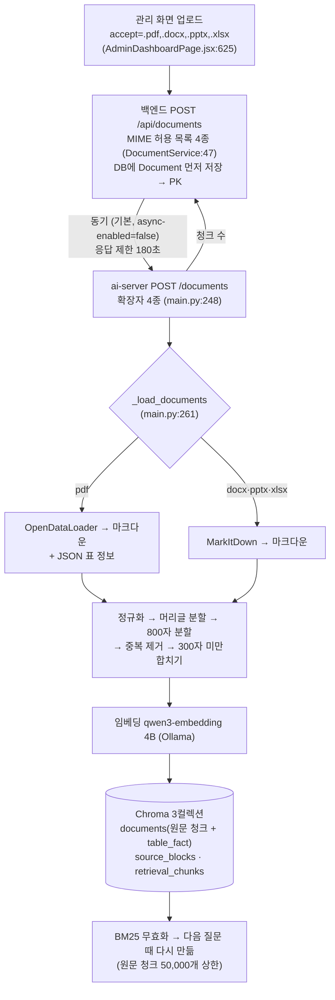
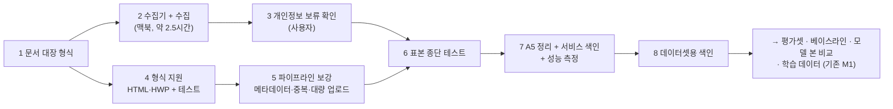

# 수집 → 업로드 → 임베딩 → 저장 파이프라인 점검과 M1 계획 초안 (2026-10-01)

> 목적: M1에서 학교 문서를 대량으로 넣기 전에, 지금 업로드 파이프라인이 **새 형식(HTML·HWP)·대량 색인·데이터셋 원칙**을 감당하는지 코드로 점검하고, 수집부터 테스트까지의 순서를 초안으로 세운다. AI 허브 데이터셋 활용 여부도 함께 본다.
> 방법: `develop` 코드(프론트 `AdminDashboardPage.jsx`, 백엔드 `DocumentService`·`FastApiClient`·`application.yaml`, ai-server `main.py`, `docker-compose.yml`, `requirements.txt`)를 직접 읽었다. AI 허브는 이용정책·데이터셋 페이지 원문으로 확인했다. **코드는 바꾸지 않았다.**
> 상태: **계획 초안.** 순서는 사용자 문답으로 정한 뒤 총괄계획 §4.2 M1에 반영하고, 설계 6단계가 끝난 뒤 실행한다.
> 관련: ADR-0005·0006·4, `학교-문서-원천-조사-20261001.md`, 문제 A1·A3·A4·A5·B2·D2·F2

## 0. 결론 먼저

- **새 형식 하나를 받으려면 세 곳을 같이 고쳐야 한다**: 프론트 업로드 화면(`accept`), 백엔드 허용 MIME 목록, ai-server 허용 확장자와 로더. 지금은 셋 다 PDF·DOCX·PPTX·XLSX만 받는다.
- **HTML은 쉽다**: ai-server가 PDF 외 형식을 MarkItDown으로 변환하는데, 설치된 `markitdown[all]==0.1.5`가 HTML 변환을 지원한다. 다만 학교 페이지에는 메뉴·바닥글이 섞여 있어 **본문 영역(`article#_contentBuilder`)만** 넘겨야 한다.
- **HWP는 표가 관건이다**: 글자 추출은 `olefile`(BSD)로 되지만 표 구조가 풀린다(조사 보고서 §13). 표 보존 변환을 ai-server 로더에 넣어야 한다(데이터셋 원칙 ①: 데이터셋용 변환기를 따로 두지 않는다).
- **대량 색인에서 걸릴 곳**: ① 백엔드가 MIME을 브라우저가 보낸 값으로 검사(HWP는 환경마다 MIME이 다름) ② 관리 화면은 한 번에 1개 업로드 → 스크립트 필요 ③ 동기 처리에 180초 제한 ④ **원래 주소·게시일·연도·분류가 색인에 안 들어감** ⑤ 같은 파일 중복 검사 없음 ⑥ 서버가 원본 파일을 보관하지 않음(재색인은 맥북 원본에서) ⑦ 표 질문마다 `table_fact` **전체**를 읽음 ⑧ BM25는 원문 청크 50,000개를 넘으면 경고만 남기고 꺼짐 ⑨ Chroma 서버 1.0.0과 클라이언트 1.5.5 버전 차이 ⑩ DB와 색인 불일치(A5).
- **AI 허브**: 쓸 만한 데이터셋이 있다(행정 문서 기계독해 41만 건: 표·절차·응답불가 유형 포함, 표 정보 질의응답 100만 건: 응답불가 20만 포함). 이용정책상 챗봇 연구·개발에 쓸 수 있지만 **제3자 제공 금지**(학교 인계 때 데이터 자체는 못 넘김)와 **2차적 저작물에도 출처 표시** 의무가 있다. 추천: 지금은 넣지 않고, M1 평가에서 표 읽기·거절이 약하게 나오면 우리 프롬프트 형식으로 바꾼 표본을 보조로 넣는다(기존 판단 유지).

## 1. 지금 파이프라인 (as-is)

| 단계 | 저장되는 것 | 저장되지 않는 것 |
|---|---|---|
| 백엔드 DB `documents` | 업로더, 카테고리, UUID 파일명, 원래 파일명, 크기, MIME, 청크 수, 처리 시간·상태 | **원본 파일**(ai-server로 넘기기만 함), 원래 주소, 게시일, 연도, 유효 기간 |
| ai-server → Chroma | 청크 본문, document_id, source(파일명), 청크 번호, 쪽, 머리글 경로, table_fact | 카테고리(백엔드가 넘기지 않음), 연도·게시일·원래 주소 |

## 2. 점검 결과 — 대량 색인·새 형식에서 걸릴 곳

| # | 문제 | 근거(코드) | 영향 | 계획 |
|---|---|---|---|---|
| G1 | 새 형식 미지원 | 프론트 `accept` 4종, 백엔드 `ALLOWED_MIME_TYPES` 4종, ai-server `ALLOWED_EXTENSIONS` 4종 | HTML·HWP를 올릴 수 없다 | 세 곳 동시 수정 + 형식별 테스트 |
| G2 | HTML에 메뉴·바닥글 섞임 | 학교 페이지 구조(조사 보고서 §1) | 청크가 메뉴 글자로 오염, 페이지마다 같은 메뉴가 반복 색인 | 수집기가 본문 영역만 저장하거나 로더가 본문만 추출. 표는 MarkItDown이 마크다운 표로 바꿔 기존 `_parse_markdown_table` 경로를 탄다 |
| G3 | HWP 표 구조 | 조사 보고서 §13: 문서당 표 3~26개, 단순 추출 시 칸이 한 줄로 풀림 | 표 값 읽기(B1) 악화 | 표 레코드(행·열·병합)를 해석해 마크다운 표로 바꾸는 로더. 라이선스: pyhwp AGPL 피함, `olefile` BSD(지금은 다른 패키지를 따라 설치된 상태라 명시 추가 필요). HWPX(압축 XML)가 나오면 함께 |
| G4 | MIME 검사가 브라우저 값 의존 | `file.getContentType()`(DocumentService:81) | HWP는 환경마다 `application/x-hwp`·`application/haansofthwp`·`application/octet-stream` 등으로 와서 거절될 수 있다 | 확장자 + 파일 서명(PDF `%PDF`, HWP OLE `D0CF11E0`, ZIP `PK`) 검사로 바꾼다 |
| G5 | 메타데이터 전달 없음 | `FastApiClient.uploadDocument`는 파일과 document_id만 보냄 | 출처 링크·연도 필터(M2 B2)·데이터셋 근거 위치·평가의 연도 구분이 안 된다 | 문서 대장 ID·원래 주소·게시일·연도·주제를 업로드 때 넘겨 청크 메타데이터에 넣는다 |
| G6 | 한 번에 1개, 동기 180초 | 관리 화면 1개 업로드, `fastapi.response-timeout: 180s`, `document.processing.async-enabled` 기본 false | 2,000여 개를 손으로 못 올림. 큰 PDF는 시간 초과 위험 | 백엔드 API를 부르는 업로드 스크립트(관리자 로그인 토큰), 비동기 처리 사용 또는 큰 문서 처리 시간 측정 |
| G7 | 중복 검사 없음 | 업로드 경로에 해시 비교 없음 | 같은 공고가 여러 게시판·연도에 있으면 중복 색인 → 검색 결과가 같은 내용으로 채워짐 | 문서 대장의 파일 해시로 업로드 전에 거른다 |
| G8 | 원본 미보관 | 백엔드는 UUID 파일명만 저장 | 재색인할 때 서버에서 원본을 못 꺼낸다 | 원본 보관소는 맥북 `Assets/corpus/`(§5.4 결정). 재색인 = 대장 기준 재업로드 |
| G9 | 규모: 표 사실 전체 조회 | `_lookup_lexical_table_fact_candidates`가 `where={"chunk_role": "table_fact"}`를 **제한 없이** 읽음(main.py:3021) | HWP 공고처럼 표가 많은 문서가 들어오면 표 질문마다 수만 개를 읽어 느려진다(§2.2에 적힌 위험) | 전체 색인 뒤 질의 지연을 측정하고, 느리면 M2에서 범위 필터·색인 구조로 푼다 |
| G10 | 규모: BM25 상한 | `BM25_INDEX_MAX_ENTRIES=50000`, 넘으면 경고 후 빈 색인(main.py:3240) | 넘는 순간 키워드 검색이 **조용히** 꺼진다. 서비스 색인(수천)은 안전, 데이터셋 색인(1~2만 추정)도 아래 | 색인 크기 점검 항목에 넣고, 꺼지면 실패로 처리하게 한다 |
| G11 | Chroma 버전 차이 | `chromadb/chroma:1.0.0`(compose) 대 `chromadb==1.5.5`(requirements) | 대량 쓰기·읽기에서 호환 문제 가능(§2.5) | 대량 색인 전에 서버 이미지를 클라이언트에 맞추고 백업·복원 리허설로 확인 |
| G12 | DB와 색인 불일치(A5) | DB 문서 1~4, 색인 101~105 | 관리 화면과 실제 답의 근거가 다르다 | 백업 → 101~105 정리 → 이후 백엔드 경로로만 색인(M1 기존 작업) |
| G13 | 데이터셋용 색인 | 데이터셋 원칙 ③ | 학습 재료(공지 3년)를 서비스 색인에 넣으면 낡은 정보로 답한다 | 같은 코드의 별도 compose 프로젝트(M0-7 `documind_restoretest` 방식) |

## 3. AI 허브 데이터셋

### 3.1 이용정책 (원문, `aihub.or.kr/intrcn/guid/usagepolicy.do`)

| 항목 | 원문 | 우리에게 |
|---|---|---|
| 이용 목적 | "지능형 제품・서비스, 챗봇 등 다양한 분야에서 영리적・비영리적 연구・개발 목적으로 활용할 수 있습니다." | 학교 챗봇 연구·개발에 쓸 수 있다 |
| 상업적 이용 | "AI 데이터셋의 판매 등 상업적 이용을 희망하는 경우 수행기관과 별도 협의가 필요합니다." | 데이터셋을 팔지 않으므로 해당 없음 |
| 국외 반출 | "국외 반출을 위해서는 수행기관 등 및 한국지능정보사회진흥원과 별도로 합의가 필요합니다." | AWS 서울 리전은 국내다. 단 정책에 클라우드 언급은 없다 → 서울 리전 밖으로 옮기지 않는다 |
| 제3자 제공 | "…승인을 받지 않은 다른 법인, 단체 또는 개인에게 열람하게 하거나 제공, 양도, 대여, 판매하여서는 안됩니다." | **학교 인계 때 AI 허브 데이터 자체는 넘길 수 없다**(승인 필요). 인계 패키지(E3)에서 빼야 한다 |
| 출처 표시 | "…반드시 한국지능정보사회진흥원의 사업결과임을 밝혀야 하며, …2차적 저작물에도 동일하게 밝혀야 합니다." | 학습한 모델을 쓰면 모델 설명·서비스 고지에 표시(안건 5 라이선스 고지 목록에 추가) |
| 신청 | 데이터셋 페이지: "내국인만 데이터 신청이 가능", 다운로드 승인 필요 | 사용자가 직접 가입·신청한다(Claude는 계정을 만들지 않는다) |

### 3.2 후보 데이터셋 (데이터셋 페이지 원문)

| 데이터셋 | 규모·구성 | 원천 문서 | 우리 문제와의 관계 |
|---|---|---|---|
| 행정 문서 대상 기계독해 데이터 (2021 구축, 2022-07 개방, 주관 ㈜포티투마루) | 라벨 411,840건: 정답경계 추출 133,166 · 절차(방법) 60,523 · **Table 정답 추출 131,068** · Yes/No 35,125 · 다지선다 31,458 · **응답불가 20,500** | 공공데이터포털·정부 부처·지자체·공공기관 행정문서(HWP·PDF) | 학교 공지·규정과 문체가 비슷한 행정문서. 표 읽기(B1)·절차 질문·"모르면 모른다"(B3) |
| 표 정보 질의응답 데이터 (2022 구축, 2023-12 v1.1, 주관 ㈜유클리드소프트) | 1,000,000건: 정답 추출 800,000 · **응답불가 200,000** | 한국학술정보·국가통계포털·서울소통광장 등 표 문서(HWP·PDF) (원문 재확인 2026-10-01: 처음 웹 요약의 "NIA"는 오기) | 표 값 찾기(B1)와 표에 없는 값 거절 |
| (참고) 민원(콜센터) 질의-응답, 민원 업무 자동화 언어 데이터 | 질의응답 110만 쌍 등 | 콜센터·국민신문고 | 실제 사용자 말투(어휘 불일치 B5) 참고용. 근거 문서가 없어 RAG 학습엔 맞지 않음 |

### 3.3 쓰는 방법과 이점·비용

| 쓰는 방법 | 이점 | 비용·위험 |
|---|---|---|
| 생성 모델 행동 교정 보조 | 사람이 만든 응답불가·표 질문으로 "근거에서만 답하고 없으면 모른다"를 보강 | **형식 변환 필수**(데이터셋 원칙 ①): 지문을 우리 `[출처 N]` 블록과 프롬프트로 감싸야 한다. 너무 많이 섞으면 학교 문서 행동이 묽어진다 → 소량·비율 관리 |
| 임베딩 학습 예열 | 한국어 질문-지문 쌍이 수십만 개 | 우리 청크와 모양이 다르다. 효과는 우리 평가셋으로 확인해야 한다 |
| 학습 뒤 일반 능력 점검 | 학습 후 한국어 문서 읽기가 망가지지 않았는지 보는 보조 지표 | 후보 모델이 사전학습에서 이미 봤을 수 있다(오염) |
| 공통 | — | 다운로드 승인 대기, 인계 시 데이터 제외, 출처 표시 |

**추천**: 지금은 넣지 않는다. 우리 학교 문서로 먼저 만들고(기존 판단: `생성모델-라이선스-및-학습데이터-조사-20261001.md` §5), M1 평가에서 표 읽기·거절이 약하게 나오면 위 두 데이터셋에서 표본을 골라 **우리 프롬프트 형식으로 바꿔** 보조로 넣는다. 그때를 위해 신청은 미리 해 둘 수 있다(승인에 시간이 걸릴 수 있음).

## 4. M1 계획 초안 — 수집부터 테스트까지

| 순서 | 작업 | 어디서 | 완료 기준 |
|---|---|---|---|
| 1 | 문서 대장 형식: 원래 주소, 게시판·글 번호, 제목, 게시일, 수집일, 첨부 파일명, 해시, 형식, 연도, 유효 기간, 주제, 공개 범위, 용도(색인/학습/평가), 개인정보 검사 결과, 별칭(학과명·교명) | 맥북 | 형식 확정, 표본 20건 기록 |
| 2 | 수집기 작성과 수집: 결정 1 범위, 결정 3 규칙(robots·2초 간격·증분·보류) | 맥북 `Assets/corpus/` | 대장의 원천을 모두 받음(실패 목록 포함), 첨부 실측 크기 기록 |
| 3 | 개인정보 보류 건 확인 | 사용자 | 보류 건마다 제외/가림 처리 |
| 4 | 형식 지원: HTML(본문 영역) · HWP(표 보존) · 필요하면 HWPX. 프론트·백엔드·ai-server 동시 수정, 백엔드 검증은 확장자 + 파일 서명 | 코드 (PR) | 형식별 단위 테스트(골든 파일: 표 있는 HWP·HTML → 기대 마크다운·table_fact) 통과, 기존 34개 테스트 유지 |
| 5 | 파이프라인 보강: 메타데이터 전달(G5), 중복 검사(G7), 대량 업로드 스크립트(G6), Chroma 버전 맞춤(G11) | 코드 (PR) + 데스크탑 | 표본 업로드에서 청크 메타데이터에 대장 ID·원래 주소·연도가 들어감, 같은 파일 재업로드가 막힘 |
| 6 | 표본 종단 테스트: 형식별 표본 10~20개 업로드 → 청크·table_fact·메타데이터 확인 → 질문 몇 개로 검색 trace | 데스크탑 | 형식마다 검색이 근거 청크를 찾음, 그림 위주 문서는 표시됨 |
| 7 | A5 정리(백업 → 101~105 정리) → 서비스 색인(지금 유효한 문서) → 성능 측정: 색인 시간, 질의 지연(표 질문 포함, G9), BM25 크기(G10), VRAM | 데스크탑 | DB 활성 문서 = 색인 document_id, 측정값 기록 |
| 8 | 데이터셋용 색인: 별도 compose 프로젝트에 학습 재료 문서 색인 | 데스크탑 | 서비스 색인과 분리 확인 |

- 순서 2(수집)와 4~5(코드)는 서로 기다리지 않아서 함께 진행할 수 있다.
- 이 표 다음은 이미 M1에 있는 작업이다: 평가셋 설계 → 지표 4개 → 새 베이스라인, 그리고 6단계 결과로 추가할 모델 본 비교(문맥 8,192 이상, `OllamaLLM(reasoning=False)`)·학습 데이터 준비.

## 5. 확인하지 못한 것

- 동기 처리 180초 안에 가장 큰 PDF(2026 모집요강 22MB)가 끝나는지(과거 업로드 로그 미확인)
- 대량 색인 시 임베딩 시간(청크 수천~수만 개)과 GPU 메모리
- 학교 HWP 중 HWPX·배포용 문서 비율(표본 4개는 모두 HWP 5.0 일반 문서)
- AI 허브 데이터의 실제 품질과 표 저장 형식(내려받지 않음)

## 6. 학습 포인트 (면접)

- "새 파일 형식 하나를 지원하려면 화면·API 검증·파서 세 층을 같이 바꿔야 했다. 특히 백엔드가 브라우저가 보낸 MIME 값을 믿고 있어서, HWP처럼 표준 MIME이 없는 형식은 확장자와 파일 서명으로 검사하도록 바꾸기로 했다."
- "대량 색인 전에 '조용히 실패하는 곳'을 찾았다. BM25는 5만 개를 넘으면 경고만 남기고 꺼지고, 표 검색은 질문마다 표 사실 전체를 읽는다. 문서 수가 늘면 정답률이 아니라 이런 곳에서 먼저 문제가 난다."
- "외부 데이터셋은 이용정책 원문을 읽고 '학교에 인계할 때 데이터 자체는 넘길 수 없다'는 조건을 찾아 인계 계획에 반영했다."

## 7. 출처

- 코드(`develop` `8828088`): `frontend/src/features/admin/AdminDashboardPage.jsx:625`, `backend/src/main/java/com/documind/documind/domain/document/DocumentService.java:47·81`, `backend/src/main/resources/application.yaml:7·27`, `ai-server/main.py:121·248·261·2403·2526·3021·3240·4465·4826`, `docker-compose.yml:38`, `ai-server/requirements.txt:13·42`
- AI 허브 이용정책: https://aihub.or.kr/intrcn/guid/usagepolicy.do
- 행정 문서 대상 기계독해 데이터: https://aihub.or.kr/aihubdata/data/view.do?dataSetSn=569
- 표 정보 질의응답 데이터: https://www.aihub.or.kr/aihubdata/data/view.do?currMenu=115&topMenu=100&dataSetSn=71565
- 민원(콜센터) 질의-응답 데이터: https://www.aihub.or.kr/aihubdata/data/view.do?currMenu=115&topMenu=100&dataSetSn=98

## 8. 후속: 수집한 문서가 데이터셋이 되는 예와 학습 서버 사용 추정 (같은 날)

사용자 질문: "우리가 수집한 게 어떻게 데이터셋이 되는거야? 학습 서버를 잘 쓰게 될까? 규모에 비해 작은 학습일까?"

### 8.1 실제 문서 하나로 본 흐름

예: 학사 공지(2026-09-22) 첨부 `학생 출결 관리 규정.hwp`(17KB, 2019-11-25 개정). 조사 보고서 §13의 시험 추출 결과를 그대로 썼다.

| 단계 | 이 문서에서 |
|---|---|
| ① 원본 | HWP 5.0 파일 |
| ② 문서 대장 | 원래 주소, 게시판·글 번호, 게시일, 해시, 형식, 개정일(2019-11-25), 용도 |
| ③ 색인 (서비스 파이프라인) | 조문 단위 청크. 제4조 ①항 5호의 **경조사 인정일수 표**(결혼·사망 × 대상 × 인정일수)와 6호의 입원 증빙 표가 있다. 지금 추출로는 "구분 / 대상 / 인정일수 / 결혼 / 본인 / 5 / …"처럼 칸이 한 줄씩 풀린다 → 표 보존 변환이 필요한 실제 사례 |
| ④ 원본 레코드 1행 | 질문: "할머니 장례 때문에 결석하면 며칠까지 출석 인정돼?" / 정답: 조부모 사망은 휴일 포함 3일까지 출석 인정, 사유 발생일로부터 7일 이내에 증빙서류를 붙인 출석인정원 제출 / 근거: 제4조 ①항 5호 표 + ②항 / 유형: 표 + 절차 / 구분: 학습 |
| ⑤ 파생: 생성 모델 | 그 질문으로 실제 검색 → 서비스 프롬프트 그대로 → 목표 답 = 원본 레코드 정답. 일부는 정답 청크를 빼고 넣어 목표 답을 "근거에서 확인할 수 없다"로 둔다(RAFT 방식의 거절 학습) |
| ⑤ 파생: 임베딩 | (질문, 제4조 청크) = 정답 쌍. (질문, 제6조 장기결석 청크) = 헷갈리는 오답 |

- 질문이 문서에 없는 말(할머니·장례)을 쓰고 정답 근거는 다른 말(조부모·사망)을 쓴다 → 어휘 불일치(B5)를 학습시키는 예다.
- 같은 제목의 규정이 학사규정 게시판에도 있다. 형식(PDF/HWP)이 다르면 파일 해시가 달라서 **내용 기준 중복 검사**가 필요할 수 있다(G7 보강, 실제 중복 여부는 미확인).

### 8.2 학습 서버(AWS g5.xlarge, A10G 24GB) 사용 추정

계산 근거: A10G BF16 70 TFLOPS(밀집, AWS 공식 데이터시트). LoRA + 기울기 체크포인팅의 토큰당 연산 ≈ 6 × 파라미터(A.X 4.0 Light 7.26B → 약 4.4×10^10). GPU 이용률 25~50%를 가정하면 **초당 약 400~800토큰**. 실측은 작은 시험 학습으로 한다.

| 작업 | 규모 | A10G 시간 (추정) |
|---|---|---|
| 학습 데이터 초안 생성 (오픈 모델로 질문·정답) | 청크 수천~1만 개 × 출력 300~400토큰 | 수 시간 |
| 생성 모델 LoRA 1회 | 예시 2천~4천 × 약 2,700토큰(RAG 프롬프트 중앙값 2,119 + 답) × 2~3 epoch = 1,100만~3,200만 토큰 | **약 4~22시간** |
| 실험 반복 (데이터 구성·설정 비교 3~5회) | 위 × 3~5 | 며칠 |
| 임베딩·재순위 학습 (안건 3에서 정하면) | 0.6B는 짧고 4B는 수 시간 | 1~수 시간 |
| 병합·GGUF 변환 | 7B 16비트 병합에 RAM 약 15GB(서버 RAM 16GB) | GPU에서 병합하거나 지연 로딩 변환 |

- **데이터 개수로는 작은 학습**이다(2천~4천 개. 일반 지시 학습 데이터는 수만~수백만). 하지만 목표가 지식 주입이 아니라 행동 교정이라 근거 규모(LIMA 1,000개, DPR 1,125~2,474개)에 맞는 크기다.
- **계산량으로는 A10G에 맞는 일감**이다. RAG 프롬프트가 길어서(질문·답보다 근거가 대부분) 한 번 학습에 반나절~하루가 걸린다.
- **서버 크기도 맞다**: 7~8B 16비트 LoRA는 19~22GB가 필요해 데스크탑 12GB로는 안 되고 24GB가 최소이자 적정이다(상세조사 §9). 더 큰 GPU는 시간만 줄인다.
- 학습이 필요할 이유가 커졌다: EXAONE을 빼면서 후보 모델의 지문 읽기가 베이스라인보다 낮을 수 있다(호랑이 KorQuAD: EXAONE 87.2, A.X 4.0 Light 73.9). 학습할지는 M1 평가로 정한다(§4.0 원칙).
- 잘 쓰는 방법: 쓸 때만 켠다(멈춰도 EBS 데이터는 남는다), 시험 학습(예시 200개 정도)으로 속도·메모리를 먼저 잰다, 학습 데이터 생성도 AWS에서 오픈 모델로 한다(약관 문제를 피하는 곳과 같은 곳).
- 출처: A10G 데이터시트 https://d1.awsstatic.com/product-marketing/ec2/NVIDIA_AWS_A10G_DataSheet_FINAL_02_17_2022.pdf (FP32 35 TF, BF16 70 TF·희소 140 TF, 24GB GDDR6, 600GB/s)
