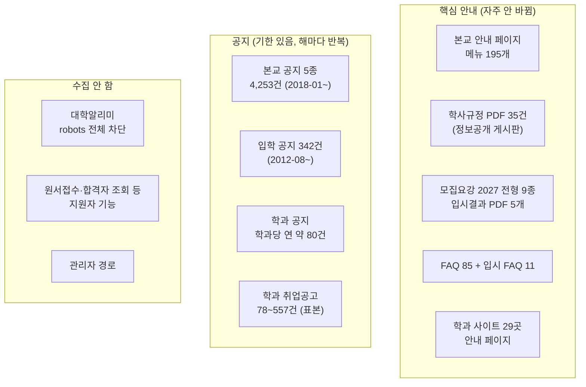
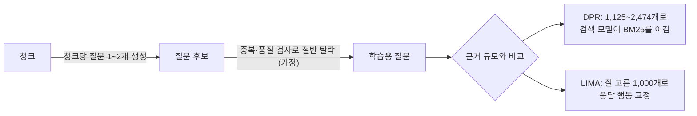
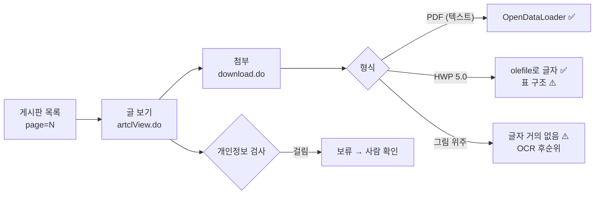

# 학교 문서 원천 조사 — 설계 6단계 안건 2 (2026-10-01)

> 목적: M1에서 모을 인하공전 공개 문서를 **어디서(원천), 어떻게(수집 예절·개인정보·저작권), 얼마나(문서·청크 수 → 학습 데이터 규모)** 구할 수 있는지 실제 학교 누리집으로 확인한다.
> 방법: 학교 누리집(본교 `www.inhatc.ac.kr`, 입학 `ipsi.inhatc.ac.kr`, 학과 사이트 3곳 표본)을 robots.txt 확인 후 **요청 간격 2초**로 약 120회 열어 메뉴·게시판·첨부 구조를 셌다. 법령은 국가법령정보센터 본문, 공공데이터 조건은 공공데이터포털 원문으로 확인했다. 조사용 사본은 세션 임시 폴더에만 두었고, **개인정보가 보인 페이지는 확인 직후 지웠다**(내용은 출력하지 않음).
> 상태: **결정 완료(2026-10-01)** — 수집 범위·이용 방침·수집 규칙 모두 사용자 결정, 총괄계획 §4.6 안건 2. 법률 자문이 아니다.
> 관련: 총괄계획 §2.3(문서 원천 표본 조사 2026-09-30)·§4.2 M1·§4.6 안건 2, 문제 A1·A3·A4·D5

## 0. 결론 먼저

- **수집은 기술적으로 막혀 있지 않다.** 본교·입학·학과 사이트의 robots.txt는 관리자 경로만 막고 공개 페이지는 허용한다(요청 간격 지정 없음). 모두 같은 CMS(K2Web)라 게시판 목록 → 글 → 첨부 구조가 같아서 수집 도구 하나로 된다.
- **대학알리미(`academyinfo.go.kr`)는 robots.txt가 사이트 전체를 막는다(`Disallow: /`)** → 자동 수집하지 않는다. 필요한 공시 수치는 학교 누리집의 장학금·취업 현황 페이지나 공공데이터포털 파일(공공누리 제1유형, 출처표시)로 대신한다.
- **규모(확인한 수)**: 본교 메뉴 페이지 195개, 학사규정 PDF 35건, 2027 모집요강 전형 9종, 입시결과 PDF 5개(2022~2026), FAQ 85건 + 입시 FAQ 11건, 본교 공지 4,253건(2018-01~, 연 약 490건), 입학 공지 342건, 학과 사이트 29곳(학과 공지 학과당 연 약 80건).
- **규모(추정)**: 핵심 안내(안내 페이지·규정·모집요강·FAQ·학과 안내)만으로 **청크 약 1,300~2,100개**. 본교 공지를 3년 치 더하면 본문만 약 2,600개, 첨부까지 더하면 그 2~6배. → 학습용 질문 1천~2천여 개(DPR·LIMA 규모)는 **핵심 안내만으로도 하한선에 닿고, 공지를 더하면 넉넉하다.**
- **개인정보가 실제로 있다.** 장학 게시판의 2018년 '인증자 명단' 공지 **본문**에 학번으로 보이는 가리지 않은 숫자가 181개 있었고, '선발자 명단.pdf'·'버스탑승대상자.hwp' 같은 첨부도 있다. 2020년 명단 공지는 학번 일부를 가렸다. → 제목·파일명·본문 패턴으로 걸러 사람이 확인하는 규칙이 필요하다.
- **HWP는 '빈 서식'만이 아니다.** 공지 표본 12건의 첨부 16개 중 **HWP가 10개**였고, 규정(`학생 출결 관리 규정.hwp`)·장학생 선발 공고·장학금 FAQ·예비군 안내문처럼 내용이 있는 문서였다. M1 표의 "HWP는 빈 서식뿐이라 보류"는 문서자료실(서식 27건)에만 맞다 → 공지를 모으면 HWP 변환이 필요하다(A3).
- **이름이 출처마다 다르다.** 2027 모집요강·학과 사이트는 `AI소프트웨어학과`, 본교 메인 메뉴는 아직 `컴퓨터정보공학과`. 모집요강 `반도체기계공학과` 대 메뉴 `반도체기계정비학과`. 대학알리미 소개글은 "24개 학과". 학교는 **교명 변경을 추진 중**이다(2026-09-29 총장 공지). → 문서 대장에 별칭·유효 기간을 기록해야 한다(A4).
- **저작권**: 학교 누리집은 "COPYRIGHT(c) INHA TECHNICAL COLLEGE. ALL RIGHTS RESERVED."만 있고 공공누리 표시는 없다. **현행 저작권법(법률 제21336호, 2026-08-11 시행)에는 정보분석(TDM) 면책 조항이 없다.** 학교는 국가·지자체가 아니라 제7조(보호받지 못하는 저작물)에도 해당하지 않는다. 기댈 수 있는 것은 제35조의5(공정한 이용)의 사례별 판단이나 학교의 허락이다 → 이용 방침을 정해야 한다.

## 1. 용어

| 용어 | 뜻 |
|---|---|
| robots.txt | 사이트가 자동 수집 프로그램에게 "여기는 가져가지 말라"고 적어 두는 파일. 법적 강제력은 없지만 수집 예절의 기준이다 |
| K2Web | 학교 누리집이 쓰는 CMS(콘텐츠 관리 시스템). 주소 모양이 `/kr/123/subview.do`(메뉴 페이지), `/bbs/kr/11/artclList.do`(게시판 목록), `/bbs/kr/11/110595/artclView.do`(글), `/bbs/kr/32/159869/download.do`(첨부)로 일정하다 |
| 핵심 안내 | 자주 바뀌지 않는 안내 자료: 메뉴 안내 페이지, 학사규정, 모집요강, 입시결과, FAQ, 학과 안내 페이지 |
| 공지 | 기한이 있는 알림 글(학사·장학·행사·채용·일반, 입학, 학과). 해마다 비슷한 공지가 반복된다 |
| 청크 | 색인·검색 단위로 자른 글 조각. 지금 설정은 최대 800자(`CHUNK_SIZE=800`, 겹침 80자, 300자 미만은 합침). 이 문서는 **청크 하나를 평균 650자로 가정**해 계산했다 |
| TDM | 텍스트·데이터 마이닝. 많은 글을 기계로 분석하려고 복제하는 것. 일본·EU는 법에 면책 조항이 있고 한국은 개정안만 논의됐다 |

## 2. robots.txt와 이용 조건

| 대상 | 확인 결과 | 수집 판단 |
|---|---|---|
| 본교 `www.inhatc.ac.kr` | 관리자 경로만 막음: `/topMngr`·`/midMngr`·`/siteMngr`·`/fnctMngr`·`/menuMngr`(각각 `/*/` 형태 포함)·`/topLogin`·`/jwadLogin`. `Crawl-delay` 없음. 최종 수정 2023-09-11 | 공개 페이지 수집 가능 |
| 입학 `ipsi.inhatc.ac.kr`, 학과 `cs.inhatc.ac.kr` | 본교와 같은 파일(272바이트, 같은 ETag) | 같음 |
| 대학알리미 `www.academyinfo.go.kr` | `User-agent: *` / `Disallow: /` | **자동 수집 안 함** (공시 페이지를 한 번 열어 본 뒤 중단) |
| 학교 누리집 저작권 표시 | 바닥글 "COPYRIGHT(c) INHA TECHNICAL COLLEGE. ALL RIGHTS RESERVED." 공공누리 표시·별도 저작권 정책 페이지 없음 | 이용 방침 필요 (§7 결정 2) |
| 첨부 내려받기 | 모집요강 PDF는 해당 페이지의 Referer 없이 요청하면 403(직접 링크 차단). 페이지를 거쳐 받으면 열림 | 브라우저처럼 페이지 → 첨부 순서로 받는다 |
| 공공데이터포털 대학알리미 파일 | `교육부_대학알리미_대학주요정보_학생_교원_연구_재정_교육여건_20221031`: 공공누리 **제1유형(출처표시)**, XLSX, 수정 2025-05-28 | 필요하면 출처를 표시하고 쓴다 |

**저작권법 (국가법령정보센터 본문, 2026-10-01 확인)**

| 조항 | 내용 | 우리에게 주는 뜻 |
|---|---|---|
| 현행 판 | [시행 2026. 8. 11.] [법률 제21336호, 2026. 2. 10., 일부개정] | — |
| 정보분석(TDM) 면책 | **없음.** 본문에 '정보분석'·'텍스트'·'데이터 마이닝'·'인공지능'이라는 말이 없다 | 수집·색인·학습 복제를 법이 일괄로 허용하지 않는다 |
| 제7조 보호받지 못하는 저작물 | 법령, 국가·지자체의 고시·공고·훈령, 판결, 국가·지자체가 만든 그 편집물, 사실 전달에 불과한 시사보도 | 사립 학교법인의 학칙·공지는 여기에 해당하지 않는다 |
| 제35조의5 공정한 이용 | 일반적인 이용 방법과 충돌하지 않고 저작자의 정당한 이익을 부당하게 해치지 않으면 이용 가능. 판단 요소: ① 이용 목적·성격 ② 저작물 종류·용도 ③ 이용한 부분의 비중 ④ 시장·가치에 미치는 영향 | 사례별 판단이다. 비공개 개발·학교에 제안하는 시연·출처 표시·재배포 없음은 유리한 요소이지만 보장은 아니다 |

## 3. 원천 목록 (확인한 수)

### 3.1 본교 `www.inhatc.ac.kr/kr`

| 원천 | 위치 | 형식 | 확인한 수 | 비고 |
|---|---|---|---|---|
| 안내 페이지 (학사·장학·대학생활·대학안내) | 사이트맵 `/sitemap/kr/siteMapView.do` | HTML(표 많음) | 메뉴 페이지 **195개**(중복 제거). 이 중 게시판·신청 기능·외부 링크를 빼면 글 페이지는 120~150개로 추정 | 표본 15개: 본문 중앙값 1,143자·평균 1,727자, 학사일정 페이지 표 13개·졸업학점 표 6개 |
| 학사규정 | 정보공개 > 정보목록 게시판(`/bbs/kr/32`)의 '학사규정' 분류 | PDF | **35건**(정관·학칙·학칙시행세칙·장학금지급규정 등) | 게시일은 대부분 2014-06-01이지만 **첨부는 갱신됨**: 파일명에 개정일(예: `정석인하학원 정관(20260210).pdf`, `학력증명발급규정(20240902).pdf`) → 개정일은 파일명·본문에서 읽어야 한다 |
| 같은 게시판의 다른 분류 | 예산·결산·산학협력단·등록금심의위원회·재정지원사업·대학평의원회·업무추진비·적립금 | PDF | 게시판 전체 551건 | 학생 질문과 거리가 멀다. 등록금심의위원회만 등록금 질문에 쓸모가 있을 수 있다 |
| 공지 5종 | 학사(`/bbs/kr/11`)·장학(17)·행사(18)·채용(19)·일반(33), 통합(`/combBbs/kr/2`) | 본문 + 첨부 | 글 번호 기준 학사 1,090·장학 811·행사 803·채용 949·일반 699, **통합 4,253건**(첫 글 2018-01-02, 연 약 490건). 학사 첫 글 2018-01-11 | 표본 12건: 본문 중앙값 600자·평균 1,146자, 글당 첨부 1.33개, **첨부 HWP 10·PDF 6**, 이미지 위주 글 1건(152자 + 그림 2장) |
| FAQ | `/kr/143` | HTML | **85건**, 분류 11개(학적·수업/학사·장학/등록·정보시스템·이러닝·시설·취업/학생지원·도서관·병무/예비군·학습지원·기타) | 학교가 직접 쓴 실제 질문과 답 |
| 문서자료실 | `/kr/484` | HWP 서식 | **27건** | 빈 서식 위주(§2.3과 같음) |
| 장학금현황·취업현황 | `/kr/214`·`/kr/215` | HTML 표 | 2페이지 | 공시 기준 수치(장학금 3년치, 주요 취업처) |
| 종합민원 안내 | `/kr/140` | HTML | 1페이지 | 질문 목록은 보이지 않고 **주제 → 담당 부서 안내표**가 있다(학사지원팀·인사학적팀·전산정보원 등) |

### 3.2 입학 `ipsi.inhatc.ac.kr`

| 원천 | 형식 | 확인한 수 | 비고 |
|---|---|---|---|
| 모집요강 | PDF(출력용) + 쪽 이미지 뷰어 | 전형 9종(수시1차·수시2차·정시 공통 1개, 산업체위탁, e-MU 2종, 전공심화, 편입학, 외국인 등) | 수시·정시 출력용 `2027 신입생 모집요강(출력용).pdf`: 22쪽, 0.5MB, 한글(HWP 2022)로 만든 **텍스트 PDF**(OCR 불필요), 글자 약 2.8만 자. 이미 `AI소프트웨어학과`(정원 93) 표기 |
| 전년도 입시결과 | PDF | **5개** (2022~2026학년도 수시1·2차·정시 지원/성적현황) | 평가용 후보(연도 구분 질문) |
| 입시 FAQ | HTML | **11건** | 전공심화·전과·복수지원 등 |
| 입학 공지 | 본문 + 첨부 | **342건**(첫 글 2012-08, 연 약 24건) | — |
| 학과소개 | HTML | 1페이지(7,022자) | 학과별 소개 요약 |
| 지원자 기능 | — | 원서접수·지원현황·합격자 조회·등록금 환불 신청 등 | **수집 대상 아님**(개인 조회 기능) |

### 3.3 학과 사이트 (29곳: 학과 28 + 자유전공학부)

- 주소: 대부분 `https://<학과>.inhatc.ac.kr`(예: `mecheng`, `cs`, `tour`), 일부는 본교 하위(`/mecha/`, `/ee/`, `/er/`, `/inc/`, `/gisup/`, `/asm/`). 전공심화과정 15개 과정(입시 FAQ 기준 1년 과정 6 + 2년 과정 9), 고숙련미래인재학부 5개 과정 페이지가 따로 있다.

| 표본 | 메뉴 페이지 | 안내 페이지(추정) | 학과 공지 | 학과 취업공고 |
|---|---|---|---|---|
| 컴퓨터정보공학과(현 AI소프트웨어학과) `cs` | 41 | 15~18 | **1,090건**(2012-09~, 연 약 78건) | 110 |
| 기계공학과 `mecheng` | 20 | 약 8 | 확인 못 함(게시판이 다른 방식으로 열림) | 78 |
| 관광경영학과 `tour` | 28 | 약 13 | **466건**(2021-01~, 연 약 82건) | 557 |

- 안내 페이지 길이: 학과소개 약 520~540자 + 그림, 교과목개요 4,600~5,800자.
- 학과 공지 최근 글 6건(cs)을 보면 본교 공지와 제목이 같은 글 2건, 채용 2건, 학과 고유 공지 2건이었다(표본이 작아 비율로 일반화하지 않는다).

## 4. 개인정보 (D5)

| 확인한 것 | 위치 | 뜻 |
|---|---|---|
| 학번으로 보이는 가리지 않은 숫자 181개 | 장학 게시판 2018학년도 '인증자 명단 공지(확인용)' **본문** | 첨부만 거르면 안 된다. 본문도 검사해야 한다 |
| 학번 일부를 가린 표기 4개 | 2020학년도 '장학생 선발자 명단 안내' 본문 | 가린 형태도 명단이다. 챗봇 근거로 쓸 필요가 없다 |
| `…선발자 명단.pdf` | 2018 국가교육근로 선발자 명단 공지 첨부 | 파일명으로 거를 수 있다 |
| `…버스탑승대상자.hwp` | 2026년 2학기 예비군 공지 첨부(8개 중 1개) | 최근 공지에도 대상자 명단으로 보이는 첨부가 있다(내용은 열지 않음) |
| 교수진 이름·연구실·연락처 | 학과 사이트 '교수진소개' | 학교가 업무용으로 공개한 정보. 챗봇이 답에 개인 연락처를 넣을지는 정책으로 정할 일(안건 4 또는 M4) |

- 조사 중 개인정보가 보인 페이지 사본은 확인 직후 지웠고, 보고서와 대화에 내용을 옮기지 않았다.

## 5. 형식 (A3)

| 형식 | 어디서 | 지금 처리 | 판단 |
|---|---|---|---|
| HTML 안내 페이지 | 본교·학과 메뉴 | 색인 경로 없음 | M1 "HTML 색인 경로" 작업 그대로 필요 |
| 텍스트 PDF | 학사규정, 모집요강, 입시결과, 공지 첨부 | OpenDataLoader로 처리 중 | 그대로 |
| **HWP** | **공지 첨부의 다수**, 문서자료실 서식 | 처리 안 함 | 공지를 모으면 변환 필요. 서식(문서자료실)은 계속 보류 |
| 이미지에만 담긴 공지 | 일부 공지(표본 12건 중 1건) | 처리 안 함 | OCR 없이는 내용 손실. 우선순위 낮음 |
| 모집요강 뷰어 | 입학 사이트 | — | 쪽 이미지라 쓰지 않고 출력용 PDF를 쓴다 |

## 6. 이름·연도 불일치 (A4)

| 대상 | 출처별 표기 |
|---|---|
| 컴퓨터정보공학과 | 본교 메인 메뉴: `컴퓨터정보공학과` / 2027 모집요강·학과 사이트: `AI소프트웨어학과` / 2026 모집요강·지금 평가셋: 옛 이름 |
| 반도체 학과 | 본교 메뉴: `반도체기계정비학과` / 2027 모집요강: `반도체기계공학과` |
| 학과 수 | 메뉴 28개 + 자유전공학부 / 대학알리미 소개글: "24개 학과" |
| 학교 이름 | 2026-09-29 일반 공지 "교명 변경 추진에 관해 학생 여러분께 드리는 총장의 편지" → 학교 이름 자체가 바뀔 수 있다 |

→ 문서 대장(M1)에 "공식 명칭·별칭·유효 기간"을 기록하고, 평가셋에 "옛 이름으로 물어도 새 이름 문서를 찾는가" 문항을 넣을 근거다.

## 7. 규모 추정 (추정치 — 계산식 포함)

가정: 청크 1개 평균 650자, 요청 간격 2초, 게시판 목록 1쪽 10건, 공지 첨부 글당 1.33개.

### 7.1 핵심 안내

| 원천 | 글자 수 추정 | 청크 추정 | 근거 |
|---|---|---|---|
| 본교 안내 페이지 | 21만~26만 | 320~400 | 글 페이지 120~150개 × 표본 평균 1,727자 |
| 학과 사이트 안내 페이지 | 23만~41만 | 360~620 | 29곳 × 8천~1만 4천 자(학과소개 + 교과목개요 + 교육과정 + 로드맵 등) |
| 학사규정 35건 | 25만~40만 | 380~620 | 학칙 3.7만 자(실측, `Assets/test_docs`) + 나머지 규정 |
| 모집요강 2027(9종) + 입시결과 5개 | 15만~25만 | 230~380 | 수시·정시 2.8만 자(실측) + 다른 전형·결과표 |
| FAQ 96건 | 2.5만~3.5만 | 약 100 (문답 1개 = 청크 1개) | 실측 건수 |
| **합계** | **약 86만~135만 자** | **약 1,300~2,100** | — |

### 7.2 공지 (기간에 따라)

| 범위 | 글 수 | 본문 청크 | 첨부 | 수집 시간(2초 간격) |
|---|---|---|---|---|
| 본교 공지 1년 | 약 490 | 약 860 | 약 650개 | 약 40분 |
| 본교 공지 3년 | 약 1,460 | 약 2,600 | 약 1,900개 (청크 3천~1만 5천, 첨부 1개 1천~5천 자 가정) | 약 2시간 |
| 본교 공지 전체(2018-01~) | 4,253 | 약 7,500 | 약 5,700개 (청크 9천~4만 4천) | 약 6시간 |
| 입학 공지 | 연 약 24 (전체 342) | 작음 | — | 수 분 |
| 학과 공지 | 29곳 × 연 약 80 = **연 약 2,300** | 연 약 2,000 이상 | 확인 못 함 | 1년 치만 해도 본교 공지 3년 치 이상 |

- 핵심 안내 수집은 요청 약 620회, **약 20분**이다.
- 첨부 크기를 재지 않아 첨부 청크는 범위가 넓다. M1 수집 첫 단계에서 실측해 다시 적는다.
- **후속 실측(§13, 첨부 5개)**: HWP 4개는 1,676·2,778·10,014·12,267자(평균 약 6,700자), PPT로 만든 PDF 1개(7쪽)는 703자. 위 표의 "첨부 1개 1천~5천 자" 가정보다 HWP가 크다 → 공지 3년 첨부는 청크 6천~2만 수준일 수 있다(중복 제거 전).

### 7.3 학습 데이터로 환산

| 수집 범위 | 청크 | 학습용 질문 (추정) | 근거 규모(1천~2.5천)와 비교 |
|---|---|---|---|
| 핵심 안내만 | 1,300~2,100 | 650~2,100 | 하한선 근처. 주제가 안내 페이지에 몰린다 |
| 핵심 + 본교·입학 공지 3년 | 본문만 3,900~4,700 (+ 첨부) | 2천~4천 이상 | 넉넉하다. 장학·학사 절차처럼 해마다 반복되는 공지가 연도별로 3판씩 생긴다 |
| 전부 (공지 2018~ + 학과 공지) | 1만 이상 | 5천 이상 | 양은 많지만 오래된 공지일수록 사실이 낡고 명단 노출 사례가 있다 |

- 평가용 문서는 학습에서 빼야 하므로 실제 학습량은 이보다 줄어든다(분리 단위·평가 문서 선정은 안건 4).
- **학교 FAQ 96건은 실제 질문 문장이라 평가셋 재료로 가치가 높다.** 학습에 쓰면 평가와 섞이므로 용도는 안건 4에서 정한다.

## 8. 결정할 것 (사용자 문답, 한 번에 하나씩)

| # | 결정 | 선택지 요약 |
|---|---|---|
| 1 | 수집 범위 (특히 공지 기간·학과 공지) | ✅ **핵심 + 본교·입학 공지 최근 3년** (2026-10-01 사용자 결정, 학과 공지·취업공고 제외) |
| 2 | 저작권·이용 방침 | ✅ **비공개 개발·평가와 학교 제안 시연에만 쓰고, 출처를 남기고 표시하며, 외부에 공개·배포하지 않는다. 이용 허락은 M5 제안 때 받는다** (2026-10-01 사용자 결정) |
| 3 | 수집 예절·개인정보 규칙 | ✅ §9 초안대로 확정 + 보강 2개: 휴대전화 번호(010)만 잡고 학교 업무 전화(032-870-…)는 제외, User-Agent에 연락용 이메일은 넣지 않음 (2026-10-01 사용자 결정, 총괄계획 §4.6) |

## 9. 수집 규칙 초안 (결정 3에서 확정)

| 규칙 | 내용 |
|---|---|
| robots.txt | 수집 전에 매번 읽고 따른다. 대학알리미는 자동 수집하지 않는다 |
| 요청 간격 | 한 번에 1개, 2초 이상. 학교 업무 시간(평일 9~18시)을 피한다 |
| 신원 표시 | User-Agent에 프로젝트 이름과 연락 방법을 적는다 |
| 내려받기 | 페이지 → 첨부 순서(브라우저와 같은 방식). 로그인·관리자·지원자 기능은 건드리지 않는다 |
| 증분 수집 | 받은 글 번호를 기록하고 다시 돌릴 때는 새 글만 받는다 |
| 원본 보존 | HTML 원문·추출 텍스트·메타데이터(주소, 게시판, 글 번호, 게시일, 수집일, 첨부 파일명, 해시)를 `Assets/corpus/`에 두고 문서 대장과 연결한다 |
| 개인정보 1차 | 제목·첨부 파일명에 `명단`·`선발자`·`합격자`·`대상자`·`인증자`·`당첨`이 있으면 보류 폴더로 |
| 개인정보 2차 | 본문·첨부 텍스트에서 학번형 숫자(8~10자리), 전화번호, 주민등록번호 형식, 가린 이름(`홍*동`)을 찾으면 보류 |
| 보류 처리 | 사람이 확인해 제외하거나 해당 부분을 가린다. 제외한 문서는 원본을 남기지 않고 주소만 기록한다 |
| 출처 | 모든 문서에 원래 주소와 수집일을 남긴다(답변 출처 표시·저작권 대응) |

## 10. 확인하지 못한 것

- 학사규정 35건과 공지 첨부의 실제 글자 수(내려받지 않음) → M1 첫 수집에서 실측
- 학과 29곳 전부의 안내 페이지 수와 학과 공지 수(표본 3곳), 기계공학과 학과 공지 게시판
- 공지 5종 각각의 첫 글 날짜(학사·통합만 확인)
- 종합민원 질문답변 목록(로그인 필요 여부)
- 생활관·도서관·일자리·평생교육원 등 하위 사이트(4개 주제 중 캠퍼스 생활과 관련)
- 학과 공지와 본교 공지의 중복 비율
- 공정한 이용(제35조의5)이 우리 사용에 적용되는지는 법률 판단이 필요하다

## 11. 학습 포인트 (면접)

- "수집 전에 robots.txt를 사이트마다 확인했다. 학교 누리집은 관리자 경로만 막았지만 대학알리미는 전체를 막고 있어서, 같은 공시 수치를 학교 페이지와 공공데이터포털(공공누리 1유형)에서 받는 경로로 바꿨다."
- "공지 표본에서 첨부의 60%가 HWP였고 규정·공고 같은 실제 내용이 들어 있었다. '학교 HWP는 빈 서식뿐'이라는 앞선 가정을 표본으로 뒤집었다."
- "개인정보는 첨부에만 있을 거라 생각했는데 2018년 공지 본문에 학번 목록이 있었다. 그래서 제목·파일명 키워드와 본문 패턴 검사를 함께 두는 2단계 규칙을 세웠다."
- "한국 저작권법에는 2026년 현재 TDM 면책 조항이 없다는 것을 법령 원문으로 확인했다. 그래서 학교 자료를 쓰는 근거와 범위를 방침으로 정해야 했다."

## 12. 출처

- 학교 누리집: https://www.inhatc.ac.kr/robots.txt , https://www.inhatc.ac.kr/sitemap/kr/siteMapView.do , 공지 https://www.inhatc.ac.kr/combBbs/kr/2/list.do , 학사규정 https://www.inhatc.ac.kr/kr/131/subview.do (→ 정보목록 게시판 `/bbs/kr/32`), FAQ https://www.inhatc.ac.kr/kr/143/subview.do , 문서자료실 https://www.inhatc.ac.kr/kr/484/subview.do
- 입학: https://ipsi.inhatc.ac.kr/robots.txt , 모집요강 https://ipsi.inhatc.ac.kr/ipsi/356/subview.do , 입시결과 https://ipsi.inhatc.ac.kr/ipsi/406/subview.do , 입시 FAQ https://ipsi.inhatc.ac.kr/ipsi/403/subview.do , 입학 공지 https://ipsi.inhatc.ac.kr/ipsi/402/subview.do
- 학과 표본: https://cs.inhatc.ac.kr , https://mecheng.inhatc.ac.kr , https://tour.inhatc.ac.kr
- 대학알리미: https://www.academyinfo.go.kr/robots.txt
- 저작권법(현행, 국가법령정보센터): https://www.law.go.kr/법령/저작권법
- 공공데이터포털: https://www.data.go.kr/data/15118998/fileData.do
- 학습 데이터 규모 근거: `docs/rag/research/생성모델-라이선스-및-학습데이터-조사-20261001.md` §4 (DPR arXiv 2004.04906, LIMA arXiv 2305.11206)

## 13. 후속: 끝까지 수집할 수 있나 (같은 날 시험)

사용자 질문("a안대로 가는데 여기서 끝까지 수집 가능하겠어?")에 답하려고, 조사에서 확인하지 않은 막힐 만한 지점을 맥북에서 직접 시험했다(요청 약 15회 추가, 간격 2초). 내려받은 시험 파일은 세션 임시 폴더에만 있다.

| 확인 | 방법 | 결과 |
|---|---|---|
| 공지 목록 쪽 넘김 | `artclList.do?page=N`, `combBbs/.../list.do?page=N` 일반 요청 | ✅ 통합 공지 마지막 쪽(426)까지 열림. 첫 글 2018-01-02 |
| 공지 첨부 내려받기 | `download.do`를 Referer 없이 / 있이 | ✅ 둘 다 200. Referer가 필요한 것은 모집요강 출력용(viewer `fileDownload.do`)뿐 |
| 모집요강이 PDF 링크 없이 뷰어만 있는 전형(e-MU 전문학사) | 내장 브라우저로 뷰어 확인 | ✅ 화면 속 pdf.js 뷰어가 `/sites/ipsi/atchmnfl/viewer/19/…tmp`를 불러온다 → 그 주소로 받을 수 있다. 단 파일 이름의 시각 값이 2025-10-14라 **작년 판일 수 있다**(문서 대장에 연도 확인) |
| HWP 5.0 글자 추출 | `olefile`(BSD, ai-server venv에 이미 있음) + `zlib`으로 본문 레코드(`HWPTAG_PARA_TEXT`)를 읽는 시험 스크립트(임시 폴더) | ✅ 4개 모두 성공: 규정 1,676자, 장학 공고 12,267자·10,014자, 장학 FAQ 2,778자. 4개 모두 HWP 5.0·압축·암호 없음·배포용 아님 |
| HWP 표 | 같은 스크립트로 표 제어(`tbl `) 개수 | ⚠️ 문서당 표 3·25·26개. 글자는 나오지만 **칸이 한 줄로 풀려 행·열 구조가 사라진다** |
| LibreOffice | `/opt/homebrew/bin/soffice` | ✗ 앱이 지워진 빈 연결이다. 기본 HWP 필터는 옛 판만 읽고, HWP 5.0은 확장(H2Orestart)이 있어야 한다 |
| 그림 위주 첨부 | PPT로 만든 PDF(7쪽) `pdftotext` | ⚠️ 703자뿐. 내용 대부분이 그림 |
| 첨부 출처 | 파일 내용 | ⚠️ 장학 공지 첨부 상당수가 **외부 재단의 공고문**(춘천·대전) → 학교가 아닌 제3자 저작물 |
| LibreOffice·브라우저 외 설치 | — | 새로 설치한 것 없음 |

**판단**: 이 맥북에서 끝까지 수집할 수 있다. 막히는 단계는 없고, 남는 일은 수집 뒤 처리다.

| 남는 일 | 왜 중요한가 | 어디서 |
|---|---|---|
| HWP 표 구조 보존 | 표 값 읽기가 이미 약점(B1). 장학 공고의 선발 기준·금액이 표에 있다 | M1 HWP 변환: 표 레코드(행·열·병합)를 해석해 마크다운 표로 만들거나 변환기 사용. 라이선스 확인(PyPI·GitHub 원문, 2026-10-01): **pyhwp 0.1b15는 AGPLv3+**(마지막 배포 2020-05-30)라 서비스 코드에 넣으면 소스 공개 의무 문제, **H2Orestart(LibreOffice 확장)는 GPL-3.0**(2026-09-07 갱신)으로 별도 변환 도구로 쓰는 방식. 우리가 시험한 `olefile`은 BSD |
| 그림 위주 공지·첨부 | 내용 손실(표본 공지 12건 중 1건, 첨부 5개 중 1개) | 문서 대장에 "그림 위주"로 표시하고 OCR은 평가에서 필요할 때 |
| 개인정보 보류 건 확인 | 자동 검사만으로 확정하지 않는다 | 사용자 확인 (분량은 수집 후 집계) |
| 제3자 저작물(외부 재단 공고) | 학교 허락만으로 정리되지 않는다 | 결정 2(저작권·이용 방침)에 포함 |
| 대량 요청 시 차단 여부 | 약 130회까지는 차단 없음. 4천여 회는 미확인 | 403·429·5xx가 나오면 멈추고 간격을 늘린다(결정 3 규칙) |
| 수집 시점 | 설계 6단계를 마친 뒤 M1에서 한다 | 맥북 `Assets/corpus/`(§5.4 결정), 약 2.5시간, 중단돼도 받은 글 번호로 이어서 |
