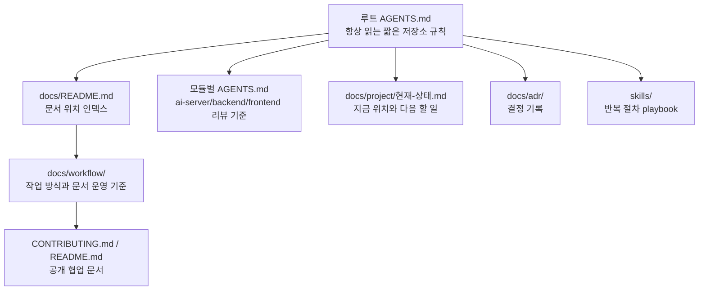

# AGENTS 및 AI 문서 운영 기준

## 1. 목적

이 문서는 DocuMind에서 AI 에이전트 지침과 문서를 어디에 두고, 언제 분리하고, 어떤 순서로 참고할지 정한다.
날짜가 붙은 작업 보고서가 아니라 계속 적용하는 운영 기준이다.

## 2. 공식 기준과 DocuMind 적용

| 근거 | 공식 기준 | DocuMind 적용 |
|---|---|---|
| OpenAI Codex `AGENTS.md` guide | Codex는 작업 시작 전에 `AGENTS.md`를 읽고, global -> project -> nested 순서로 지침을 합친다. 더 가까운 폴더의 지침이 우선한다. | 루트 `AGENTS.md`는 저장소 전체 규칙만 둔다. `ai-server/AGENTS.md`, `backend/AGENTS.md`, `frontend/AGENTS.md`는 모듈별 PR 리뷰 기준만 둔다. |
| OpenAI Codex project instructions discovery | 프로젝트 지침에는 기본 크기 한도가 있고, 길어지면 일부 지침이 잘릴 수 있다. | 루트 `AGENTS.md`는 짧은 router(길 안내자)로 유지하고 긴 절차는 `docs/`와 `skills/`로 분리한다. |
| OpenAI Codex best practices | 좋은 지침은 repo layout, 실행/검증 명령, 개발 규칙, PR 기대치, 금지 규칙, 완료 기준을 짧고 정확하게 다룬다. | 루트에는 항상 필요한 규칙만 남기고, 설명이 길어지는 항목은 `docs/workflow/`로 이동한다. |
| OpenAI Codex skills | 반복 workflow(작업 흐름)는 skill로 분리해 필요할 때만 자세한 지침을 읽게 할 수 있다. | 3회 이상 반복되는 표준 절차는 `skills/{name}/SKILL.md`로 승격을 검토한다. |

참고 링크:

- https://developers.openai.com/codex/guides/agents-md
- https://developers.openai.com/codex/config-advanced#project-instructions-discovery
- https://developers.openai.com/codex/learn/best-practices
- https://developers.openai.com/codex/skills

## 3. 문서 계층



## 4. 책임 분리

| 위치 | 넣는 내용 | 넣지 않는 내용 |
|---|---|---|
| 루트 `AGENTS.md` | 세션 시작 프로토콜, 로컬·클라우드 세션 차이, 안전 규칙, 공개 범위, 사용자와 합의한 작업 방식, 참조 문서 라우팅 | 현재 이슈 진행률, 긴 실행 절차, 서버 IP, 임시 판단, 특정 작업 로그 |
| 모듈별 `AGENTS.md` | 해당 모듈 PR 리뷰 체크리스트와 기술 스택별 위험 | 로컬 환경 정보, 비밀값, 현재 작업 상태 |
| `docs/README.md` | 문서 폴더 구조, 새 문서 위치 기준, 자주 쓰는 문서 링크 | 개별 작업의 긴 설명 전체 |
| `docs/workflow/` | AI 작업 흐름, PR, 브랜치, 문서 작성, AGENTS 운영 기준 | RAG 세부 분석, 배포 장애 로그, 프론트/백엔드 작업 보고서 |
| `docs/project/현재-상태.md` | 지금 위치(마일스톤·이슈·브랜치), 다음 할 일, 막힌 것 (60줄 이하) | 지난 이력, 결정 이유, 운영 주의 |
| `docs/adr/` | 지금 유효한 설계·기술 결정(결정 하나 = 파일 하나, 상태·대체 관계) | 작업 방식 규칙, 한 번 하고 끝난 운영 작업 |
| `docs/development/알려진-문제.md` | 아직 고치지 않은 동작과 피해 가는 방법 | 해결된 문제의 긴 경위(→ PR·보고서) |
| GitHub Issues·Projects | 작업 목록, 진행 상태(할 일 / 진행 중 / develop 반영 / 릴리스) | 설계 결정 원문 |
| `skills/` | 반복 가능한 절차 지식 | 단발성 보고서, 현재 서버 상태 |
| `CONTRIBUTING.md` | 공개 가능한 협업 규칙 | 개인 로컬 경로, Tailscale 주소, 비공개 운영 노트 |

## 5. 새 지침을 넣을 위치 결정표

| 질문 | 예 | 위치 |
|---|---|---|
| 매 세션 반드시 필요한 저장소 전체 규칙인가? | 파괴적 명령 금지, 세션 시작 프로토콜 | 루트 `AGENTS.md` |
| 특정 모듈에서만 필요한 리뷰 기준인가? | Spring Security, React UI, RAG parser 위험 | 해당 모듈 `AGENTS.md` |
| 설명이 길거나 따라 하는 절차인가? | 로컬 GPU 테스트, PR 절차, 문서 작성 규칙 | `docs/workflow/` 또는 `docs/development/` |
| 지금 이슈와 브랜치에만 해당하는가? | 현재 branch, 다음 작업, 임시 blocker | `docs/project/현재-상태.md` |
| 설계·기술 결정인가? | 모델 후보, 평가셋 분할, 업로드 중복 차단 | `docs/adr/` 새 ADR |
| 아직 안 고친 동작의 주의사항인가? | 헬스체크 오판, 버전 표시 오류 | `docs/development/알려진-문제.md` |
| 같은 절차가 3회 이상 반복되는가? | PR 초안 생성, RAG 진단, 새 도메인 추가 | `skills/` |
| 공개 협업자가 알아야 하는가? | PR target, commit message, issue 작성 방식 | `CONTRIBUTING.md` |
| 외부 제출 또는 포트폴리오 문서인가? | 교수님 제출 보고서, 면접 자료 | `docs/local/`(커밋 안 함). 2026-10-06 이전 것은 `docs/archive/reports/` |
| 접속 주소·계정처럼 공개하면 안 되는 운영 값인가? | Tailscale 주소, 데스크탑 사용자 이름 | `docs/local/접속정보.md`(커밋 안 함). 공개 문서에는 `<WSL IP>` 같은 자리표시 |

## 6. 크기와 분리 기준

| 대상 | 정상 범위 | 조치 기준 |
|---|---:|---|
| 루트 `AGENTS.md` | 200줄 안팎, 16KiB 이하 권장 | 250줄 또는 24KiB를 넘으면 분리 검토 |
| 모듈별 `AGENTS.md` | 30~80줄 | 체크리스트가 길어지면 세부 설명을 `docs/`로 이동 |
| `docs/workflow/` 루트 | 현재 실행 기준 문서만 노출 | 날짜 붙은 보고서는 `docs/archive/workflow/reports/`로 이동 |
| 오래된 AI 운영 참고 자료 | 직접 실행 기준이 아님 | `docs/archive/workflow/references/`로 이동하고 현재 기준 문서를 먼저 본다 |
| 특정 이슈 폴더 | 20개 문서 이상 또는 탐색이 어려움 | 해당 폴더에 `README.md` 추가 |

2026-10-07 점검 기준 루트 `AGENTS.md`는 약 110줄, 13KiB 안팎이다. OpenAI Codex 기본 지침 한도인 32KiB보다 작다.

## 7. 작업 절차

### 7.1 세션 시작

1. 루트 `AGENTS.md`를 따른다.
2. `docs/project/현재-상태.md`를 읽고, 필요하면 총괄계획 §4와 관련 ADR·이슈를 읽는다.
3. 사용자에게 현재 이슈, 브랜치, 다음 단계를 한 줄로 보고한다.
4. 문서 경로가 필요하면 `docs/README.md`를 먼저 연다.

### 7.2 문서 작성

1. 먼저 `docs/README.md`에서 저장 위치를 고른다.
2. 위치가 애매하면 문서를 만들기 전에 `docs/README.md`의 분류표를 보강한다.
3. 실행 기준 문서는 날짜 없는 이름을 우선 사용한다.
4. 날짜 붙은 문서는 작업 보고서나 특정 시점의 검토 결과로 둔다.
5. 작업 보고서에는 표, Mermaid diagram(다이어그램), 체크리스트 중 하나 이상을 포함한다.

### 7.3 AGENTS 수정

1. 새 내용이 루트에 들어갈 만큼 항상 필요한지 먼저 판단한다.
2. 설명이 길면 루트에는 참조 링크 한 줄만 넣고, 상세는 `docs/workflow/` 또는 해당 도메인 문서에 둔다.
3. 수정 후 아래 명령으로 크기를 확인한다.

```bash
wc -l -c AGENTS.md
```

4. 250줄 또는 24KiB를 넘으면 즉시 분리 작업을 한다.

### 7.4 스킬 승격

반복 절차가 아래 조건을 만족하면 `skills/`로 승격한다.

| 조건 | 판단 |
|---|---|
| 같은 절차가 3회 이상 반복됨 | skill 후보 |
| 명령 순서와 검증 기준이 고정됨 | skill 후보 |
| 특정 도메인 작업을 매번 같은 구조로 해야 함 | skill 후보 |
| 한 번뿐인 보고서나 분석임 | skill 아님 |

## 8. 검증 명령

문서 구조를 바꾼 뒤에는 최소한 아래를 확인한다.

```bash
wc -l -c AGENTS.md
find docs -maxdepth 1 -type f -not -name '.DS_Store' -print
git diff --check -- AGENTS.md docs
rg -n "docs/(이슈-|로컬-GPU|맥북-로컬|pdf/)" AGENTS.md docs/README.md docs/workflow/README.md docs/workflow/AGENTS-및-AI문서-운영기준.md docs/project/현재-상태.md
```

정상 기준:

| 검사 | 정상 |
|---|---|
| `wc -l -c AGENTS.md` | 250줄 미만, 24KiB 미만 |
| `find docs -maxdepth 1 ...` | `docs/README.md`만 출력 |
| `git diff --check` | 출력 없음 |
| 과거 루트 경로 검색 | 현재 기준 문서에는 남지 않음. `docs/archive/`의 과거 기록은 예외 |

## 9. 공개 전환과 클라우드 세션 (2026-10-07)

- 클라우드 세션(claude.ai/code 등)은 GitHub 저장소를 새로 클론한 것만 본다. 사용자 메모리(`~/.claude/...`)와 `.gitignore`로 뺀 파일은 넘어가지 않는다([원문] Claude Code 문서 "Configure cloud environments" — What carries over from your setup).
- 그래서 루트 `AGENTS.md`(`CLAUDE.md`)와 `docs/` 현재 문서를 커밋한다. 비공개 저장소를 따로 두는 안은 관리가 번거로워 쓰지 않았다(사용자 결정).
- 지난 기록 506개는 `docs/archive/`로, 접속 정보는 `docs/local/`로 옮겨 커밋하지 않는다. 옮기기 전 전체 백업은 `Assets/backups/agent-docs-before-refactor-20261007.tar.gz`.
- 사용자 메모리에 있던 작업 규칙(한국어, 실무 용어, 결정 방식, PR 형식 등)은 루트 `AGENTS.md` §4로 옮겨 로컬·클라우드가 같은 규칙을 읽게 했다.
- `memory-bank/`(Cline Memory Bank에서 온 AI 도구 관례)를 실무 구조로 바꿨다: 현재 위치 → `docs/project/현재-상태.md`, 결정 → `docs/adr/`(ADR 21개), 작업 큐 → GitHub Issues·Projects, 작업 이력 → PR·보고서, 운영 주의 → `docs/development/알려진-문제.md`. 원본은 `docs/archive/memory-bank/`(ADR-0021).

### 9.1 상태·결정·작업 목록 문서 운영

정보가 서로 다르면 아래 순서로 더 믿고, 아래쪽 문서를 고친다.

1. 실제 코드와 설정
2. 테스트 결과와 실행 로그
3. Git 커밋·PR·GitHub Issue
4. ADR·작업 보고서·README
5. `docs/project/현재-상태.md`

| 시점 | 할 일 |
|---|---|
| 세션 시작 | 루트 `AGENTS.md` → `docs/project/현재-상태.md`를 읽고 현재 상태를 한 줄로 보고 |
| 설계·기술 결정 | `docs/adr/`에 새 ADR(번복이면 옛 ADR을 '대체됨'으로) |
| 작업 완료 | 현재 상태 문서의 위치·다음 할 일 갱신, 이슈의 Projects 상태 이동, 작업 보고서 |
| PR 머지 후 | 현재 상태 문서에서 끝난 항목을 지우고 다음 할 일로 |

- 날짜는 `YYYY-MM-DD` 절대 날짜로 쓴다. 이슈 번호·브랜치·파일 경로·검증 명령을 구체적으로 쓴다.
- 사실과 추정을 구분한다. "나중에 확인"보다 무엇을 어디서 확인할지 적는다.
- 비밀값, 실제 `.env` 값, 접속 주소, 개인 토큰은 쓰지 않는다.

## 10. 이전 적용 결과 (2026-06-07)

- 루트 `AGENTS.md`는 짧은 지침 router로 유지한다.
- `docs/README.md`를 문서 위치 source of truth(진실 원천)로 사용한다.
- `docs/workflow/` 루트에는 현재 실행 기준 문서만 남긴다.
- 날짜 붙은 workflow 보고서는 `docs/archive/workflow/reports/`로 옮긴다.
- 오래된 AI 운영 참고 자료는 `docs/archive/workflow/references/`로 옮긴다.
- `docs/archive/workflow/reports/OpenAI-Codex-AGENTS-문서관리-적용계획-20260607.md`는 이 기준을 만들기 위한 근거 보고서로 보관한다.
