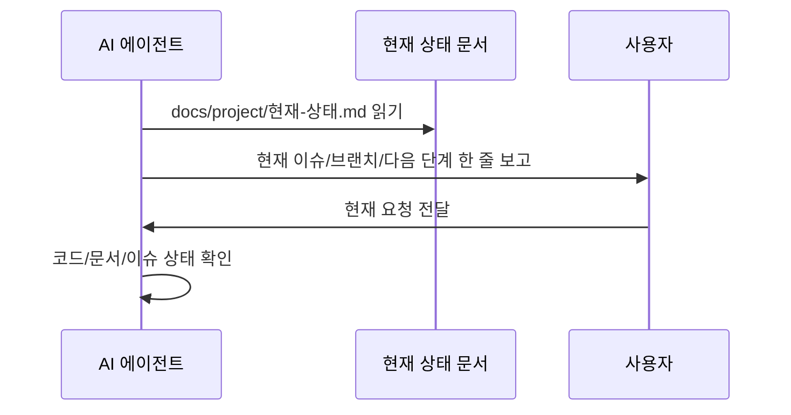
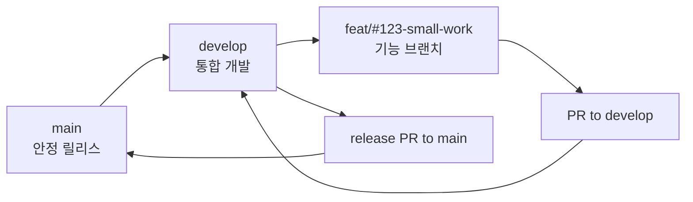

# AI 에이전트 작업 흐름

이 문서는 DocuMind에서 AI 에이전트가 이슈를 시작하고, 브랜치를 만들고, 커밋·PR까지 진행하는 운영 절차를 정리한다.

## 공식 OpenAI Codex 기준과 적용 방식

OpenAI Codex 문서에서 확인한 기준을 DocuMind에 다음처럼 적용한다.

| 공식 기준 | DocuMind 적용 |
|---|---|
| `AGENTS.md`는 Codex가 작업 전에 자동으로 읽는 지속 지침이다. | 루트 `AGENTS.md`를 항상 읽는 짧은 핵심 지침으로 유지한다. |
| 가장 가까운 `AGENTS.md`가 더 깊은 디렉토리 작업에 적용된다. | `backend/`, `frontend/`, `ai-server/`별 리뷰 체크리스트를 유지한다. |
| 짧고 정확한 지침이 긴 지침보다 유용하다. | 프로젝트 상세 정보는 `docs/`로 분리한다. |
| 긴 작업에는 계획 문서를 사용해 목표, 진행률, 검증을 추적한다. | `docs/workflow/실행계획-ExecPlan-템플릿.md`를 사용한다. |
| 반복 절차는 skills로 분리할 수 있다. | `skills/new-domain/SKILL.md` 같은 반복 절차 문서를 읽고 따른다. |

AGENTS, `docs/`, ADR·현재 상태 문서, `skills`의 책임 경계와 분리 기준은 `docs/workflow/AGENTS-및-AI문서-운영기준.md`를 따른다.

참고:

- [OpenAI Codex AGENTS.md guide](https://developers.openai.com/codex/guides/agents-md)
- [OpenAI Codex best practices](https://developers.openai.com/codex/learn/best-practices)
- [OpenAI Codex advanced configuration](https://developers.openai.com/codex/config-advanced)
- [OpenAI Codex exec plans guide](https://cookbook.openai.com/articles/codex_exec_plans/)
- [OpenAI Codex skills](https://developers.openai.com/codex/skills)

## 세션 시작



세션 시작 시 루트 `AGENTS.md`에 적힌 프로토콜을 따른다.

## 브랜치 전략

DocuMind의 기본 개발 흐름은 `develop` 중심으로 운영한다.



| 브랜치 | 역할 | 직접 작업 여부 |
|---|---|---|
| `main` | 안정 릴리스 기준. 발표, 제출, 배포 기준으로 삼을 수 있는 branch(브랜치) | 직접 작업하지 않는다. |
| `develop` | 여러 기능 PR이 먼저 모이는 통합 branch | 직접 커밋하지 않고 PR로만 변경한다. |
| `feat/#이슈번호-작업명` | 새 기능 또는 개선 구현 | 최신 `develop`에서 만든다. |
| `fix/#이슈번호-작업명` | 버그 수정 | 최신 `develop`에서 만든다. |
| `refactor/#이슈번호-작업명` | 동작 유지 구조 개선 | 최신 `develop`에서 만든다. |
| `docs/#이슈번호-작업명` | 공개 문서 변경 | 최신 `develop`에서 만든다. |
| `release/YYYY-MM-DD` | 검증된 `develop`을 `main`으로 올릴 때 필요한 release 준비 | 필요할 때만 만든다. |

원칙:

- 일반 PR target은 `develop`이다.
- `main`으로 바로 PR을 만들지 않는다. 예외는 긴급 hotfix(긴급 수정)와 release PR뿐이다.
- GitHub 머지 전략은 Squash & Merge 전용이다.
- 기능 브랜치 merge 후에는 원격 branch와 로컬 branch를 정리한다.
- 보존할 branch는 현재 진행 중인 branch, `main`, `develop`, release branch, 명시적 backup branch뿐이다.

## 이슈 계층 운영

큰 작업은 하나의 issue(이슈)에 모든 구현을 넣지 않는다. 큰 작업은 parent issue 또는 Epic(상위 관리 이슈)로 두고, 실제 구현은 child issue(파생 이슈) 단위로 나눈다.

예를 들어 #73은 "문서 구조를 보존하는 RAG 파이프라인으로 재설계하기"라는 Epic이다. 이 Epic 안에서 다음처럼 child issue를 만든다.

| child issue 예시 | 왜 따로 나누는가 |
|---|---|
| TableFact 문자열 근거를 typed table 구조로 승격 | 표의 행/열/값 관계를 보존하는 별도 data contract 문제이기 때문이다. |
| SourceBlock 원문 preview 전환 | 사용자 출처 표시가 검색용 synthetic text(합성 텍스트)에 오염되지 않게 하는 source 책임 문제이기 때문이다. |
| SelectedContext와 query context 공유 | trace와 실제 답변 생성이 서로 다른 근거를 보는 drift(흐트러짐) 문제이기 때문이다. |
| unsupported 질문 처리 강화 | 문서에 없는 질문을 추측하지 않는 안전 응답 문제이기 때문이다. |

child issue를 만들 때 반드시 적을 내용:

1. parent issue 번호
2. 해결하려는 실제 문제
3. 관련 실패 축 또는 위험 영역
4. 이번 issue에서 바꾸는 pipeline 단계
5. 이번 issue에서 바꾸지 않는 안전 경계
6. 완료 조건
7. 최소 검증 방법

#73 RAG child issue는 추가로 아래 중 어떤 실패 축을 줄이는지 적는다.

| 실패 축 | 의미 |
|---|---|
| `scope_loss` | 상위 제목, 모집 구분, 학과 같은 범위 정보가 사라짐 |
| `table_relation_loss` | 표의 행/열/값 관계가 문장화 과정에서 깨짐 |
| `retrieval_miss` | 문서 안에 근거가 있는데 검색 후보로 못 가져옴 |
| `source_contamination` | 사용자 출처에 검색용 또는 다른 문맥의 내용이 섞임 |
| `unsupported_handling` | 문서에 없는 질문에 추측 답변을 함 |
| `generation_grounding` | 근거는 context에 있는데 답변 생성이 무시함 |
| `trace_query_drift` | `/debug/rag-trace`와 실제 `/query`가 서로 다른 근거를 봄 |
| `index_consistency` | 업로드 실패, 삭제 실패, 중복 색인으로 검색 상태가 불일치 |
| `runtime_fit` | 모델, LangChain, Ollama 호출 방식이 실제 런타임과 맞지 않음 |

## 매 이슈 작업 순서

일반 기능/수정 작업은 아래 순서로 진행한다.

1. GitHub parent/child issue를 확인한다.
2. 현재 작업 중인 변경이 있으면 `git status --short --branch`로 먼저 확인한다.
3. 새 작업을 시작할 때는 `develop`을 최신화한다.

```bash
git checkout develop
git pull --ff-only origin develop
```

4. child issue 기준으로 작업 branch를 만든다.

```bash
git checkout -b feat/#123-short-work
```

5. 개발한다.
6. 테스트 또는 smoke test(간단 검증)를 실행한다.
7. `git diff --check`로 줄 끝 공백과 patch 오류를 확인한다.
8. 필요한 작업 보고서를 `docs/`에 작성한다. 2026-10-07부터 `docs/` 현재 문서는 같은 PR에 함께 커밋한다(공개 범위는 루트 `AGENTS.md` §6).
9. `docs/project/현재-상태.md`를 갱신하고, 설계·기술 결정이 있었으면 `docs/adr/`에 ADR을 쓴다. 같은 PR에 함께 커밋한다.
10. 커밋 대상만 선별한다.

```bash
git status --short
git diff --name-only
```

11. 커밋한다.

```bash
git commit -m "feat(scope): 작업 내용 (#123)"
```

12. 원격 feature branch에 push한다.

```bash
git push -u origin feat/#123-short-work
```

13. PR 확인·초안·생성·머지는 `docs/workflow/PR-작성-및-머지-절차.md`를 따른다 (2026-09-30부터). 요약: PR 전 확인(테스트, `git diff --check`, AI 서명 0) → 초안을 사용자에게 보여주고 "올리고 바로 머지 / 올리기만 / 수정" 중 선택 → 승인 후 생성 → squash 머지(제목 `PR 제목 (#PR번호)`, 본문 비움, 브랜치 삭제) → 로컬 `develop` 최신화.

14. parent issue의 checklist 또는 child issue 목록을 갱신한다.

## release 작업 순서

`develop`에 모인 작업을 발표, 제출, 배포 기준으로 확정할 때만 `main`으로 올린다.

1. `develop`에서 필요한 로컬/서버 검증을 끝낸다.
2. release note(릴리스 요약)를 작성한다.
3. `develop -> main` PR을 만든다.
4. PR 본문에는 포함된 child issue와 검증 결과를 적는다.
5. Squash & Merge로 `main`에 병합한다.
6. 배포나 제출은 `main` 기준으로 진행한다.

## branch 정리 기준

원격 branch가 많아지면 어떤 작업이 살아 있는지 알기 어렵다. 아래 기준으로 정리한다.

| 상태 | 처리 |
|---|---|
| PR이 `MERGED`이고 후속 작업이 없음 | 원격 branch 삭제 |
| 현재 작업 중인 branch | 보존 |
| release branch | release 종료 전까지 보존 |
| backup branch | 보존 이유가 문서에 있을 때만 임시 보존 |
| PR이 없고 용도를 모름 | 바로 삭제하지 않고 사용자 확인 |

주의:

- Squash & Merge를 사용하면 feature branch commit hash가 `main` 또는 `develop`의 조상으로 보이지 않을 수 있다.
- 따라서 branch 삭제 판단은 `git merge-base`만 보지 말고 GitHub PR 상태가 `MERGED`인지 함께 확인한다.
- 삭제 전에는 현재 작업 branch와 원격 branch 이름을 반드시 구분한다.

## 승인 필요 작업

아래 작업은 사용자 사전 승인을 받는다.

| 작업 | 이유 |
|---|---|
| GitHub issue 생성 | 공개 추적 항목이 생기기 때문이다. |
| 원격 push | 원격 브랜치 상태가 바뀌기 때문이다. |
| PR 생성 | 리뷰 요청과 공개 변경 제안이 생기기 때문이다. |
| 원격 branch 삭제 | 다른 세션이나 데스크탑 테스트 환경에서 참조 중일 수 있기 때문이다. |
| 파괴적 명령 | 복구 어려운 변경이 생길 수 있기 때문이다. |
| 대규모 리팩토링 | 현재 이슈 범위를 넘을 수 있기 때문이다. |

## 커밋 대상 분리

| 파일/폴더 | 커밋 여부 |
|---|---|
| 소스 코드 | 이슈 범위에 맞으면 커밋한다. |
| `CONTRIBUTING.md` | 공개 협업 문서이므로 필요 시 커밋한다. |
| `backend/AGENTS.md`, `frontend/AGENTS.md`, `ai-server/AGENTS.md` | 공개 리뷰 체크리스트이므로 필요 시 커밋한다. |
| 루트 `AGENTS.md`, `CLAUDE.md`(심볼릭 링크) | 커밋한다(2026-10-07~, 클라우드 세션용). |
| `docs/` 현재 문서 | 커밋한다. `docs/archive/`(지난 기록)·`docs/local/`(접속 정보)는 커밋하지 않는다. |
| `docs/adr/`, `docs/project/현재-상태.md` | 커밋한다. |
| `Assets/` | 학교 데이터이므로 커밋하지 않는다. |
| `outputs/`, 실험 결과 | 별도 요청이 없으면 커밋하지 않는다. |

## 브랜치 네이밍

```text
feat/#이슈번호-작업명
fix/#이슈번호-작업명
refactor/#이슈번호-작업명
docs/#이슈번호-작업명
chore/#이슈번호-작업명
release/YYYY-MM-DD
```

## 커밋 메시지

```text
feat(scope): 작업 내용 (#이슈번호)
```

예시:

```text
fix(rag): 표 라벨 값 근거 보강 (#18)
```

## PR 본문 작성 요약

PR 본문은 리뷰어용이다. 길게 설명하지 말고 변경 이유와 위험 영역을 선명하게 적는다.
DocuMind PR 제목과 본문은 기본적으로 한국어로 작성한다. 영어 변수명, API명, 파일명은 그대로 쓰되 사용자가 헷갈릴 수 있는 용어는 처음 등장할 때 `영어(한국어 뜻)` 형식으로 풀어 쓴다.

1. 배경
2. 변경 내용
3. 리뷰 포인트
4. 변경 파일
5. 확인한 내용
6. 이슈

상세 설명은 `docs/` 작업 보고서에 둔다.

## 작업 완료 시

작업 완료 후 아래를 확인한다.

- 필요한 테스트 또는 문서 검사를 실행했는가
- `git diff --check`를 통과했는가
- `docs/project/현재-상태.md`가 다음 시작 위치를 가리키는가
- 이슈의 Projects 상태를 옮겼는가(할 일 / 진행 중 / develop 반영 / 릴리스)
- 설계·기술 결정이 있으면 `docs/adr/`에 ADR을 썼는가(번복이면 옛 ADR을 '대체됨'으로)
