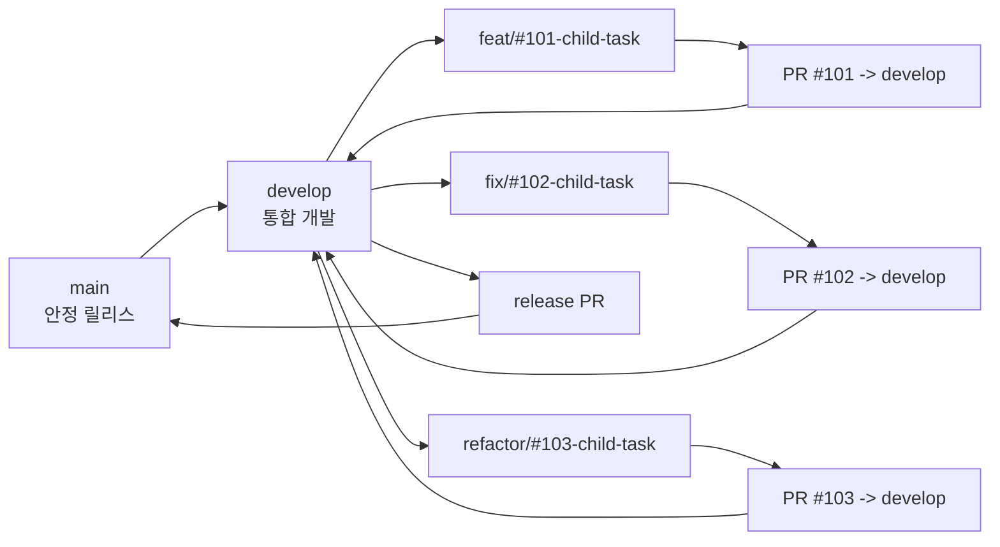
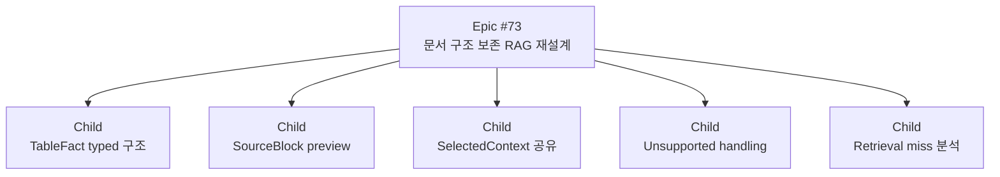

# GitHub develop 브랜치 및 파생 이슈 운영 기준

작성일: 2026-06-06
적용 프로젝트: DocuMind

## 1. 왜 바꾸는가

기존 흐름은 기능 브랜치를 만들고 PR을 `main`으로 바로 병합했다.

작은 프로젝트 초반에는 이 방식이 빠르지만, #73처럼 큰 RAG 구조 개선을 여러 단계로 나누면 문제가 생긴다.

| 문제 | 실제 불편 |
|---|---|
| `main`이 계속 바뀜 | 발표, 제출, 배포 기준으로 삼을 안정 지점이 흐려진다. |
| 큰 이슈 안에 작은 작업이 섞임 | 어떤 문제가 어떤 PR에서 해결됐는지 추적하기 어렵다. |
| 기능 브랜치가 많이 남음 | 지금 진행 중인 브랜치와 이미 끝난 브랜치를 구분하기 어렵다. |
| 테스트 전 코드가 바로 `main`에 들어감 | 로컬/데스크탑/GPU 검증 전에 안정 브랜치가 흔들릴 수 있다. |

그래서 앞으로는 `develop`을 통합 개발 브랜치로 두고, `main`은 안정 릴리스 브랜치로 둔다.

## 2. 새 브랜치 구조



| 브랜치 | 뜻 | 사용 방법 |
|---|---|---|
| `main` | 안정 버전 | 발표, 제출, 배포 기준. 직접 기능 작업 금지 |
| `develop` | 개발 통합 버전 | 모든 일반 PR의 target |
| `feat/#번호-작업명` | 기능 추가 | `develop`에서 만들고 `develop`으로 PR |
| `fix/#번호-작업명` | 버그 수정 | `develop`에서 만들고 `develop`으로 PR |
| `refactor/#번호-작업명` | 구조 개선 | `develop`에서 만들고 `develop`으로 PR |
| `docs/#번호-작업명` | 공개 문서 변경 | `develop`에서 만들고 `develop`으로 PR |
| `release/YYYY-MM-DD` | 릴리스 준비 | 필요할 때만 만들고 `main`으로 PR |

## 3. 이번에 확인한 GitHub 브랜치 상태

2026-06-06 기준으로 `origin/develop`을 새로 만들었다.

기준 commit:

```text
0a82ac5 feat(ai): typed contract trace preview 추가 (#73)
```

원격 branch 정리 결과:

| 상태 | 브랜치 |
|---|---|
| 유지 | `origin/main` |
| 신규 생성 | `origin/develop` |
| 현재 작업 관련 보존 | `origin/temp/#73-tablefact-header-path-gcp-test` |
| 보류 | `origin/backup/#49-stacked-before-split` |
| 보류 | `origin/feat/#18-docker-compose-deploy` |
| 보류 | `origin/feat/#18-rag-evaluation-loop` |

이미 `MERGED`된 PR의 원격 브랜치들은 GitHub에는 이미 없었고, 로컬 remote-tracking 목록만 오래된 상태였다. `git fetch --prune origin`으로 로컬의 stale ref(원격에는 없는데 로컬에만 남은 참조)를 정리했다.

주의:

- Squash & Merge를 쓰면 feature branch의 commit hash가 `main`이나 `develop`의 조상으로 보이지 않을 수 있다.
- 그래서 삭제 판단은 `git merge-base`만 보지 말고 GitHub PR 상태가 `MERGED`인지 확인해야 한다.
- PR이 없거나 보존 이유가 애매한 branch는 바로 삭제하지 않는다.

## 4. 앞으로 새 작업을 시작하는 방법

초보자가 그대로 따라 할 수 있는 기준 절차다.

### 4.1 작업 시작 전 상태 확인

```bash
git status --short --branch
```

확인할 것:

| 출력 | 의미 | 해야 할 일 |
|---|---|---|
| `M path/file` | 수정했지만 commit하지 않은 파일 | 현재 작업인지 확인 |
| `?? path/file` | Git이 추적하지 않는 새 파일 | 커밋 대상인지 확인 |
| `## branch-name` | 현재 브랜치 | 작업하려는 브랜치가 맞는지 확인 |

### 4.2 새 작업 branch 만들기

새 child issue를 작업할 때는 `develop`에서 시작한다.

```bash
git checkout develop
git pull --ff-only origin develop
git checkout -b feat/#123-short-name
```

예시:

```bash
git checkout develop
git pull --ff-only origin develop
git checkout -b feat/#101-selected-context-contract
```

### 4.3 작업 후 커밋

```bash
git status --short
git diff --check
git add 변경할파일
git commit -m "feat(ai): SelectedContext contract 연결 (#101)"
```

주의:

- `docs/` 현재 문서와 루트 `AGENTS.md`는 2026-10-07부터 커밋한다. `docs/archive/`, `docs/local/`, `Assets/`는 커밋하지 않는다.
- 공개 협업 규칙인 `CONTRIBUTING.md`, `.github/ISSUE_TEMPLATE/*`, `.github/PULL_REQUEST_TEMPLATE.md`, 모듈별 `AGENTS.md`는 필요하면 커밋할 수 있다.

### 4.4 PR 만들기

PR target은 `develop`으로 둔다.

PR 이슈 문구:

```text
Closes #child
Related #parent
```

예시:

```text
Closes #101
Related #73
```

뜻:

| 문구 | 의미 |
|---|---|
| `Closes #101` | 이 PR이 child issue #101을 끝낸다. |
| `Related #73` | 이 PR은 Epic #73의 일부지만 #73 전체를 끝내지는 않는다. |

## 5. 큰 이슈와 파생 이슈 운영 방식

큰 이슈는 구현 자체가 아니라 방향과 완료 조건을 관리한다.

child issue는 실제 코드 변경, 검증, 문서화가 가능한 작은 작업이다.



child issue를 만들어야 하는 경우:

| 상황 | child issue로 분리해야 하는 이유 |
|---|---|
| data contract가 바뀐다 | 다른 pipeline 단계에 영향이 생긴다. |
| API response가 바뀐다 | frontend/backend 호출부 검증이 필요하다. |
| prompt 또는 answer generation이 바뀐다 | 답변 품질 회귀를 따로 확인해야 한다. |
| 검색 ranking 또는 index 저장이 바뀐다 | 기존 문서 검색 결과가 바뀔 수 있다. |
| 테스트 환경이나 평가 gate가 바뀐다 | 이후 PR의 판단 기준이 바뀐다. |

child issue로 만들지 않아도 되는 경우:

| 상황 | 이유 |
|---|---|
| 오탈자 수정 | 독립적인 추적 가치가 작다. |
| 같은 PR 안에서 필요한 작은 helper 이름 정리 | 현재 issue의 구현 일부다. |
| 현재 상태 문서만 갱신 | 작업 PR에 함께 넣는다. 따로 issue로 관리할 내용이 아니다. |

## 6. #73 기준 child issue 후보

#73은 이미 Epic이다. 앞으로 구현할 수 있는 child issue 후보는 다음과 같다.

| 후보 | 관련 실패 축 | 설명 |
|---|---|---|
| SelectedContext endpoint 검증 및 backend drift 확인 | `trace_query_drift`, `generation_grounding` | `/debug/rag-trace`, `/query`, backend `/api/chat`이 같은 근거를 쓰는지 확인 |
| unsupported 질문 처리 강화 | `unsupported_handling`, `source_contamination` | 문서에 없는 질문이 과거 결과나 관련 없는 표를 근거로 삼지 않게 보강 |
| Source contamination P0 재현과 정리 | `source_contamination`, `scope_loss` | 학과 설명, 주요 교과목, 취업처처럼 source가 섞이는 질문을 분리 진단 |
| retrieval miss 분석 | `retrieval_miss` | 문서에 근거가 있는데 검색 후보에 못 올라오는 질문을 조사 |
| TableFact 저장 schema 설계 | `table_relation_loss`, `index_consistency` | runtime 문자열 table_fact를 typed schema 저장 구조로 승격할지 결정 |
| runtime 호출 방식 검증 | `runtime_fit`, `generation_grounding` | OllamaLLM flat prompt와 chat message 호출 차이를 비교 |

child issue 제목 예시:

```text
[AI/RAG] SelectedContext endpoint drift 검증
[AI/RAG] unsupported 질문 처리 gate 보강
[AI/RAG] Source contamination P0 재현 정리
[AI/RAG] Retrieval miss 질문 원인 분석
[AI/RAG] TableFact typed 저장 schema 설계
```

## 7. 브랜치 삭제 방법

삭제 전 확인:

```bash
git branch -r
gh pr list --state all --limit 200 --json number,title,state,mergedAt,headRefName,baseRefName
```

삭제해도 되는 branch:

- PR 상태가 `MERGED`
- 현재 작업 중이 아님
- release/backup 용도가 아님

삭제하면 안 되는 branch:

- `main`
- `develop`
- 현재 작업 중인 branch
- 사용자가 보존하라고 한 branch
- PR 상태를 확인하지 못한 branch

원격 branch 삭제:

```bash
git push origin --delete branch-name
```

삭제 후 로컬 remote-tracking 정리:

```bash
git fetch --prune origin
```

## 8. 이번 기준 변경으로 바뀐 문서

| 파일 | 변경 내용 |
|---|---|
| `AGENTS.md` | develop 기본 통합, main 안정 릴리스, parent/child issue 기준 추가 |
| `docs/workflow/AI-에이전트-작업-흐름.md` | 상세 브랜치 전략, child issue, release, branch cleanup 절차 추가 |
| `CONTRIBUTING.md` | 공개 협업 기준을 develop 중심으로 변경 |
| `.github/PULL_REQUEST_TEMPLATE.md` | target branch, parent/child issue, 검증 항목 추가 |
| `.github/ISSUE_TEMPLATE/child_task.md` | child issue 전용 템플릿 추가 |
| `.github/ISSUE_TEMPLATE/*.md` | 상위 이슈 또는 관련 이슈 입력란 추가 |

## 9. 한 줄 기준

앞으로 DocuMind는 `develop`에서 기능을 통합하고, `main`은 안정 릴리스로 유지하며, 큰 작업은 Epic issue 아래 child issue 단위 PR로 작게 끝낸다.
