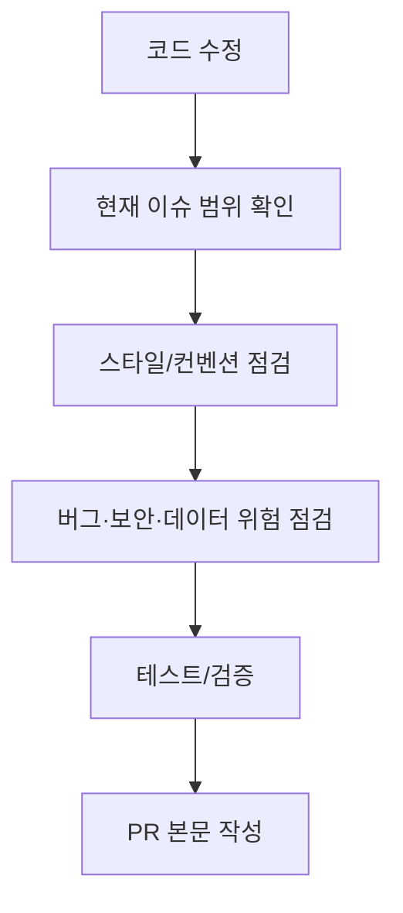

# PR 클린 코드 체크리스트

이 문서는 PR 전 자체 점검 기준이다. 루트 `AGENTS.md`에는 요약만 두고, 상세 체크는 이 문서를 따른다.

## 참고 기준

- [Google Java Style Guide](https://google.github.io/styleguide/javaguide.html)
- [우아한테크코스 PR 체크리스트](https://github.com/woowacourse/woowacourse-docs/blob/main/cleancode/pr_checklist.md)

## 점검 흐름

## 공통 원칙

- 새로 작성하거나 수정한 코드에 우선 적용한다.
- 기존 코드 전체를 한 번에 대규모 리팩토링하지 않는다.
- 현재 이슈 범위를 벗어난 변경은 별도 리팩토링 이슈로 분리한다.
- 프레임워크 특성상 그대로 적용하기 어려운 경우 PR 본문 또는 작업 보고서에 예외 사유를 짧게 남긴다.

## Java/Spring Boot 체크리스트

| 항목 | 점검 기준 |
|---|---|
| 자바 코드 컨벤션 | Google Java Style Guide와 프로젝트 기존 스타일을 따른다. |
| 한 메서드 한 단계 indent | 중첩 `if`, 반복문, 예외 처리 블록이 깊어지면 메서드 추출이나 guard clause를 검토한다. |
| `else` 최소화 | early return 또는 전략 객체로 풀 수 있는지 검토한다. |
| 원시값/문자열 포장 | 도메인 의미가 반복되는 값은 값 객체나 record로 묶을 수 있는지 확인한다. |
| 일급 컬렉션 | 컬렉션에 검증, 필터링, 계산, 정렬 규칙이 붙으면 별도 타입 분리를 검토한다. |
| 인스턴스 변수 수 | 3개 이상 필드를 가진 클래스는 책임이 섞였는지 확인한다. |
| getter/setter | 핵심 도메인 객체는 상태를 꺼내 조작하지 말고 의미 있는 행위를 둔다. |
| 메서드 인자 수 | 4개 이상이면 command 객체, DTO, 값 객체로 줄일 수 있는지 검토한다. |
| 디미터 법칙 | 한 줄에 점(`.`)이 과도하게 이어지면 객체 탐색을 감쌀 수 있는지 확인한다. |
| 한 가지 일 | 검증, 조회, 변환, 저장, 외부 호출이 한 메서드에 섞이면 분리한다. |
| 작은 클래스 | 파일이 길어지거나 public 메서드가 늘어나면 책임 분리를 검토한다. |

## AI Server/RAG 체크리스트

| 항목 | 점검 기준 |
|---|---|
| 단계 분리 | 파싱, 정규화, 청킹, 임베딩, 저장, 검색, 답변 생성 책임이 섞이지 않았는지 확인한다. |
| 파일 형식 | PDF/DOCX/PPTX/XLSX 처리 기준이 일관적인지 확인한다. |
| 구조 보존 | 제목, 표, 목록, 페이지 경계가 과도하게 깨지지 않는지 확인한다. |
| 메타데이터 | 문서 ID, 원본 파일명, 헤더 경로, 페이지 정보가 출처 표시와 삭제에 충분한지 확인한다. |
| 실패 처리 | 외부 라이브러리 호출 실패를 사용자에게 이해 가능한 오류로 바꾸는지 확인한다. |
| 정책값 | chunk size, overlap, topK 같은 값이 상수나 환경변수로 관리되는지 확인한다. |
| 하드코딩 | 특정 문서명, 학과명, 질문 예시 전용 조건을 넣지 않았는지 확인한다. |

## Frontend 체크리스트

| 항목 | 점검 기준 |
|---|---|
| 상태 관리 | 로그인, 로그아웃, 새 질문, 스트리밍 중단, 삭제 흐름에서 state가 꼬이지 않는지 확인한다. |
| API 분리 | 화면 컴포넌트에 fetch 세부 구현이 직접 들어가지 않는지 확인한다. |
| 접근성 | 모달, 팝오버, 드로어에서 Escape, 외부 클릭, focus 이동, `aria-*`를 확인한다. |
| 오류 표시 | API 오류가 사용자에게 이해 가능한 메시지로 표시되는지 확인한다. |
| SSE | 중단, 오류, 완료, 늦게 도착한 이벤트 처리에서 중복 state update가 없는지 확인한다. |

## PR 본문 구조

PR 본문은 `.github/PULL_REQUEST_TEMPLATE.md`를 그대로 따른다 (2026-09-30부터 단일 기준). 섹션은 관련 이슈, 배경, 변경 내용, 확인한 내용, 주의할 점 다섯 개뿐이고, 이모지·자동 생성 서명·템플릿에 없는 섹션은 넣지 않는다. 제목은 `type(scope): 요약`이고 이슈 번호는 넣지 않는다 (본문 `Closes #번호`로 연결). 상세 실행 로그와 학습 설명은 `docs/` 보고서에 둔다.

이 문서의 체크리스트는 PR을 올리기 **전에** 작성자가 확인하는 용도다. PR 본문에는 옮기지 않는다.

## 주의사항

- 검증 섹션을 완전히 삭제하지 않는다.
- 큰 PR일수록 `리뷰 포인트`를 반드시 쓴다.
- PR 본문은 작업 보고서가 아니다.
