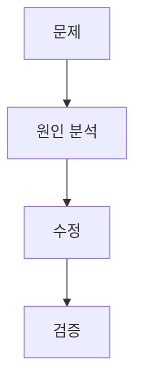
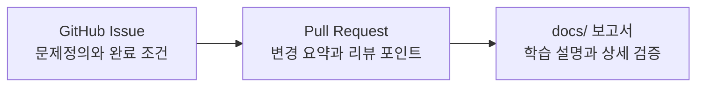

# 문서 작성 및 학습 보고 규칙

이 문서는 사용자 설명과 작업 보고서를 어떻게 작성할지 정리한다. 루트 `AGENTS.md`에는 핵심만 남기고, 자세한 설명 기준은 이 문서를 따른다.

## 목적

DocuMind는 단순 구현 프로젝트가 아니라 사용자가 초보 개발자로서 면접과 취업을 준비하며 학습하는 프로젝트다. 따라서 작업 결과를 보고할 때는 사용자가 기술 스택과 코드를 자신의 경험으로 설명할 수 있도록 돕는다.

## 보고 깊이 조절

| 작업 성격 | 설명 깊이 |
|---|---|
| 단순 명령 결과, 오타 수정, 짧은 질문 | 핵심만 간결하게 답한다. |
| 코드 수정, 리팩토링, 버그 수정 | 파일 위치, 함수명, 동작 원리, 검증 결과를 설명한다. |
| RAG, 검색, 청킹, 배포, 보안, 성능, 테스트 | 설계 이유, 한계, 대안, 검증 방법, 면접 포인트까지 자세히 설명한다. |
| GitHub issue/PR 본문 | 문제정의, 작업 범위, 완료 조건 중심으로 짧게 작성한다. |

## 사용자 설명에 포함할 항목

가능한 한 아래 항목을 포함한다.

| 항목 | 설명 |
|---|---|
| 파일 경로와 라인 번호 | 예: `ai-server/main.py:223` |
| 함수명/메서드명 | 예: `_load_documents()` |
| 라이브러리/프레임워크/메서드 | 예: FastAPI `UploadFile`, LangChain `Document`, ChromaDB `collection.add()` |
| 프로젝트 전체 흐름에서의 역할 | 해당 코드가 업로드, 파싱, 청킹, 검색, 답변 중 어디에 속하는지 설명한다. |
| 동작 원리 | 입력이 어떻게 처리되어 출력으로 바뀌는지 설명한다. |
| 선택 이유 | 왜 이 라이브러리나 구조를 썼는지 설명한다. |
| 한계와 보완점 | 현재 방식의 실패 가능성과 후속 개선 방향을 적는다. |
| 검증 방법 | 어떤 명령, 테스트, 로그, 화면으로 확인했는지 적는다. |
| 면접 포인트 | 사용자가 자신의 프로젝트 경험으로 말할 수 있는 문장을 제공한다. |

## 설명 예시 형식

```text
ai-server/main.py:223 _load_documents()

이 함수는 업로드된 파일을 LangChain Document 형태로 바꾸는 진입점이다.
PDF는 OpenDataLoaderPDFLoader를 사용하고, DOCX/PPTX/XLSX는 MarkItDown을 사용한다.
이렇게 분리한 이유는 PDF는 레이아웃과 한글 줄바꿈 문제가 크고, Office 문서는 Markdown 변환 품질이 중요하기 때문이다.
```

## 신뢰도 높은 근거 사용

설계 판단, 기술 선택, 최신 버전, 보안, 성능, RAG 구조를 설명할 때는 공식 문서와 1차 자료를 우선한다.

우선순위:

1. 해당 제품/라이브러리 공식 문서
2. OpenAI, Google, AWS, Microsoft, NVIDIA, IBM, Anthropic 같은 공식 기술 문서
3. Google SRE, AWS Well-Architected, Microsoft Azure Architecture Center 같은 운영·아키텍처 가이드
4. 논문 또는 기술 리포트
5. 블로그나 개인 글

근거 없이 "대기업도 이렇게 한다"고 쓰지 않는다. 어떤 공식 자료나 설계 원칙과 연결되는지 구체적으로 설명한다.

## 보고서 저장 위치와 형식

- 보고서 위치: `docs/README.md`의 분류 기준에 맞는 하위 폴더
- 파일명: 한글로 내용을 대표하는 제목
- 원칙: 의미 있는 작업 1개당 보고서 1개
- 커밋: 보고서는 그 작업의 PR에 함께 커밋한다(2026-10-07~). 비밀값·접속 주소·학교 문서 원문 대량 인용·개인정보는 넣지 않는다(루트 `AGENTS.md` §6). 외부 제출물·포트폴리오 같은 개인 문서는 `docs/local/`에 둔다.

## 문서 위치 결정

새 문서를 작성하기 전에 `docs/README.md`를 먼저 확인한다.

| 문서 성격 | 위치 |
|---|---|
| AI 작업 흐름, PR, 브랜치, 문서 작성 규칙 | `docs/workflow/` |
| 루트 `AGENTS.md`, 모듈별 `AGENTS.md`, `memory-bank`, `skills` 책임 경계 | `docs/workflow/AGENTS-및-AI문서-운영기준.md` |
| workflow 변경 작업 보고서 | `docs/archive/workflow/reports/` |
| 오래된 AI 운영 참고 자료 | `docs/archive/workflow/references/` |
| 맥북/데스크탑/로컬 실행과 테스트 | `docs/development/` |
| RAG parser, chunking, retrieval, grounding 분석 | `docs/rag/` |
| 백엔드 작업 보고서 | `docs/archive/backend/reports/` |
| 프론트엔드 작업 보고서 | `docs/archive/frontend/reports/` |
| 과제 제출, 포트폴리오, 면접 준비 자료 | `docs/archive/reports/` |

위치가 애매하면 문서를 먼저 만들지 않는다.
`docs/README.md`의 분류표를 보강한 뒤 그 기준에 맞는 위치에 작성한다.

루트 `AGENTS.md`가 길어지는 내용은 바로 넣지 않는다.
항상 필요한 repo-wide(저장소 전체) 규칙인지 확인하고, 긴 설명은 `docs/workflow/` 문서로 분리한다.
반복되는 절차가 3회 이상 나오면 `skills/` 승격을 검토한다.

## 보고서 필수 구성

보고서에는 아래 내용을 포함한다.

| 항목 | 내용 |
|---|---|
| 배경 | 왜 이 작업이 필요한지 |
| 변경 내용 | 어떤 파일과 구조를 바꿨는지 |
| 동작 원리 | 코드 또는 절차가 어떻게 동작하는지 |
| 검증 | 어떤 명령이나 확인으로 검증했는지 |
| 한계 | 아직 남은 위험이나 보완점 |
| 학습 포인트 | 면접이나 포트폴리오에서 설명할 수 있는 내용 |

## RAG/파이프라인 보고서 추가 기준

RAG, parser, retrieval, prompt, source, trace처럼 여러 단계가 이어지는 작업 보고서는 단순히 "무엇을 추가했다"로 끝내지 않는다.
사용자가 프로젝트 흐름을 발표하거나 설명할 수 있도록 아래 구성을 우선 적용한다.

| 항목 | 반드시 설명할 내용 |
|---|---|
| 결론 | 이번 이슈가 어디까지 해결했고, 무엇은 아직 해결하지 않았는지 먼저 쓴다. |
| 용어 표 | 영어 변수명과 내부 객체명을 `영어(한국어 뜻)` 형식으로 풀고, 현재 구현에서 실제로 쓰이는 위치를 적는다. |
| 변경 전 파이프라인 | 입력 데이터가 어떤 함수와 저장소를 거쳐 답변 후보가 되는지 Mermaid diagram과 표로 설명한다. |
| 변경 전 위험 | 기존 방식이 왜 헷갈리거나 위험했는지 실제 문자열, metadata, API 응답 예시로 보여준다. |
| 변경 후 파이프라인 | 새 helper, contract, selector, trace, prompt 중 어느 단계까지 연결했는지 점선/주석으로 구분해 그린다. |
| 실제 예시 | 대표 질문 1개 이상으로 입력, 중간 구조, 선택 결과, 제외된 후보를 표로 보여준다. |
| 안전 경계 | upload, ChromaDB schema, retrieval ranking, prompt, `/query`, source 응답 중 바꾼 것과 안 바꾼 것을 분리한다. |
| 검증 결과 | helper smoke와 실제 endpoint 검증을 나눠 적고, 실패했거나 아직 부정확한 결과도 숨기지 않는다. |
| 다음 작업 | 현재 이슈에서 끝낼 일과 다음 child issue로 넘길 일을 분리한다. |

`preview`, `trace`, `selected`, `candidate`, `context`, `prompt`처럼 사용자가 헷갈릴 수 있는 단어는 처음 등장할 때 반드시 아래처럼 설명한다.

```text
selected_table_facts(선택된 표 근거 후보)
= 질문 기준으로 고른 TableFact 목록이다.
= 다만 현재 이슈에서는 /debug/rag-trace에서만 확인하고, 아직 /query prompt에는 넣지 않았다.
```

특히 "미리보기"라는 표현을 쓸 때는 무엇을 미리 보는지 명확히 쓴다.

좋은 예:

```text
trace preview(디버그 미리보기)는 사용자 화면 미리보기가 아니라,
실제 답변 생성에 연결하기 전에 /debug/rag-trace 응답에서 내부 선택 결과만 확인한다는 뜻이다.
```

나쁜 예:

```text
trace preview를 추가했다.
```

위처럼만 쓰면 사용자는 무엇을, 왜, 어디서 미리 보는지 알 수 없다.

## 시각화 의무

모든 보고서에는 Mermaid diagram(다이어그램), 표, 체크리스트 중 최소 1개 이상의 시각화 자료를 포함한다.

권장 사용:



흐름·구조·원인 분류·배포 경로는 Mermaid `flowchart`, `sequenceDiagram`, `stateDiagram`을 우선 사용한다. 숫자, 명령어, 정상/실패 결과는 Markdown 표와 체크리스트로 보완한다.

## 행위 해설 의무

보고서에는 에이전트가 수행한 주요 행위를 단순 결과만 쓰지 않고 아래 항목으로 설명한다.

| 항목 | 설명 |
|---|---|
| 어디서/무엇에 적용하는가 | Mac 로컬, 서버, Docker 컨테이너, 파일, GitHub 이슈 등 |
| 왜 하는가 | 해결하려는 문제, 검증하려는 가설, 달성 목표 |
| 무엇을 바꾸거나 확인하는가 | 코드, 설정, 데이터, 서버 상태, 문서 |
| 어떻게 동작하는가 | 명령 옵션, 설정값, 코드 흐름, API 호출 경로 |
| 정상 결과 | 성공했을 때 기대되는 로그, 응답, 화면, 테스트 결과 |
| 실패 시 의미 | 자주 나오는 오류와 다음 확인 위치 |
| 주의사항 | 데이터 삭제, 보안, 비용, 서버 영향 등 |

## GitHub Issue/PR과 보고서의 역할 분리



GitHub issue와 PR은 리뷰어가 빠르게 읽는 문서다. 장문 학습 설명, 명령 로그, 실패 시 의미, 면접 답변 포인트는 `docs/` 보고서나 최종 사용자 설명에 둔다.
