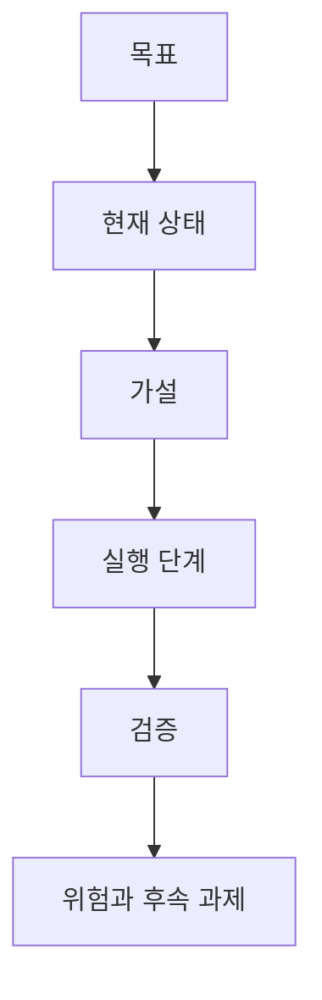

# 실행계획 ExecPlan 템플릿

이 문서는 오래 걸리는 작업이나 불확실성이 큰 작업에서 사용하는 실행 계획 템플릿이다. 단순 수정에는 사용하지 않는다.

## 언제 사용하는가

아래 조건 중 하나에 해당하면 실행계획을 작성한다.

| 조건 | 예시 |
|---|---|
| 여러 파일과 계층을 동시에 바꾼다 | RAG pipeline 분리, Spring Boot 인증 구조 변경 |
| 실패 원인을 단계별로 좁혀야 한다 | 청킹 실패, 검색 누락, SSE 중단 |
| 검증 기준을 먼저 고정해야 한다 | RAG baseline/gate, 회귀 테스트 추가 |
| 작업이 하루 이상 이어질 수 있다 | 대규모 리팩토링, 배포 구조 전환 |

## 작성 원칙



- 계획은 자기완결적이어야 한다. 나중에 다른 에이전트가 읽어도 맥락을 이해할 수 있어야 한다.
- 진행 중 발견한 사실은 계획에 반영한다.
- 완료 조건을 명확히 적는다.
- 실행 중 결정이 바뀌면 이유를 기록한다.
- 진행 상태는 `docs/project/현재-상태.md`에 요약하고, 결정은 ADR로 남긴다.

## 템플릿

```markdown
# ExecPlan: <작업명>

## 목적

이 작업으로 해결하려는 사용자 문제를 적는다.

## 현재 상태

- 관련 이슈:
- 관련 브랜치:
- 관련 파일:
- 현재 실패 증상:

## 문제정의

문제를 코드, 데이터, 사용자 영향 기준으로 정확히 정의한다.

## 가설

1. <가설 1>
2. <가설 2>
3. <가설 3>

## 실행 단계

- [ ] 1단계:
- [ ] 2단계:
- [ ] 3단계:

## 검증 방법

- 명령:
- 기대 결과:
- 실패 시 확인 위치:

## 위험과 한계

- 위험:
- 한계:
- 후속 과제:

## 완료 조건

- [ ] 코드 변경 완료
- [ ] 테스트/검증 완료
- [ ] 보고서 작성
- [ ] 현재 상태 문서·ADR 갱신
```

## RAG 작업용 추가 항목

RAG 관련 작업에서는 아래 항목을 추가한다.

```markdown
## RAG 단계별 영향

| 단계 | 영향 여부 | 확인 방법 |
|---|---|---|
| parser |  |  |
| cleanup |  |  |
| chunking |  |  |
| indexing |  |  |
| retrieval |  |  |
| reranking |  |  |
| prompt context |  |  |
| answer generation |  |  |
| source citation |  |  |

## 실패 샘플

| 질문 | 기대 근거 | 현재 실패 | 의심 단계 |
|---|---|---|---|
|  |  |  |  |
```
