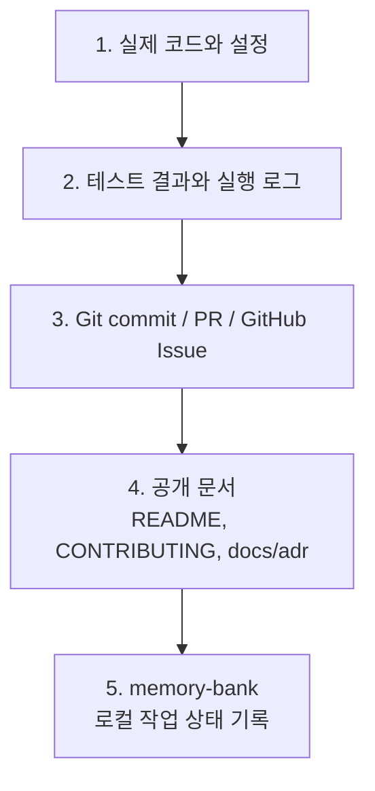

# memory-bank — 1인 개발자용 로컬 작업 상태 기록

`memory-bank/`는 1인 개발자와 AI agent(에이전트)가 작업 맥락을 이어가기 위한 운영 기록이다. 2026-10-07부터 현재본(이 파일, `activeContext.md`, `progress.md`, `decisionLog.md`)을 커밋해 클라우드 세션도 같은 맥락을 읽는다. 지난 기록 `archive/`는 로컬에만 둔다.

가장 정확한 이름은 **AI 작업 인수인계 로그** 또는 **local project state log(로컬 프로젝트 상태 기록)** 이다. Jira, Linear, GitHub Projects 같은 project tracker(작업 추적 도구)를 작게 대체하되, Git commit(커밋), GitHub Issue, PR, 테스트 결과의 공식 기록을 대체하지 않는다.

## 1. 왜 필요한가

1인 개발에서는 코드를 쓰는 사람, PM(프로젝트 관리자), 리뷰어, 운영자가 모두 한 사람이다. 그래서 시간이 지나면 다음 정보가 쉽게 끊긴다.

- 지금 어떤 issue(이슈)를 하고 있는가
- 어느 branch(브랜치)에서 작업 중인가
- 마지막으로 확인한 정상 상태는 무엇인가
- 다음에 바로 해야 할 작업은 무엇인가
- 왜 특정 기술 결정을 했는가
- 실패했거나 되돌린 시도는 무엇인가

`memory-bank/`는 이 정보를 짧고 구조적으로 남겨, 다음 세션에서 바로 작업을 이어가게 만드는 보조 시스템이다.

## 2. 무엇을 대체하고 무엇을 대체하지 않는가

| 구분 | memory-bank가 하는 일 | 대체하지 않는 것 |
|---|---|---|
| 현재 작업 상태 | 현재 issue, branch, 다음 단계 요약 | GitHub Issue의 최종 상태 |
| 작업 큐 | 로컬에서 기억해야 할 우선순위와 미완료 작업 | Jira, Linear, GitHub Projects의 공식 backlog(작업 목록) |
| 기술 결정 | 왜 이 방향을 선택했는지 append-only(추가 전용) 기록 | 정식 ADR(Architecture Decision Record, 아키텍처 의사결정 기록) 문서 전체 |
| 에이전트 인수인계 | 다음 AI agent가 읽을 시작 맥락 제공 | 코드 리뷰, 테스트, PR 승인 |
| 개인 운영 메모 | 공개하기 어려운 로컬 맥락 보관 | 공개 문서, README, CONTRIBUTING |

정리하면 `memory-bank/`는 **공식 source of truth(진실 원천)가 아니라, 공식 기록을 빠르게 찾고 이어가기 위한 working memory(작업 기억)** 이다.

## 3. source of truth 우선순위

정보가 서로 다르면 아래 순서로 더 신뢰한다.



`memory-bank/`가 코드나 GitHub Issue와 다르면 `memory-bank/`를 수정한다. 코드나 이슈 상태를 `memory-bank/`에 맞추지 않는다.

## 4. 파일별 책임

| 파일 | 책임 | 쓰면 안 되는 것 |
|---|---|---|
| `README.md` | memory-bank의 정의, 운영 규칙, 템플릿 | 현재 진행률 |
| `activeContext.md` | 지금 진행 중인 issue 1개, 다음 시작 위치, blocker(차단 요소) | 긴 과거 이력, 완료된 issue 전체 기록 |
| `progress.md` | 로컬 작업 큐, branch 상태, 다음 우선순위 | GitHub Issue에 이미 있는 세부 논의 전체 |
| `decisionLog.md` | 기술 결정, 번복, 실패 시도, 이유 | 단순 작업 로그, 오늘 한 일 나열 |

## 5. 파일 작성 규칙

### 5.1 activeContext.md

`activeContext.md`는 다음 세션에서 바로 손을 댈 위치만 알려야 한다.

필수 항목:

- 현재 issue 번호와 이름
- 현재 branch 이름
- 마지막 완료 상태
- 다음 단계 한 줄
- 현재 blocker가 있으면 명시
- 최근 작업 요약은 최신순으로 짧게 유지

권장 형식:

```markdown
## 현재 이슈

**이슈 #18 — 작업명**

- 작업 브랜치: `feat/#18-work-name`
- 현재 로컬 체크아웃: `feat/#18-work-name`
- 마지막 완료: 무엇을 끝냈는가
- 다음 단계: 무엇부터 시작할 것인가
- blocker: 없으면 `없음`
```

### 5.2 progress.md

`progress.md`는 GitHub에 없는 로컬 작업 상태만 보관한다.

넣을 내용:

- 로컬 branch 상태
- 아직 push하지 않은 작업
- 사용자 승인 대기 항목
- 다음 우선순위
- 임시로 보류한 작업

넣지 않을 내용:

- GitHub Issue 본문 전체 복사
- 이미 merge된 PR의 긴 설명
- 단순 감상 또는 중복 회고

### 5.3 decisionLog.md

`decisionLog.md`는 append-only(추가 전용)로 작성한다. 기존 결정을 삭제하거나 고치지 않는다. 결정이 틀렸으면 새 항목으로 번복한다.

권장 형식:

```markdown
## YYYY-MM-DD — 결정 제목

- **선택**: 무엇을 선택했는가
- **선택 이유**: 왜 그렇게 했는가
- **대안**: 검토했지만 선택하지 않은 방법
- **결과 기대**: 어떤 동작이나 품질을 기대하는가
- **한계**: 무엇을 검증해야 하는가
```

번복 형식:

```markdown
## YYYY-MM-DD — 이전 결정 번복: 결정 제목

- **번복 대상**: YYYY-MM-DD의 결정 제목
- **번복 이유**: 어떤 증거 때문에 바꾸는가
- **새 선택**: 앞으로 무엇을 따르는가
- **주의**: 남는 위험은 무엇인가
```

## 6. 업데이트 타이밍

| 시점 | 해야 할 일 |
|---|---|
| 새 세션 시작 | `activeContext.md`, `progress.md`, `decisionLog.md`를 읽고 현재 상태를 한 줄로 보고 |
| 작업 시작 전 | 현재 issue와 branch가 맞는지 확인 |
| 중요한 결정 발생 | `decisionLog.md`에 append-only로 추가 |
| 작업 완료 | `activeContext.md`와 `progress.md`의 다음 단계, 완료 상태 갱신 |
| PR merge 후 | 완료된 세부 이력은 줄이고 다음 issue 기준으로 `activeContext.md` 정리 |
| 구조 규칙 변경 | `README.md`와 루트 `AGENTS.md`를 함께 갱신 |

## 7. 품질 기준

모든 항목은 다음 기준을 따른다.

- 날짜는 `YYYY-MM-DD` 절대 날짜로 쓴다.
- issue 번호, branch, 파일 경로, 검증 명령을 구체적으로 쓴다.
- 사실과 추정을 구분한다.
- "나중에 확인"보다 무엇을 어디서 확인할지 적는다.
- 오래된 상세 이력은 `activeContext.md`에서 제거하고 `progress.md`나 `docs/` 보고서로 넘긴다.
- 비밀값, 실제 `.env` 값, 운영 계정, 개인 access token(접근 토큰)은 쓰지 않는다.

## 8. 현업 문서와의 대응 관계

| memory-bank | 현업에서 가까운 문서 |
|---|---|
| `activeContext.md` | handoff note(인수인계 메모), current status(현재 상태) |
| `progress.md` | issue tracker(이슈 추적), project board(프로젝트 보드), devlog(개발 로그) |
| `decisionLog.md` | ADR, decision log(의사결정 기록) |
| `docs/` 작업 보고서 | runbook(운영 절차서), RCA(근본 원인 분석), postmortem(사후 분석), design note(설계 메모) |

1인 개발에서는 이 구조가 Jira, Linear, Notion, Confluence의 일부 역할을 가볍게 대체한다. 팀 개발로 커지면 `memory-bank/`의 안정된 내용은 GitHub Issue, PR, `docs/adr/`, `docs/runbooks/` 같은 공개 또는 팀 문서로 승격한다.

## 9. 운영 원칙

- `memory-bank/` 현재본은 작업 PR에 함께 커밋한다. `archive/`는 커밋하지 않는다. 접속 주소·비밀값은 쓰지 않는다(루트 `AGENTS.md` §6).
- 공개해도 되는 협업 규칙은 `CONTRIBUTING.md`에 둔다.
- 공개해도 되는 코드 리뷰 기준은 모듈별 `AGENTS.md`에 둔다.
- 오래 유지할 기술 결정은 필요하면 `docs/adr/`로 승격한다.
- 반복 가능한 운영 절차는 필요하면 `docs/runbooks/`로 승격한다.
- 실패 분석은 필요하면 `docs/postmortems/` 또는 RCA 문서로 승격한다.
